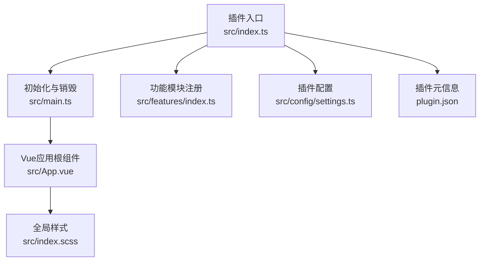
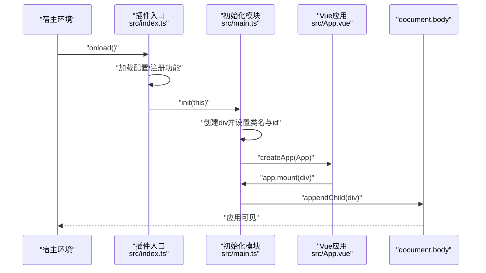
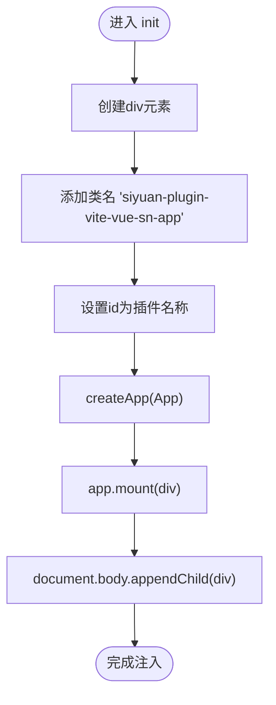
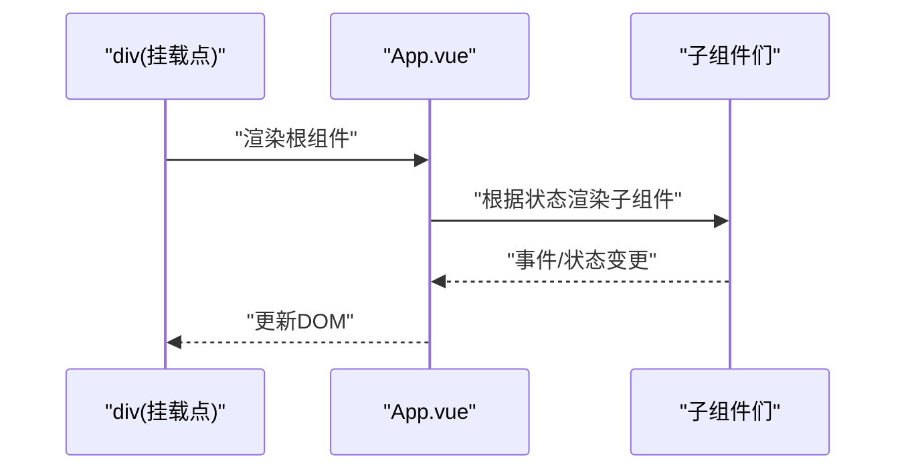
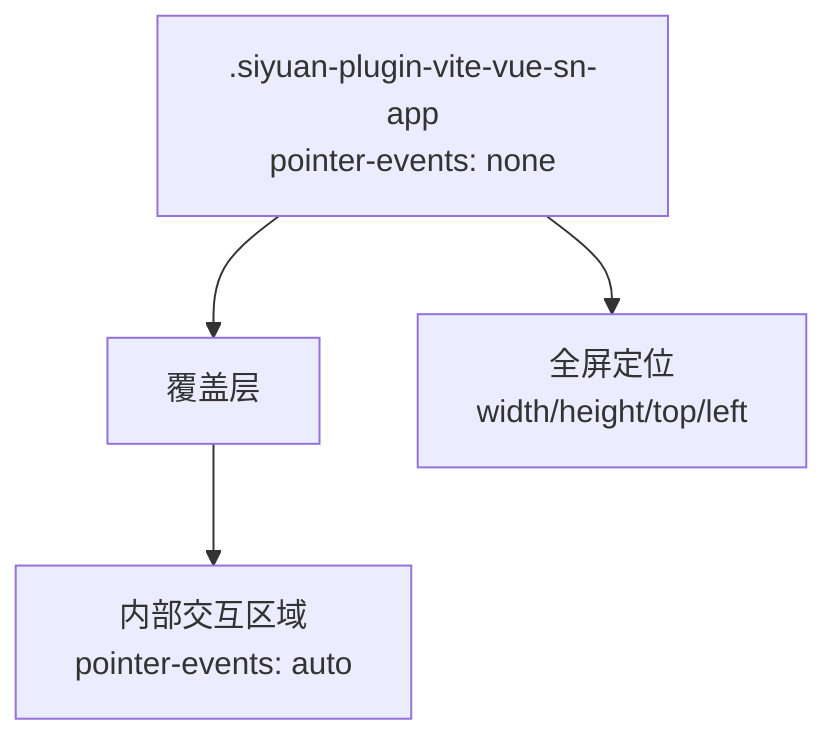
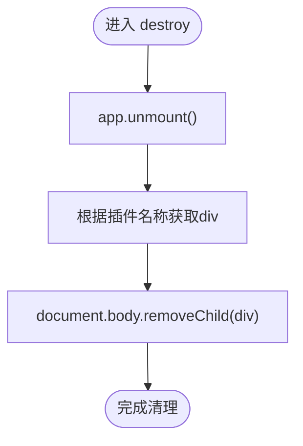
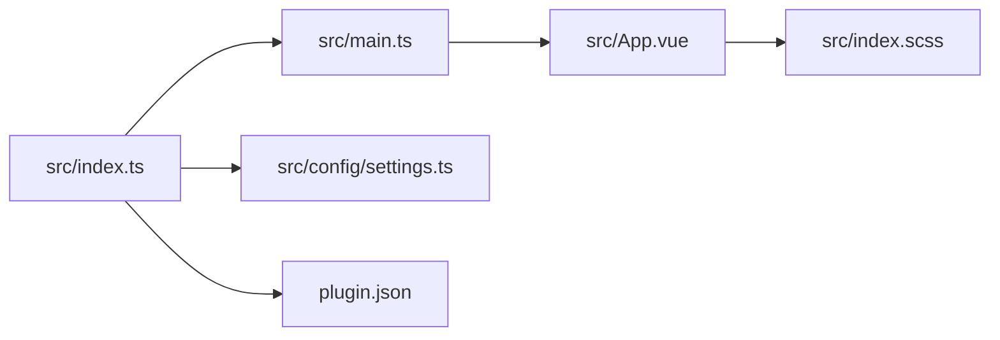

# DOM集成

<cite>
**本文引用的文件**
- [src/index.ts](file://src/index.ts)
- [src/main.ts](file://src/main.ts)
- [src/App.vue](file://src/App.vue)
- [src/index.scss](file://src/index.scss)
- [src/config/settings.ts](file://src/config/settings.ts)
- [src/features/index.ts](file://src/features/index.ts)
- [src/utils/index.ts](file://src/utils/index.ts)
- [plugin.json](file://plugin.json)
</cite>

## 目录
1. [简介](#简介)
2. [项目结构](#项目结构)
3. [核心组件](#核心组件)
4. [架构总览](#架构总览)
5. [详细组件分析](#详细组件分析)
6. [依赖关系分析](#依赖关系分析)
7. [性能考量](#性能考量)
8. [故障排查指南](#故障排查指南)
9. [结论](#结论)

## 简介
本文件聚焦于Vue应用与思源笔记宿主环境DOM的集成机制，围绕以下目标展开：
- init函数如何动态创建DOM节点并将其作为Vue应用挂载点
- app.mount(div)后组件树如何渲染到该节点
- document.body.appendChild(div)如何将应用注入页面
- App.vue中的全局样式如何通过.siyuan-plugin-vite-vue-sn-app实现全屏定位与指针事件穿透
- destroy函数如何卸载应用并安全移除DOM节点，避免内存泄漏
- 提供DOM结构示意图与常见集成问题的排查方法

## 项目结构
该插件采用“插件入口 + 主应用初始化 + Vue根组件”的分层组织方式：
- 插件入口负责平台检测、配置加载、功能注册与生命周期钩子绑定
- 主应用初始化负责创建Vue实例、构建挂载点并注入页面
- Vue根组件承载UI视图与交互逻辑，并通过全局样式实现全屏覆盖



图表来源
- [src/index.ts](file://src/index.ts#L1-L140)
- [src/main.ts](file://src/main.ts#L1-L45)
- [src/App.vue](file://src/App.vue#L1-L216)
- [src/features/index.ts](file://src/features/index.ts#L1-L15)
- [src/config/settings.ts](file://src/config/settings.ts#L1-L141)
- [src/index.scss](file://src/index.scss#L1-L464)
- [plugin.json](file://plugin.json#L1-L34)

章节来源
- [src/index.ts](file://src/index.ts#L1-L140)
- [src/main.ts](file://src/main.ts#L1-L45)
- [src/App.vue](file://src/App.vue#L1-L216)
- [src/features/index.ts](file://src/features/index.ts#L1-L15)
- [src/config/settings.ts](file://src/config/settings.ts#L1-L141)
- [src/index.scss](file://src/index.scss#L1-L464)
- [plugin.json](file://plugin.json#L1-L34)

## 核心组件
- 插件入口：负责加载配置、注册功能模块、调用init进行应用初始化、在卸载时调用destroy
- 初始化模块：创建div挂载点、创建Vue应用、挂载到div、注入到document.body
- Vue根组件：定义全局样式与布局，承载子组件
- 全局样式：为.siyuan-plugin-vite-vue-sn-app提供全屏定位与指针事件穿透策略
- 配置模块：提供默认配置与读写接口，影响初始化行为（如紧凑模式）

章节来源
- [src/index.ts](file://src/index.ts#L1-L140)
- [src/main.ts](file://src/main.ts#L1-L45)
- [src/App.vue](file://src/App.vue#L1-L216)
- [src/index.scss](file://src/index.scss#L1-L464)
- [src/config/settings.ts](file://src/config/settings.ts#L1-L141)

## 架构总览
下图展示了从插件加载到Vue应用挂载的关键流程与DOM注入路径。



图表来源
- [src/index.ts](file://src/index.ts#L1-L140)
- [src/main.ts](file://src/main.ts#L1-L45)
- [src/App.vue](file://src/App.vue#L1-L216)

## 详细组件分析

### 初始化与挂载点创建（init）
- 动态创建div元素，设置类名为“siyuan-plugin-vite-vue-sn-app”，id为插件名称
- 创建Vue应用并挂载到该div
- 将div追加到document.body，完成注入



图表来源
- [src/main.ts](file://src/main.ts#L1-L45)

章节来源
- [src/main.ts](file://src/main.ts#L1-L45)
- [plugin.json](file://plugin.json#L1-L34)

### Vue组件树渲染到挂载点
- app.mount(div)后，Vue会将App.vue及其子组件树渲染到div内部
- 子组件包括设置面板、图片查看器、二维码对话框等，均在App.vue模板中按条件渲染
- 组件树通过Vue的响应式系统驱动，状态变化触发重新渲染



图表来源
- [src/App.vue](file://src/App.vue#L1-L216)

章节来源
- [src/App.vue](file://src/App.vue#L1-L216)

### 全局样式与指针事件穿透设计
- 全局样式为.siyuan-plugin-vite-vue-sn-app定义了：
  - 宽高：100vw / 100dvh，确保覆盖全屏
  - 定位：absolute + top/left: 0，保证与视口对齐
  - 指针事件：pointer-events: none，使用户点击透过应用层传递到底层思源界面
  - 边距盒：box-sizing: border-box
- App.vue的scoped样式中，容器使用pointer-events: none，但其内部特定区域（如demo容器）显式设置pointer-events: auto，以允许交互
- 这种设计使得应用层作为“透明覆盖层”：既能展示UI，又不影响底层编辑器与菜单的交互



图表来源
- [src/App.vue](file://src/App.vue#L189-L215)

章节来源
- [src/App.vue](file://src/App.vue#L189-L215)

### 卸载与安全移除（destroy）
- 调用app.unmount()卸载Vue应用，释放组件树与事件监听
- 通过插件名称获取挂载点div并从document.body移除
- 此流程避免DOM残留与事件泄漏，降低内存占用



图表来源
- [src/main.ts](file://src/main.ts#L40-L45)

章节来源
- [src/main.ts](file://src/main.ts#L40-L45)

### 插件入口与生命周期
- 插件入口在onload中完成平台检测、配置加载、功能注册，并调用init
- 在onunload中调用destroy，确保插件卸载时清理资源
- 插件名称来源于plugin.json，用于作为挂载点的id前缀

```mermaid
sequenceDiagram
participant Host as "宿主环境"
participant Entry as "插件入口<br/>src/index.ts"
participant Init as "初始化模块<br/>src/main.ts"
participant Destroy as "销毁模块<br/>src/main.ts"
Host->>Entry : "onload()"
Entry->>Entry : "加载配置/注册功能"
Entry->>Init : "init(this)"
Host-->>Entry : "onunload()"
Entry->>Destroy : "destroy()"
```

图表来源
- [src/index.ts](file://src/index.ts#L1-L140)
- [src/main.ts](file://src/main.ts#L1-L45)
- [plugin.json](file://plugin.json#L1-L34)

章节来源
- [src/index.ts](file://src/index.ts#L1-L140)
- [src/main.ts](file://src/main.ts#L1-L45)
- [plugin.json](file://plugin.json#L1-L34)

### 配置与紧凑模式联动
- 初始化时若配置开启紧凑模式，则向<html>添加紧凑模式类，从而触发全局样式调整
- 配置项由配置模块提供默认值与持久化读写

章节来源
- [src/main.ts](file://src/main.ts#L1-L45)
- [src/config/settings.ts](file://src/config/settings.ts#L1-L141)

### 其他组件与DOM集成参考
- 工具函数提供将任意Vue组件转为DOM片段的通用方法，便于在宿主环境中以类似方式注入
- 页面锁定功能在拦截页面内容时同样采用创建div并注入body的方式，体现一致的DOM注入模式

章节来源
- [src/utils/index.ts](file://src/utils/index.ts#L1-L8)

## 依赖关系分析
- 插件入口依赖初始化模块与配置模块；初始化模块依赖Vue运行时与App根组件
- App.vue依赖各功能子组件并通过全局样式实现覆盖层定位
- 全局样式与插件名称共同决定DOM结构与交互行为



图表来源
- [src/index.ts](file://src/index.ts#L1-L140)
- [src/main.ts](file://src/main.ts#L1-L45)
- [src/App.vue](file://src/App.vue#L1-L216)
- [src/config/settings.ts](file://src/config/settings.ts#L1-L141)
- [src/index.scss](file://src/index.scss#L1-L464)
- [plugin.json](file://plugin.json#L1-L34)

章节来源
- [src/index.ts](file://src/index.ts#L1-L140)
- [src/main.ts](file://src/main.ts#L1-L45)
- [src/App.vue](file://src/App.vue#L1-L216)
- [src/config/settings.ts](file://src/config/settings.ts#L1-L141)
- [src/index.scss](file://src/index.scss#L1-L464)
- [plugin.json](file://plugin.json#L1-L34)

## 性能考量
- 挂载点仅创建一次，避免重复创建DOM节点带来的开销
- 卸载时统一调用unmount与移除节点，减少事件监听与引用残留
- 全局样式采用覆盖层而非深层嵌套，降低选择器复杂度与重排成本
- 紧凑模式通过HTML类切换实现，避免频繁修改内联样式

## 故障排查指南
- 挂载失败
  - 检查init是否被正确调用（插件入口onload中）
  - 确认div已成功appendChild到document.body
  - 排查App.vue是否存在未捕获异常导致渲染中断
- 样式冲突
  - 检查全局样式是否被宿主样式覆盖（如z-index、position）
  - 确认.siyuan-plugin-vite-vue-sn-app的pointer-events: none不会影响预期交互区域
  - 若出现滚动穿透，检查内部容器是否正确设置pointer-events: auto
- 交互失效
  - 确保内部交互区域（如demo容器）显式设置pointer-events: auto
  - 检查事件冒泡与阻止传播逻辑，避免误阻止
- 卸载不彻底
  - 确认destroy中调用了app.unmount并移除了对应id的节点
  - 检查是否有外部脚本对挂载点进行了额外操作

## 结论
该插件通过“创建div挂载点 -> 创建Vue应用 -> 挂载到div -> 注入document.body”的标准流程，实现了与思源笔记宿主环境的无缝集成。App.vue的全局样式以“全屏覆盖 + 指针事件穿透”为核心设计，既保证了UI展示，又不阻断底层交互。destroy函数确保了应用生命周期结束后的资源回收，有效避免内存泄漏。通过规范化的初始化与卸载流程，以及对样式与事件的精细控制，该方案具备良好的稳定性与可维护性。