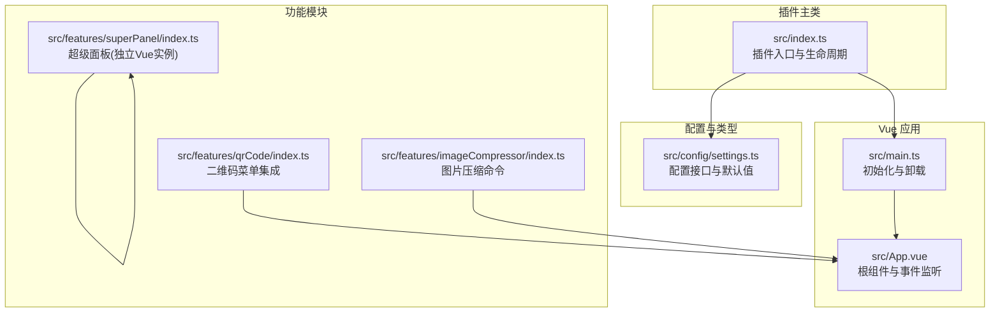
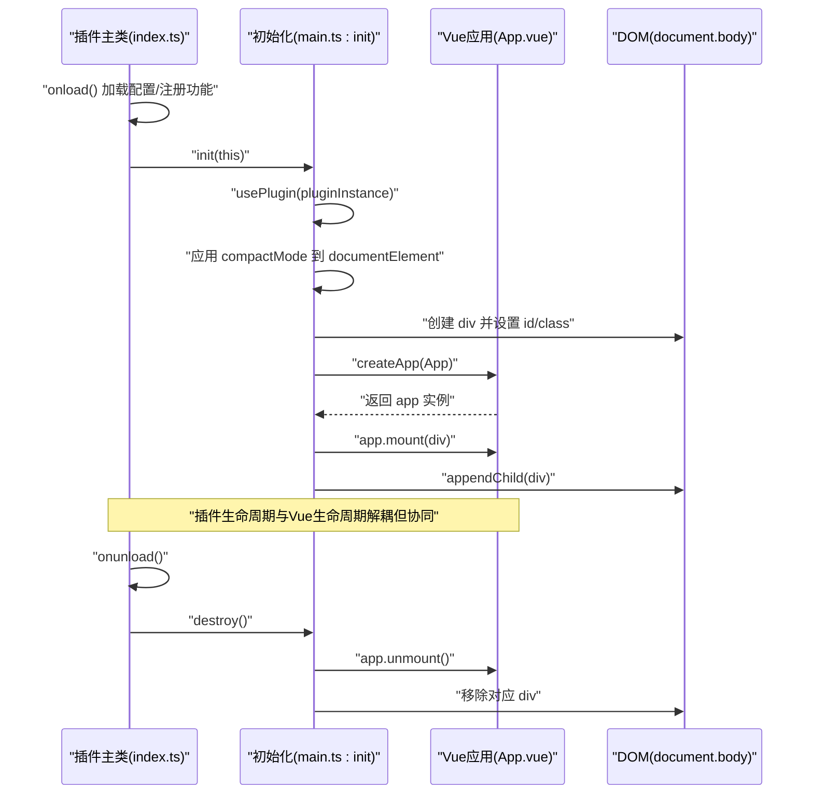
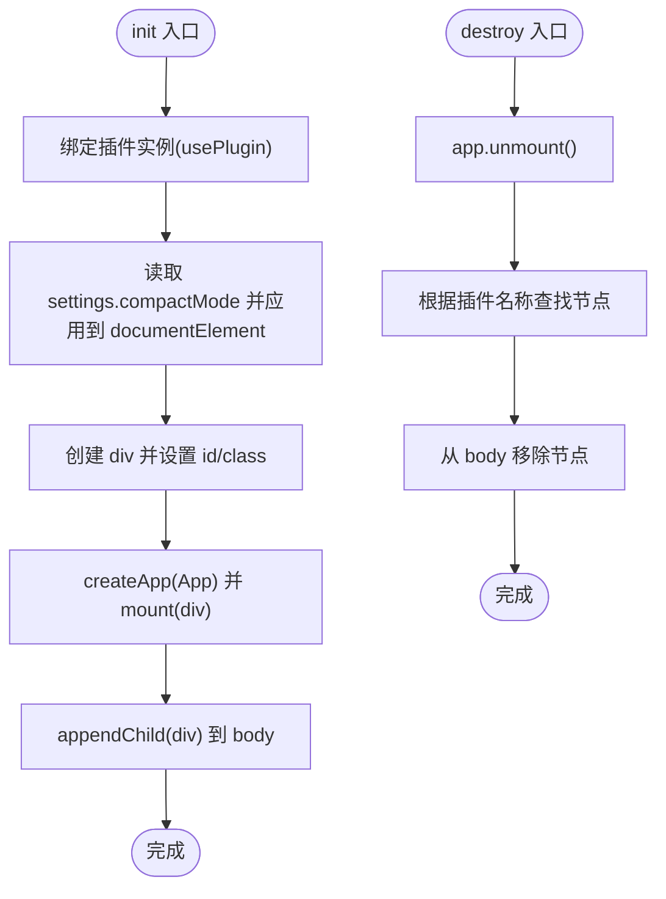
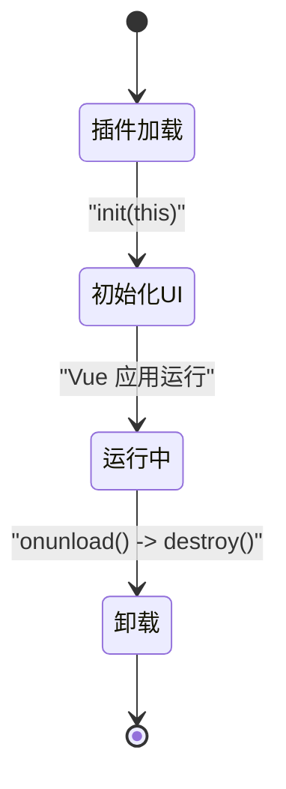
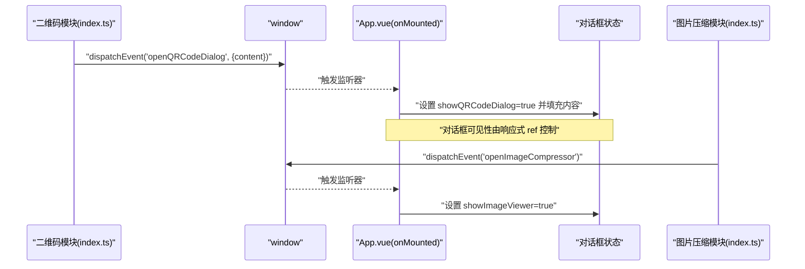
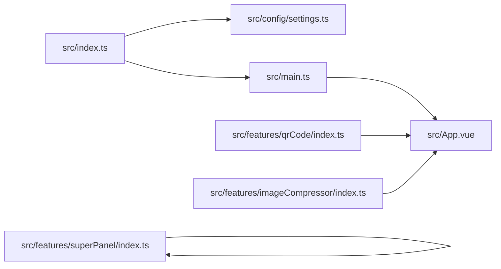

# Vue应用初始化

<cite>
**本文引用的文件**
- [src/main.ts](file://src/main.ts)
- [src/App.vue](file://src/App.vue)
- [src/index.ts](file://src/index.ts)
- [src/config/settings.ts](file://src/config/settings.ts)
- [src/features/qrCode/index.ts](file://src/features/qrCode/index.ts)
- [src/features/imageCompressor/index.ts](file://src/features/imageCompressor/index.ts)
- [src/features/superPanel/index.ts](file://src/features/superPanel/index.ts)
- [plugin.json](file://plugin.json)
- [package.json](file://package.json)
</cite>

## 目录
1. [简介](#简介)
2. [项目结构](#项目结构)
3. [核心组件](#核心组件)
4. [架构总览](#架构总览)
5. [详细组件分析](#详细组件分析)
6. [依赖分析](#依赖分析)
7. [性能考虑](#性能考虑)
8. [故障排查指南](#故障排查指南)
9. [结论](#结论)

## 简介
本文件聚焦于该 Vue 应用在思源笔记前端插件中的初始化流程，系统性阐述以下要点：
- init 函数如何通过 createApp(App) 创建 Vue 实例，并将其挂载到动态创建的 DOM 元素上
- usePlugin 函数如何实现插件实例的全局绑定，供 Vue 组件通过组合式 API 使用
- destroy 函数如何正确卸载 Vue 应用并清理 DOM 节点
- compactMode 配置如何在初始化时应用到 documentElement
- App.vue 中的全局事件监听器（openQRCodeDialog 与 openImageCompressor）如何与原生 JavaScript 事件系统集成
- Vue 生命周期与插件生命周期的对应关系

## 项目结构
该仓库采用“插件主类 + Vue 应用 + 功能模块”的分层结构：
- 插件主类负责生命周期、配置加载、功能注册与 UI 初始化
- Vue 应用负责渲染 UI 并与原生事件系统交互
- 功能模块通过事件或命令与插件主类协作

图表来源
- [src/index.ts](file://src/index.ts#L39-L71)
- [src/main.ts](file://src/main.ts#L21-L44)
- [src/App.vue](file://src/App.vue#L133-L149)
- [src/config/settings.ts](file://src/config/settings.ts#L1-L50)
- [src/features/qrCode/index.ts](file://src/features/qrCode/index.ts#L12-L69)
- [src/features/imageCompressor/index.ts](file://src/features/imageCompressor/index.ts#L1-L31)
- [src/features/superPanel/index.ts](file://src/features/superPanel/index.ts#L1-L138)

章节来源
- [src/index.ts](file://src/index.ts#L39-L71)
- [src/main.ts](file://src/main.ts#L21-L44)
- [src/App.vue](file://src/App.vue#L133-L149)
- [src/config/settings.ts](file://src/config/settings.ts#L1-L50)

## 核心组件
- 插件主类：负责加载配置、注册功能模块、调用 init 初始化 UI、onunload 时调用 destroy 卸载
- Vue 初始化模块：提供 usePlugin 全局绑定、init 创建并挂载应用、destroy 卸载并移除 DOM
- 根组件 App.vue：暴露公开方法给外部窗口对象，监听全局事件以驱动对话框状态
- 功能模块：通过事件或命令与插件主类协作，向 App.vue 发起状态变更

章节来源
- [src/index.ts](file://src/index.ts#L39-L71)
- [src/main.ts](file://src/main.ts#L9-L18)
- [src/main.ts](file://src/main.ts#L21-L44)
- [src/App.vue](file://src/App.vue#L133-L149)

## 架构总览
下图展示从插件加载到 Vue 应用挂载、再到事件驱动 UI 更新的端到端流程。

图表来源
- [src/index.ts](file://src/index.ts#L39-L71)
- [src/main.ts](file://src/main.ts#L21-L44)
- [src/App.vue](file://src/App.vue#L133-L149)

## 详细组件分析

### 初始化流程与 DOM 挂载
- usePlugin：将传入的插件实例缓存为全局单例，供 Vue 组件通过组合式 API 使用
- init：
  - 绑定插件实例
  - 读取插件设置中的 compactMode，若为真则向 documentElement 添加紧凑模式类名
  - 动态创建 div，设置唯一 id 与样式类名
  - 通过 createApp(App) 创建 Vue 应用实例
  - 将应用挂载到 div，并将 div 追加到 document.body
- destroy：
  - 调用 app.unmount() 卸载 Vue 应用
  - 通过插件名称查找并移除对应的 DOM 节点

图表来源
- [src/main.ts](file://src/main.ts#L9-L18)
- [src/main.ts](file://src/main.ts#L21-L44)

章节来源
- [src/main.ts](file://src/main.ts#L9-L18)
- [src/main.ts](file://src/main.ts#L21-L44)

### 插件生命周期与 Vue 生命周期的对应关系
- 插件生命周期：
  - onload：加载配置、注册功能模块、调用 init 初始化 UI
  - onunload：调用 destroy 卸载 UI
- Vue 生命周期：
  - onMounted：在 App.vue 中进行窗口事件监听、状态栏集成等副作用
  - 组件销毁：由 destroy 流程统一卸载，无需在组件内重复 unmount

图表来源
- [src/index.ts](file://src/index.ts#L39-L71)
- [src/main.ts](file://src/main.ts#L21-L44)
- [src/App.vue](file://src/App.vue#L133-L149)

章节来源
- [src/index.ts](file://src/index.ts#L39-L71)
- [src/main.ts](file://src/main.ts#L21-L44)
- [src/App.vue](file://src/App.vue#L133-L149)

### compactMode 配置的应用
- 在 init 中读取插件设置中的 compactMode
- 若为真，则向 documentElement 添加紧凑模式类名，从而影响全局样式
- 该行为在应用启动时一次性执行，不依赖 Vue 组件

章节来源
- [src/main.ts](file://src/main.ts#L26-L30)
- [src/config/settings.ts](file://src/config/settings.ts#L1-L50)

### Vue 应用与原生事件系统的集成
- App.vue 在 onMounted 中：
  - 将公开方法（如 openSetting、openQRCodeDialog）挂载到 window._sy_plugin_sample
  - 监听 window 上的自定义事件 openQRCodeDialog 与 openImageCompressor，以驱动对话框状态
- 功能模块通过派发自定义事件与 App.vue 通信：
  - 二维码模块：在编辑器右键菜单点击后，派发 openQRCodeDialog 事件
  - 图片压缩模块：通过命令回调派发 openImageCompressor 事件

图表来源
- [src/features/qrCode/index.ts](file://src/features/qrCode/index.ts#L59-L69)
- [src/features/qrCode/index.ts](file://src/features/qrCode/index.ts#L12-L58)
- [src/features/imageCompressor/index.ts](file://src/features/imageCompressor/index.ts#L1-L31)
- [src/App.vue](file://src/App.vue#L133-L149)

章节来源
- [src/App.vue](file://src/App.vue#L133-L149)
- [src/features/qrCode/index.ts](file://src/features/qrCode/index.ts#L12-L69)
- [src/features/imageCompressor/index.ts](file://src/features/imageCompressor/index.ts#L1-L31)

### 与超级面板的对比：独立 Vue 实例
- 超级面板是一个独立的 Vue 应用，由其自身模块创建与卸载
- 与主应用不同，超级面板在打开时创建 div 并挂载，关闭时 unmount 并移除容器

章节来源
- [src/features/superPanel/index.ts](file://src/features/superPanel/index.ts#L60-L95)

## 依赖分析
- 插件主类依赖：
  - 配置模块：加载/保存设置
  - 初始化模块：创建并挂载 Vue 应用
  - 功能模块：按配置注册
- Vue 应用依赖：
  - usePlugin 提供的全局插件实例
  - 组件间通过事件与外部系统交互
- 外部依赖：
  - siyuan SDK：插件生命周期、事件总线、命令、消息提示等
  - vue：应用创建与挂载

图表来源
- [src/index.ts](file://src/index.ts#L39-L71)
- [src/main.ts](file://src/main.ts#L21-L44)
- [src/App.vue](file://src/App.vue#L133-L149)
- [src/config/settings.ts](file://src/config/settings.ts#L1-L50)
- [src/features/qrCode/index.ts](file://src/features/qrCode/index.ts#L12-L69)
- [src/features/imageCompressor/index.ts](file://src/features/imageCompressor/index.ts#L1-L31)
- [src/features/superPanel/index.ts](file://src/features/superPanel/index.ts#L1-L138)

章节来源
- [src/index.ts](file://src/index.ts#L39-L71)
- [src/main.ts](file://src/main.ts#L21-L44)
- [src/App.vue](file://src/App.vue#L133-L149)
- [src/config/settings.ts](file://src/config/settings.ts#L1-L50)
- [src/features/qrCode/index.ts](file://src/features/qrCode/index.ts#L12-L69)
- [src/features/imageCompressor/index.ts](file://src/features/imageCompressor/index.ts#L1-L31)
- [src/features/superPanel/index.ts](file://src/features/superPanel/index.ts#L1-L138)

## 性能考虑
- 初始化阶段仅创建一次 DOM 容器并挂载一次 Vue 应用，避免重复创建
- 事件监听器在 onMounted 中注册，确保 DOM 准备就绪后再绑定
- 卸载时先 unmount 再移除节点，保证内存释放与 DOM 清理
- compactMode 仅在启动时应用一次，对运行时性能影响极小

## 故障排查指南
- 插件未加载或 UI 不显示
  - 检查插件主类 onload 是否调用了 init
  - 确认 init 中的 div 已追加到 body
- 事件无法触发对话框
  - 确认功能模块是否正确派发 openQRCodeDialog/openImageCompressor 事件
  - 确认 App.vue 的 window 监听器是否在 onMounted 中注册
- 卸载后残留 DOM
  - 确认 destroy 是否被 onunload 调用
  - 确认 destroy 中通过插件名称正确查找并移除节点
- 紧凑模式未生效
  - 确认 settings.compactMode 为真
  - 确认 documentElement 上已添加相应类名

章节来源
- [src/index.ts](file://src/index.ts#L39-L71)
- [src/main.ts](file://src/main.ts#L21-L44)
- [src/App.vue](file://src/App.vue#L133-L149)
- [src/config/settings.ts](file://src/config/settings.ts#L1-L50)

## 结论
该插件通过清晰的分层设计实现了 Vue 应用的稳定初始化与卸载：
- init 负责创建并挂载 Vue 应用，destroy 负责安全卸载
- usePlugin 提供了跨组件的插件实例共享
- compactMode 在启动时应用到 documentElement，影响全局样式
- App.vue 通过 window 事件与功能模块解耦协作，实现对话框的动态控制
- 插件生命周期与 Vue 生命周期相互独立又协同工作，确保插件加载与卸载的完整性