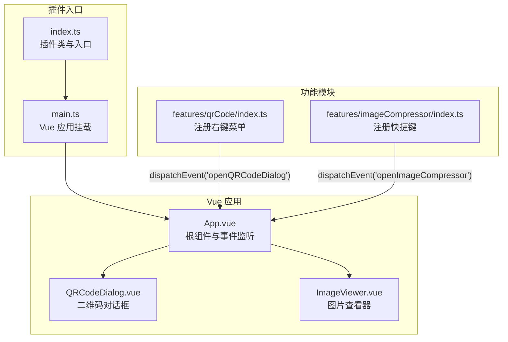
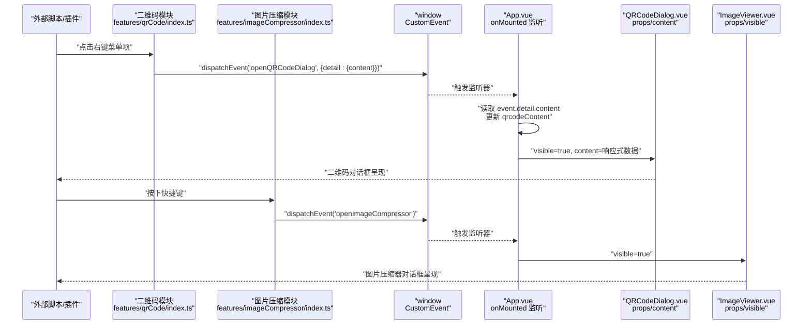
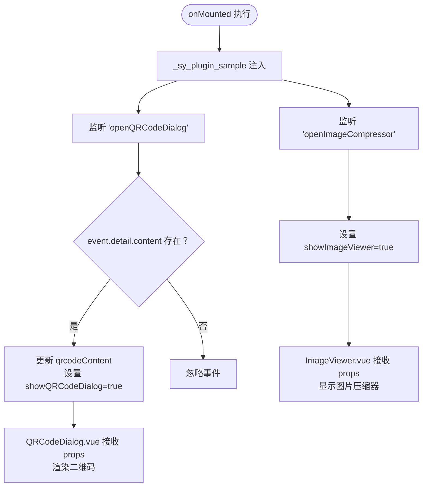
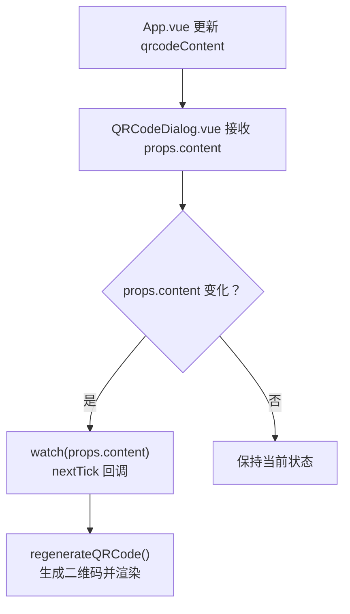
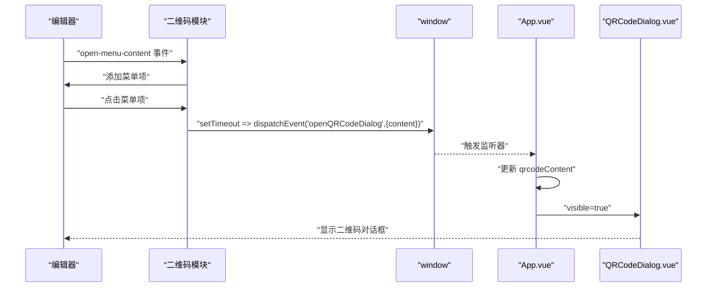
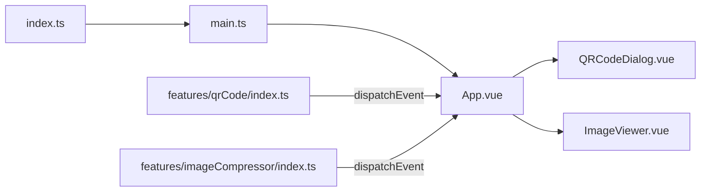

# 事件通信

<cite>
**本文引用的文件列表**
- [App.vue](file://src/App.vue)
- [main.ts](file://src/main.ts)
- [index.ts](file://src/index.ts)
- [QRCodeDialog.vue](file://src/features/qrCode/QRCodeDialog.vue)
- [CompressDialog.vue](file://src/features/imageCompressor/CompressDialog.vue)
- [index.ts（二维码模块）](file://src/features/qrCode/index.ts)
- [index.ts（图片压缩模块）](file://src/features/imageCompressor/index.ts)
- [settings.ts](file://src/config/settings.ts)
- [plugin.json](file://plugin.json)
</cite>

## 目录
1. [引言](#引言)
2. [项目结构](#项目结构)
3. [核心组件](#核心组件)
4. [架构总览](#架构总览)
5. [详细组件分析](#详细组件分析)
6. [依赖关系分析](#依赖关系分析)
7. [性能考量](#性能考量)
8. [故障排查指南](#故障排查指南)
9. [结论](#结论)
10. [附录](#附录)

## 引言
本文件围绕 Vue 应用与原生 JavaScript 的事件通信机制进行系统化解析，重点聚焦于以下目标：
- 基于 App.vue 中 onMounted 生命周期，说明如何通过 window.addEventListener 监听自定义事件“openQRCodeDialog”和“openImageCompressor”，并触发相应 UI 组件显示。
- 解释 openQRCodeDialog 函数如何接收事件详情中的 content 参数，并更新响应式数据 qrcodeContent，从而驱动 QRCodeDialog.vue 的展示与内容渲染。
- 阐述 window._sy_plugin_sample 全局对象的注入机制，使外部 JavaScript 可以直接调用 openSetting 和 openQRCodeDialog 方法。
- 结合思源笔记插件上下文，说明事件驱动架构的优势与适用场景。
- 提供事件通信流程图、实际调用示例及常见问题（如事件未触发、作用域丢失）的解决方案。

## 项目结构
该仓库采用“功能模块化 + Vue 组件”的组织方式，事件通信贯穿插件入口、模块注册、Vue 应用挂载与组件交互之间。关键路径如下：
- 插件入口与初始化：index.ts 调用 main.ts 完成 Vue 应用挂载；App.vue 作为根组件承载 UI 并监听窗口事件。
- 二维码模块：features/qrCode/index.ts 注册编辑器右键菜单项，点击后通过 window.dispatchEvent 触发“openQRCodeDialog”事件。
- 图片压缩模块：features/imageCompressor/index.ts 注册快捷键命令，回调中通过 window.dispatchEvent 触发“openImageCompressor”事件。
- UI 组件：QRCodeDialog.vue 与 CompressDialog.vue 分别负责二维码对话框与图片压缩对话框的展示与交互。

图表来源
- [index.ts](file://src/index.ts#L1-L140)
- [main.ts](file://src/main.ts#L1-L45)
- [App.vue](file://src/App.vue#L1-L216)
- [index.ts（二维码模块）](file://src/features/qrCode/index.ts#L1-L69)
- [index.ts（图片压缩模块）](file://src/features/imageCompressor/index.ts#L1-L31)

章节来源
- [index.ts](file://src/index.ts#L1-L140)
- [main.ts](file://src/main.ts#L1-L45)
- [App.vue](file://src/App.vue#L1-L216)

## 核心组件
- App.vue：在 onMounted 中完成以下职责
  - 注入 window._sy_plugin_sample，暴露 openSetting 与 openQRCodeDialog 方法，供外部脚本直接调用。
  - 监听“openQRCodeDialog”和“openImageCompressor”两个自定义事件，分别更新 qrcodeContent 并显示 QRCodeDialog.vue，或显示 ImageViewer.vue。
  - 通过 props 将 qrcodeContent 传递给 QRCodeDialog.vue，实现内容驱动的 UI 更新。
- 二维码模块（features/qrCode/index.ts）：在编辑器右键菜单中动态添加“生成二维码”项，点击后通过 window.dispatchEvent 触发“openQRCodeDialog”，并将选中文本作为 detail.content 传入。
- 图片压缩模块（features/imageCompressor/index.ts）：注册快捷键命令，回调中通过 window.dispatchEvent 触发“openImageCompressor”。

章节来源
- [App.vue](file://src/App.vue#L90-L149)
- [index.ts（二维码模块）](file://src/features/qrCode/index.ts#L1-L69)
- [index.ts（图片压缩模块）](file://src/features/imageCompressor/index.ts#L1-L31)

## 架构总览
下图展示了从外部触发到 UI 呈现的完整事件链路，包括插件入口、模块注册、事件分发与 Vue 应用监听、组件渲染与状态更新。

图表来源
- [index.ts（二维码模块）](file://src/features/qrCode/index.ts#L1-L69)
- [index.ts（图片压缩模块）](file://src/features/imageCompressor/index.ts#L1-L31)
- [App.vue](file://src/App.vue#L133-L149)
- [QRCodeDialog.vue](file://src/features/qrCode/QRCodeDialog.vue#L82-L122)

## 详细组件分析

### 组件一：App.vue 事件监听与全局方法注入
- 生命周期 onMounted
  - 注入 window._sy_plugin_sample，包含 openSetting 与 openQRCodeDialog 方法，供外部脚本直接调用。
  - 监听“openQRCodeDialog”事件：从 event.detail.content 读取内容，更新 qrcodeContent，并将 showQRCodeDialog 设为 true。
  - 监听“openImageCompressor”事件：直接将 showImageViewer 设为 true。
- 响应式数据与 props 传递
  - qrcodeContent 作为响应式 ref，通过 props 传递给 QRCodeDialog.vue，实现内容驱动渲染。
  - showQRCodeDialog 与 showImageViewer 控制对应对话框的可见性。

图表来源
- [App.vue](file://src/App.vue#L133-L149)
- [App.vue](file://src/App.vue#L90-L94)
- [App.vue](file://src/App.vue#L40-L46)
- [QRCodeDialog.vue](file://src/features/qrCode/QRCodeDialog.vue#L82-L122)

章节来源
- [App.vue](file://src/App.vue#L90-L149)
- [App.vue](file://src/App.vue#L40-L46)

### 组件二：QRCodeDialog.vue 内容驱动渲染
- Props 与 emits
  - 接收 visible 与 content，并通过 update:visible 与 close 事件向上游反馈状态变更。
- 响应式行为
  - 监听 props.content 的变化，当内容变化且与上次不同，自动触发重新生成二维码。
- 数据流
  - App.vue 的 qrcodeContent 通过 props 传入，QRCodeDialog.vue 在内部维护输入框与预览区域，实现内容到 UI 的映射。

图表来源
- [App.vue](file://src/App.vue#L90-L94)
- [QRCodeDialog.vue](file://src/features/qrCode/QRCodeDialog.vue#L114-L122)
- [QRCodeDialog.vue](file://src/features/qrCode/QRCodeDialog.vue#L125-L154)

章节来源
- [QRCodeDialog.vue](file://src/features/qrCode/QRCodeDialog.vue#L82-L154)
- [App.vue](file://src/App.vue#L90-L94)

### 组件三：二维码模块（右键菜单触发）
- 注册编辑器右键菜单项
  - 在 open-menu-content 事件中检测选中文本，动态添加“生成二维码”菜单项。
- 触发事件
  - 点击菜单项后，使用 window.dispatchEvent 触发“openQRCodeDialog”，并将选中文本作为 detail.content 传入。
- 作用域与时机
  - 使用 setTimeout 包裹 dispatchEvent，确保事件在同步执行流之外派发，避免某些平台的事件处理时序问题。

图表来源
- [index.ts（二维码模块）](file://src/features/qrCode/index.ts#L1-L69)
- [App.vue](file://src/App.vue#L133-L149)

章节来源
- [index.ts（二维码模块）](file://src/features/qrCode/index.ts#L1-L69)

### 组件四：图片压缩模块（快捷键触发）
- 注册快捷键命令
  - 通过 plugin.addCommand 注册“openImageCompressor”命令，绑定热键。
- 触发事件
  - 快捷键触发回调时，调用 window.dispatchEvent 触发“openImageCompressor”。

章节来源
- [index.ts（图片压缩模块）](file://src/features/imageCompressor/index.ts#L1-L31)

### 组件五：插件入口与全局方法调用
- 插件入口
  - index.ts 在 onload 中加载配置、注册功能模块并调用 init(this) 完成 Vue 应用挂载。
- 全局方法调用
  - index.ts 提供 openSetting 方法，内部通过 window._sy_plugin_sample.openSetting() 调用 App.vue 中的公开方法，实现外部脚本对设置面板的直接打开。

章节来源
- [index.ts](file://src/index.ts#L1-L140)
- [main.ts](file://src/main.ts#L1-L45)

## 依赖关系分析
- 模块耦合
  - App.vue 与 QRCodeDialog.vue 通过 props/content 进行内容耦合，属于组件级耦合。
  - 二维码模块与图片压缩模块均通过 window.CustomEvent 与 App.vue 解耦，形成松耦合的事件驱动架构。
- 外部依赖
  - 插件入口依赖 Siyuan 插件框架提供的事件总线与命令注册能力。
  - App.vue 依赖 Vue 响应式系统与生命周期钩子。

图表来源
- [index.ts](file://src/index.ts#L1-L140)
- [main.ts](file://src/main.ts#L1-L45)
- [App.vue](file://src/App.vue#L1-L216)
- [index.ts（二维码模块）](file://src/features/qrCode/index.ts#L1-L69)
- [index.ts（图片压缩模块）](file://src/features/imageCompressor/index.ts#L1-L31)

章节来源
- [index.ts](file://src/index.ts#L1-L140)
- [main.ts](file://src/main.ts#L1-L45)
- [App.vue](file://src/App.vue#L1-L216)

## 性能考量
- 事件派发时机
  - 二维码模块使用 setTimeout 包裹 dispatchEvent，有助于规避某些平台的事件处理时序问题，减少同步执行中的竞态风险。
- 响应式更新
  - App.vue 仅在存在有效 content 时更新 qrcodeContent 并显示对话框，避免不必要的渲染。
- 组件渲染
  - QRCodeDialog.vue 仅在 props.content 发生变化时触发重新生成，降低重复计算成本。

章节来源
- [index.ts（二维码模块）](file://src/features/qrCode/index.ts#L55-L69)
- [App.vue](file://src/App.vue#L133-L149)
- [QRCodeDialog.vue](file://src/features/qrCode/QRCodeDialog.vue#L114-L154)

## 故障排查指南
- 事件未触发
  - 检查是否在正确的生命周期内监听事件。App.vue 在 onMounted 中注入监听器，若 App.vue 尚未挂载，事件将不会被捕获。
  - 确认事件名称一致，包括大小写与拼写。
  - 确认事件 detail 结构正确，二维码模块通过 detail.content 传递内容。
- 作用域丢失
  - 确保 window._sy_plugin_sample 已在 App.vue 的 onMounted 中注入，外部脚本通过 window._sy_plugin_sample.openSetting/openQRCodeDialog 调用。
  - 若外部脚本在 App.vue 挂载前调用，将无法找到 _sy_plugin_sample。
- 内容未显示
  - 检查 App.vue 是否读取到有效的 event.detail.content，以及 qrcodeContent 是否被正确更新。
  - 确认 QRCodeDialog.vue 的 props.visible 与 props.content 是否按预期传递。
- 快捷键无效
  - 确认图片压缩模块已注册命令并绑定了热键，且插件入口已调用 registerImageCompressor。

章节来源
- [App.vue](file://src/App.vue#L133-L149)
- [index.ts（二维码模块）](file://src/features/qrCode/index.ts#L55-L69)
- [index.ts（图片压缩模块）](file://src/features/imageCompressor/index.ts#L1-L31)
- [index.ts](file://src/index.ts#L73-L75)

## 结论
该事件通信机制以 window.CustomEvent 为核心，结合 Vue 响应式数据与组件 props，实现了插件入口、功能模块与 UI 组件之间的解耦协作。其优势在于：
- 松耦合：模块通过事件而非直接调用实现交互，便于扩展与维护。
- 易用性：外部脚本可通过 window._sy_plugin_sample 直接调用公开方法，简化集成。
- 可观测性：事件名称与 detail 结构清晰，便于调试与追踪。

在思源笔记插件生态中，这种事件驱动架构特别适用于：
- 编辑器右键菜单扩展（如二维码生成）。
- 快捷键触发的工具面板（如图片压缩器）。
- 跨模块的轻量级交互（如设置面板的外部打开）。

## 附录

### 实际调用示例（步骤说明）
- 外部脚本打开设置面板
  - 步骤：在任意外部脚本中调用 window._sy_plugin_sample.openSetting()。
  - 依据：index.ts 中 openSetting 方法内部调用 window._sy_plugin_sample.openSetting()。
- 外部脚本打开二维码对话框
  - 步骤：在任意外部脚本中调用 window._sy_plugin_sample.openQRCodeDialog(content)。
  - 依据：App.vue 在 onMounted 中注入 window._sy_plugin_sample.openQRCodeDialog，并监听“openQRCodeDialog”事件更新 qrcodeContent。
- 编辑器右键菜单打开二维码
  - 步骤：在编辑器中选中文本，右键菜单出现“生成二维码”，点击该项。
  - 依据：二维码模块在 open-menu-content 事件中添加菜单项，点击后 dispatchEvent('openQRCodeDialog', { content })。
- 快捷键打开图片压缩器
  - 步骤：按下注册的快捷键组合。
  - 依据：图片压缩模块注册命令，回调中 dispatchEvent('openImageCompressor')。

章节来源
- [index.ts](file://src/index.ts#L73-L75)
- [App.vue](file://src/App.vue#L133-L149)
- [index.ts（二维码模块）](file://src/features/qrCode/index.ts#L1-L69)
- [index.ts（图片压缩模块）](file://src/features/imageCompressor/index.ts#L1-L31)