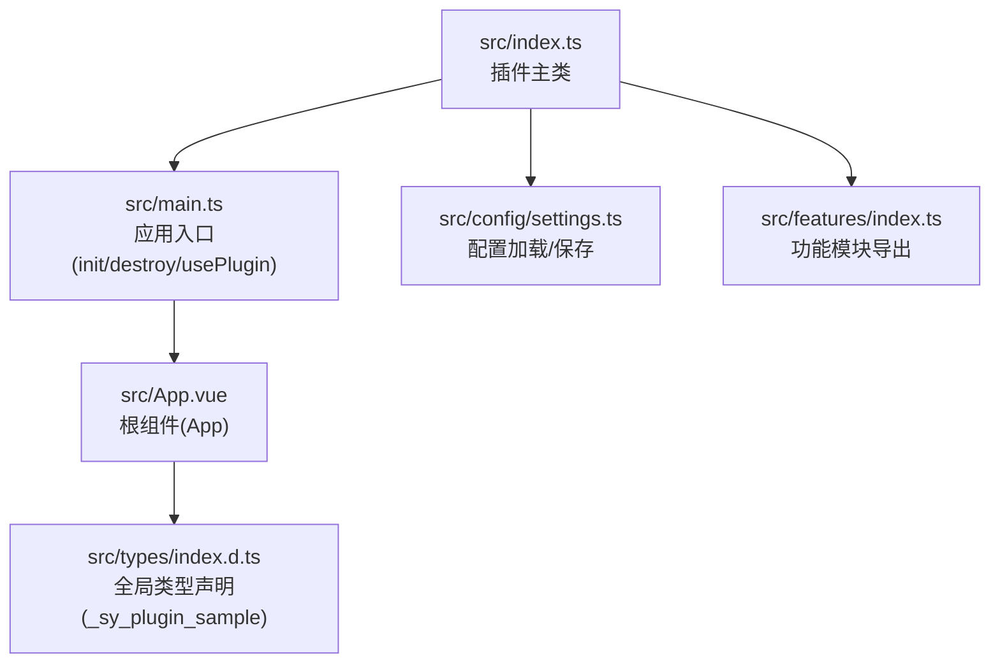
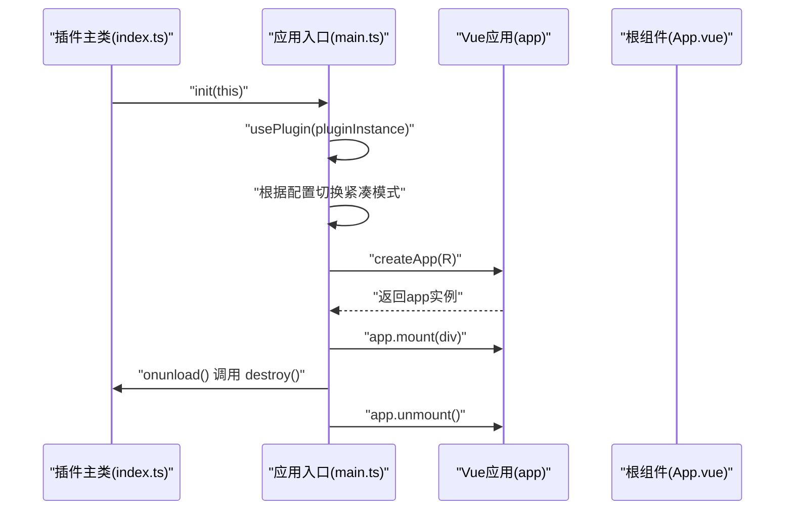
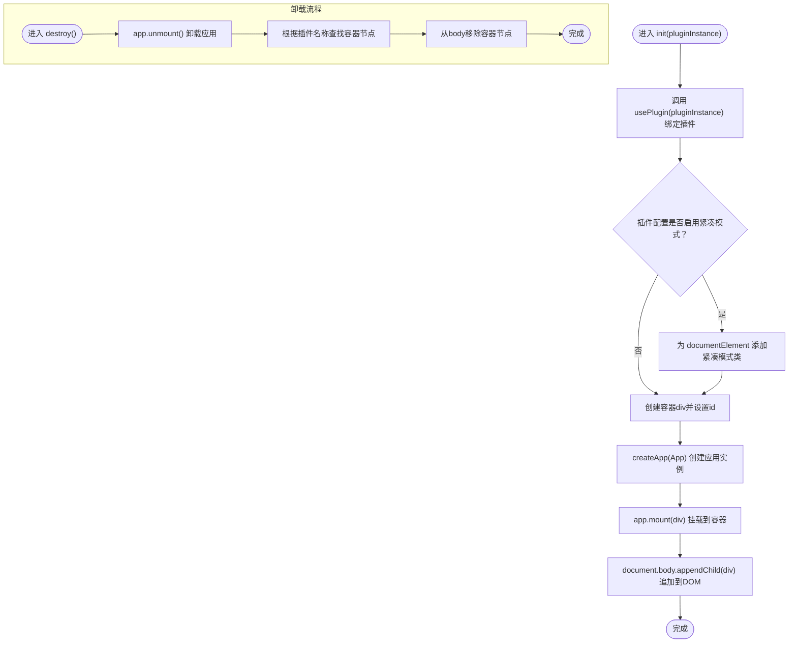
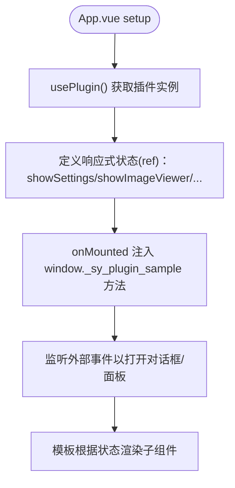
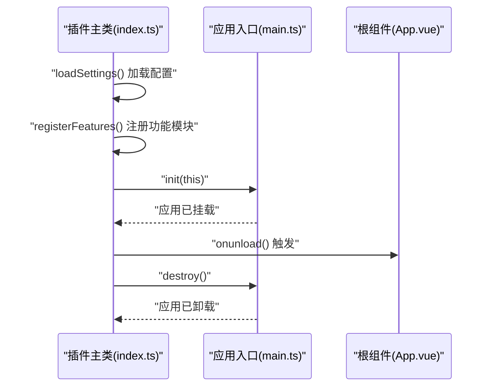
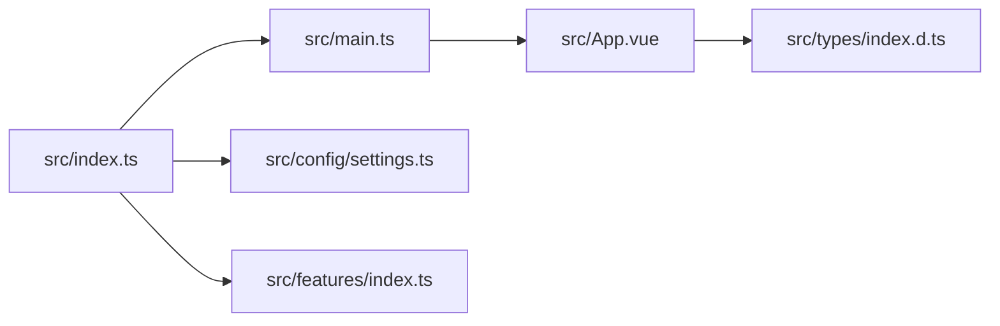

# 应用创建

<cite>
**本文引用的文件**
- [src/main.ts](file://src/main.ts)
- [src/App.vue](file://src/App.vue)
- [src/index.ts](file://src/index.ts)
- [src/config/settings.ts](file://src/config/settings.ts)
- [src/types/index.d.ts](file://src/types/index.d.ts)
- [src/features/index.ts](file://src/features/index.ts)
</cite>

## 目录
1. [简介](#简介)
2. [项目结构](#项目结构)
3. [核心组件](#核心组件)
4. [架构总览](#架构总览)
5. [详细组件分析](#详细组件分析)
6. [依赖关系分析](#依赖关系分析)
7. [性能考量](#性能考量)
8. [故障排查指南](#故障排查指南)
9. [结论](#结论)

## 简介
本节聚焦于 Vue 应用在插件初始化阶段的创建流程，围绕以下关键点展开：
- main.ts 中 init 函数如何通过 createApp(App) 创建 Vue 应用实例，并将其挂载到 DOM。
- App.vue 作为根组件，在 setup 语法中定义响应式数据（如 showSettings、showImageViewer 等），并通过 usePlugin 获取插件实例，实现与全局上下文的绑定。
- createApp 返回的 app 实例具备的方法（mount、unmount）及其在插件生命周期中的作用。
- 结合代码示例展示应用实例如何与思源笔记插件实例绑定（通过 usePlugin），并阐述插件实例在全局上下文中的重要性。
- 提供应用创建过程中可能出现的错误（如 plugin 未绑定）及其解决方案。

## 项目结构
该仓库采用“插件主类 + 应用入口 + 根组件”的组织方式：插件主类负责加载配置、注册功能模块并在 onload/onunload 生命周期内调用应用入口；应用入口负责创建并挂载 Vue 应用；根组件负责渲染 UI 并通过 usePlugin 访问插件能力。

图表来源
- [src/index.ts](file://src/index.ts#L38-L70)
- [src/main.ts](file://src/main.ts#L21-L43)
- [src/App.vue](file://src/App.vue#L30-L150)
- [src/config/settings.ts](file://src/config/settings.ts#L62-L96)
- [src/features/index.ts](file://src/features/index.ts#L1-L15)
- [src/types/index.d.ts](file://src/types/index.d.ts#L114-L128)

章节来源
- [src/index.ts](file://src/index.ts#L38-L70)
- [src/main.ts](file://src/main.ts#L21-L43)
- [src/App.vue](file://src/App.vue#L30-L150)
- [src/config/settings.ts](file://src/config/settings.ts#L62-L96)
- [src/features/index.ts](file://src/features/index.ts#L1-L15)
- [src/types/index.d.ts](file://src/types/index.d.ts#L114-L128)

## 核心组件
- 插件主类：负责平台检测、配置加载、功能模块注册、以及在 onload/onunload 中调用应用入口。
- 应用入口：负责将插件实例绑定到全局上下文、根据配置切换紧凑模式、创建并挂载 Vue 应用、在卸载时执行清理。
- 根组件 App.vue：在 setup 中通过 usePlugin 获取插件实例，定义响应式状态以控制子组件显示，暴露公开方法给全局窗口对象，用于外部触发 UI 行为。

章节来源
- [src/index.ts](file://src/index.ts#L38-L70)
- [src/main.ts](file://src/main.ts#L8-L17)
- [src/main.ts](file://src/main.ts#L21-L43)
- [src/App.vue](file://src/App.vue#L30-L150)

## 架构总览
下图展示了从插件主类到应用入口再到根组件的整体调用链路，以及插件实例在全局上下文中的角色。

图表来源
- [src/index.ts](file://src/index.ts#L38-L70)
- [src/main.ts](file://src/main.ts#L21-L43)
- [src/App.vue](file://src/App.vue#L30-L150)

## 详细组件分析

### 应用入口：init/destroy/usePlugin
- usePlugin：将传入的插件实例缓存到模块级变量，供后续组件通过相同接口访问。若未绑定且未传入实例，会输出错误日志，提示需要绑定插件。
- init：绑定插件实例后，依据插件配置切换全局紧凑模式；创建容器节点并设置唯一标识；通过 createApp(App) 创建应用实例；将应用挂载到容器并追加到 body。
- destroy：调用 app.unmount() 卸载应用，随后根据插件名称查找并移除挂载节点。

图表来源
- [src/main.ts](file://src/main.ts#L8-L17)
- [src/main.ts](file://src/main.ts#L21-L43)

章节来源
- [src/main.ts](file://src/main.ts#L8-L17)
- [src/main.ts](file://src/main.ts#L21-L43)

### 根组件：App.vue 的响应式数据与插件绑定
- 插件绑定：在 setup 中通过 usePlugin() 获取插件实例，类型断言为 PluginSample，从而获得 settings、i18n、updateSettings 等能力。
- 响应式状态：定义多个 ref 控制子组件可见性，如 showSettings、showImageViewer、showQRCodeDialog 等；同时维护 qrcodeContent 作为对话框内容。
- 交互行为：提供 openSetting、openQRCodeDialog 等公开方法；在 onMounted 中向 window._sy_plugin_sample 注入这些方法，允许外部事件触发对应 UI 行为；同时监听特定事件以打开二维码对话框或图片压缩器。
- 全局上下文：通过 window._sy_plugin_sample 暴露方法，便于其他模块或外部脚本调用；类型声明位于 src/types/index.d.ts，确保 TS 对全局对象有正确约束。

图表来源
- [src/App.vue](file://src/App.vue#L30-L150)
- [src/types/index.d.ts](file://src/types/index.d.ts#L114-L128)

章节来源
- [src/App.vue](file://src/App.vue#L30-L150)
- [src/types/index.d.ts](file://src/types/index.d.ts#L114-L128)

### 插件主类：生命周期与功能注册
- onload：检测运行环境、加载配置、注册功能模块、调用 init(this) 完成应用创建。
- onunload：调用 destroy() 清理应用实例。
- openSetting/openQRCodeDialog：通过 window._sy_plugin_sample 暴露的方法，由根组件在 onMounted 中注入，供外部触发。

图表来源
- [src/index.ts](file://src/index.ts#L38-L70)
- [src/main.ts](file://src/main.ts#L21-L43)
- [src/App.vue](file://src/App.vue#L132-L148)

章节来源
- [src/index.ts](file://src/index.ts#L38-L70)
- [src/App.vue](file://src/App.vue#L132-L148)

### 配置与类型支持
- 配置接口与默认值：src/config/settings.ts 定义了插件配置接口及默认值，包含紧凑模式开关等字段，init 会读取该配置决定是否添加紧凑模式类。
- 全局类型声明：src/types/index.d.ts 声明了 window._sy_plugin_sample 的类型，确保 TS 对全局对象的属性有正确约束。

章节来源
- [src/config/settings.ts](file://src/config/settings.ts#L62-L96)
- [src/types/index.d.ts](file://src/types/index.d.ts#L114-L128)

## 依赖关系分析
- 插件主类依赖应用入口：在 onload 中调用 init(this)，在 onunload 中调用 destroy()。
- 应用入口依赖根组件：createApp(App) 将根组件作为应用根节点。
- 根组件依赖应用入口的 usePlugin：通过 usePlugin() 获取插件实例，从而访问插件能力。
- 功能模块导出：src/features/index.ts 统一导出各功能模块的注册函数，插件主类在 onload 中按配置逐一注册。

图表来源
- [src/index.ts](file://src/index.ts#L38-L70)
- [src/main.ts](file://src/main.ts#L21-L43)
- [src/App.vue](file://src/App.vue#L30-L150)
- [src/config/settings.ts](file://src/config/settings.ts#L62-L96)
- [src/features/index.ts](file://src/features/index.ts#L1-L15)
- [src/types/index.d.ts](file://src/types/index.d.ts#L114-L128)

章节来源
- [src/index.ts](file://src/index.ts#L38-L70)
- [src/main.ts](file://src/main.ts#L21-L43)
- [src/App.vue](file://src/App.vue#L30-L150)
- [src/config/settings.ts](file://src/config/settings.ts#L62-L96)
- [src/features/index.ts](file://src/features/index.ts#L1-L15)
- [src/types/index.d.ts](file://src/types/index.d.ts#L114-L128)

## 性能考量
- DOM 操作最小化：init 仅创建一次容器节点并挂载，destroy 时统一卸载并移除节点，避免重复挂载导致的性能损耗。
- 紧凑模式类：仅在配置开启时添加，减少不必要的样式计算。
- 事件监听：根组件在 onMounted 中注入方法并监听事件，注意在卸载时确保不再产生副作用（当前 destroy 未移除事件监听，建议在插件生命周期中补充清理逻辑）。

## 故障排查指南
- 症状：控制台出现“需要绑定插件”相关错误
  - 可能原因：usePlugin 未传入插件实例，且此前也未绑定过
  - 解决方案：确保在插件主类 onload 中调用 init(this)，init 内部会先绑定插件实例；或在调用 usePlugin 时传入插件实例
  - 参考位置
    - [src/main.ts](file://src/main.ts#L8-L17)
    - [src/main.ts](file://src/main.ts#L21-L37)
- 症状：应用未显示或无法交互
  - 可能原因：init 未执行或未正确挂载；destroy 误删了容器节点
  - 解决方案：确认 onload 中调用了 init(this)；检查容器节点是否被移除；确保插件配置 compactMode 开关不会影响 UI 定位
  - 参考位置
    - [src/index.ts](file://src/index.ts#L63-L66)
    - [src/main.ts](file://src/main.ts#L21-L43)
- 症状：外部无法触发 UI 行为（如打开二维码对话框）
  - 可能原因：window._sy_plugin_sample 未注入方法；或未监听相应事件
  - 解决方案：确认 App.vue 在 onMounted 中注入 openSetting/openQRCodeDialog；确认外部事件名称与监听一致
  - 参考位置
    - [src/App.vue](file://src/App.vue#L132-L148)
    - [src/types/index.d.ts](file://src/types/index.d.ts#L114-L128)

章节来源
- [src/main.ts](file://src/main.ts#L8-L17)
- [src/main.ts](file://src/main.ts#L21-L43)
- [src/index.ts](file://src/index.ts#L63-L66)
- [src/App.vue](file://src/App.vue#L132-L148)
- [src/types/index.d.ts](file://src/types/index.d.ts#L114-L128)

## 结论
本项目的应用创建流程清晰地将“插件主类 -> 应用入口 -> 根组件”三者串联起来：插件主类负责生命周期与配置管理，应用入口负责创建并挂载 Vue 应用，根组件通过 usePlugin 获取插件实例并与全局上下文交互。通过紧凑模式配置、统一的挂载/卸载流程以及对外暴露的公开方法，系统实现了良好的可扩展性与可维护性。建议在后续版本中完善事件监听的生命周期清理，以进一步提升稳定性。