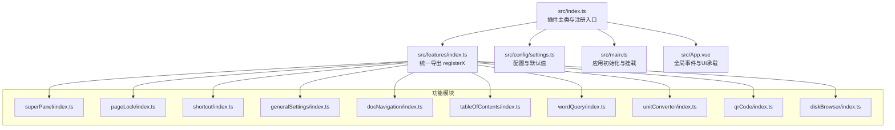
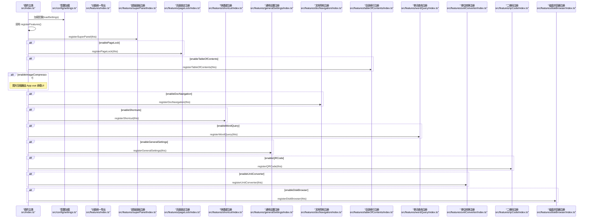
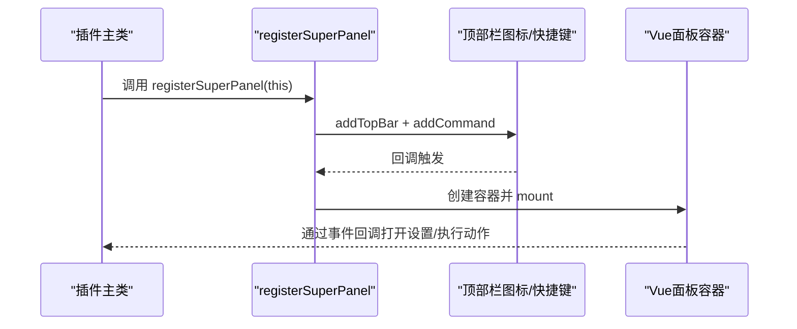
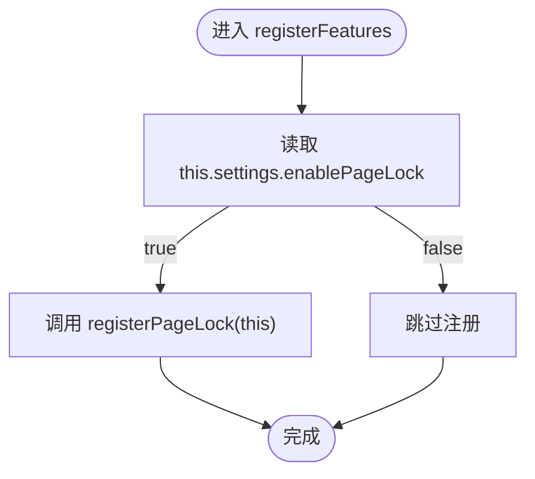
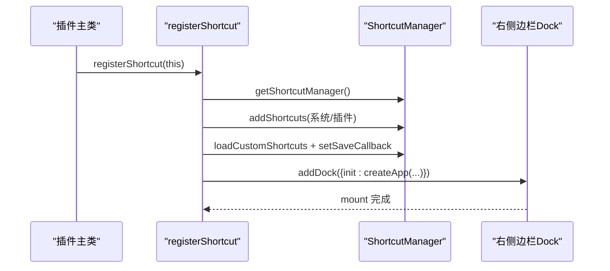
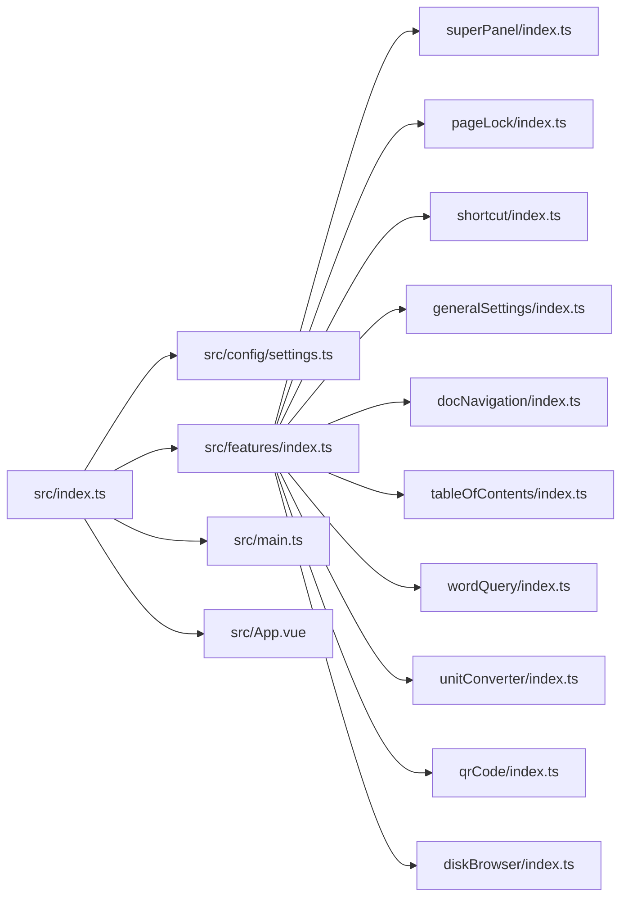

# 功能注册机制

<cite>
**本文引用的文件**
- [src/index.ts](file://src/index.ts)
- [src/features/index.ts](file://src/features/index.ts)
- [src/config/settings.ts](file://src/config/settings.ts)
- [src/features/superPanel/index.ts](file://src/features/superPanel/index.ts)
- [src/features/pageLock/index.ts](file://src/features/pageLock/index.ts)
- [src/features/shortcut/index.ts](file://src/features/shortcut/index.ts)
- [src/features/generalSettings/index.ts](file://src/features/generalSettings/index.ts)
- [src/features/docNavigation/index.ts](file://src/features/docNavigation/index.ts)
- [src/features/tableOfContents/index.ts](file://src/features/tableOfContents/index.ts)
- [src/features/wordQuery/index.ts](file://src/features/wordQuery/index.ts)
- [src/features/unitConverter/index.ts](file://src/features/unitConverter/index.ts)
- [src/features/qrCode/index.ts](file://src/features/qrCode/index.ts)
- [src/features/diskBrowser/index.ts](file://src/features/diskBrowser/index.ts)
- [src/App.vue](file://src/App.vue)
</cite>

## 目录
1. [简介](#简介)
2. [项目结构](#项目结构)
3. [核心组件](#核心组件)
4. [架构总览](#架构总览)
5. [详细组件分析](#详细组件分析)
6. [依赖关系分析](#依赖关系分析)
7. [性能考量](#性能考量)
8. [故障排查指南](#故障排查指南)
9. [结论](#结论)
10. [附录](#附录)

## 简介
本文件系统性阐述该 SiYuan 插件的功能模块注册机制，重点围绕以下目标：
- 解释 registerFeatures 方法如何通过配置开关（如 this.settings.enablePageLock）动态注册功能模块
- 说明超级面板始终启用的设计决策与实现方式
- 展示 src/features/index.ts 统一导出模式如何实现模块解耦
- 解释 registerX 函数（如 registerSuperPanel）如何接收插件实例并完成功能绑定
- 使用具体代码示例展示功能注册的调用链，例如 registerShortcut(this) 的执行过程
- 总结基于配置的条件注册模式带来的灵活性与可维护性优势，并给出自定义功能注册的最佳实践

## 项目结构
该项目采用“按功能域分层”的组织方式，核心入口位于 src/index.ts，功能模块集中在 src/features 下，每个功能模块均提供独立的 registerX 导出函数，配合 src/features/index.ts 进行统一导出，形成清晰的模块边界与解耦。

图表来源
- [src/index.ts](file://src/index.ts#L1-L140)
- [src/features/index.ts](file://src/features/index.ts#L1-L15)
- [src/config/settings.ts](file://src/config/settings.ts#L1-L141)
- [src/App.vue](file://src/App.vue#L1-L216)

章节来源
- [src/index.ts](file://src/index.ts#L1-L140)
- [src/features/index.ts](file://src/features/index.ts#L1-L15)
- [src/config/settings.ts](file://src/config/settings.ts#L1-L141)

## 核心组件
- 插件主类与注册入口：在 src/index.ts 中，插件主类在 onload 生命周期中加载配置、注册功能模块并初始化应用。
- 统一导出：src/features/index.ts 将各功能模块的 registerX 函数集中导出，便于主类按需引入与调用。
- 配置管理：src/config/settings.ts 定义了 PluginSettings 接口与默认配置，提供 loadSettings/saveSettings。
- 应用初始化：src/main.ts 提供 init/destroy，负责创建并挂载根组件 App.vue。
- 全局事件桥接：src/App.vue 通过 window 自定义事件与各功能模块交互（如打开二维码、图片压缩器）。

章节来源
- [src/index.ts](file://src/index.ts#L1-L140)
- [src/features/index.ts](file://src/features/index.ts#L1-L15)
- [src/config/settings.ts](file://src/config/settings.ts#L1-L141)
- [src/main.ts](file://src/main.ts#L1-L45)
- [src/App.vue](file://src/App.vue#L1-L216)

## 架构总览
下图展示了插件启动时的注册流程与关键交互：

图表来源
- [src/index.ts](file://src/index.ts#L60-L126)
- [src/features/index.ts](file://src/features/index.ts#L1-L15)
- [src/features/superPanel/index.ts](file://src/features/superPanel/index.ts#L1-L42)
- [src/features/pageLock/index.ts](file://src/features/pageLock/index.ts#L71-L118)
- [src/features/shortcut/index.ts](file://src/features/shortcut/index.ts#L1-L41)
- [src/features/generalSettings/index.ts](file://src/features/generalSettings/index.ts#L275-L414)
- [src/features/docNavigation/index.ts](file://src/features/docNavigation/index.ts#L1-L33)
- [src/features/tableOfContents/index.ts](file://src/features/tableOfContents/index.ts#L1-L15)
- [src/features/wordQuery/index.ts](file://src/features/wordQuery/index.ts#L560-L573)
- [src/features/unitConverter/index.ts](file://src/features/unitConverter/index.ts#L1-L43)
- [src/features/qrCode/index.ts](file://src/features/qrCode/index.ts#L1-L69)
- [src/features/diskBrowser/index.ts](file://src/features/diskBrowser/index.ts#L1-L51)

## 详细组件分析

### 超级面板：始终启用的设计与实现
- 设计决策：超级面板作为统一入口，始终注册，确保用户可通过顶部栏快速访问所有功能，降低学习成本与使用门槛。
- 实现要点：
  - 在 registerFeatures 中固定调用 registerSuperPanel(this)，不依赖配置开关。
  - 通过插件 API 添加顶部栏图标与快捷键，点击时切换面板显示/隐藏。
  - 使用 Vue 应用挂载到 body，提供统一的入口卡片视图，并通过事件与插件主类通信。

图表来源
- [src/index.ts](file://src/index.ts#L80-L86)
- [src/features/superPanel/index.ts](file://src/features/superPanel/index.ts#L17-L42)
- [src/App.vue](file://src/App.vue#L133-L149)

章节来源
- [src/index.ts](file://src/index.ts#L80-L86)
- [src/features/superPanel/index.ts](file://src/features/superPanel/index.ts#L1-L138)
- [src/App.vue](file://src/App.vue#L133-L149)

### 条件注册：以 enablePageLock 为例
- 条件判断：在 registerFeatures 中根据 this.settings.enablePageLock 决定是否注册页面锁定功能。
- 注册行为：调用 registerPageLock(this)，内部完成事件监听、按钮注入、拦截逻辑等。

图表来源
- [src/index.ts](file://src/index.ts#L86-L97)
- [src/features/pageLock/index.ts](file://src/features/pageLock/index.ts#L71-L118)

章节来源
- [src/index.ts](file://src/index.ts#L86-L97)
- [src/features/pageLock/index.ts](file://src/features/pageLock/index.ts#L71-L118)

### 统一导出模式：src/features/index.ts 的作用
- 统一导出：将各功能模块的 registerX 函数集中导出，主类只需从该文件导入即可批量使用。
- 解耦优势：功能模块之间互不依赖，新增/删除模块仅需修改该文件与主类调用处，不影响其他模块。

章节来源
- [src/features/index.ts](file://src/features/index.ts#L1-L15)

### registerX 函数的通用模式
- 参数：均接收插件实例（Plugin），以便调用插件 API（添加顶部栏、Dock、命令、事件总线等）。
- 返回：多数返回 void；个别模块（如 registerGeneralSettings、registerWordQuery）返回实例，便于跨模块共享状态。
- 典型流程：
  - 初始化/准备数据
  - 注册 UI（顶部栏图标、Dock、命令）
  - 订阅事件（如 switch-protyle、loaded-protyle 等）
  - 绑定交互（按钮点击、快捷键回调）

章节来源
- [src/features/superPanel/index.ts](file://src/features/superPanel/index.ts#L17-L42)
- [src/features/shortcut/index.ts](file://src/features/shortcut/index.ts#L16-L41)
- [src/features/generalSettings/index.ts](file://src/features/generalSettings/index.ts#L275-L414)
- [src/features/wordQuery/index.ts](file://src/features/wordQuery/index.ts#L560-L573)

### registerShortcut(this) 的调用链详解
- 主类调用：在 registerFeatures 中调用 await registerShortcut(this)。
- 管理器初始化：在 registerShortcut 内部获取 ShortcutManager 并添加系统与插件快捷键。
- UI 注册：通过 addDock 将快捷键面板以 Dock 形式挂载到右侧边栏。
- 数据持久化：设置保存回调，将自定义快捷键写入数据库。

图表来源
- [src/index.ts](file://src/index.ts#L102-L104)
- [src/features/shortcut/index.ts](file://src/features/shortcut/index.ts#L16-L41)
- [src/features/shortcut/index.ts](file://src/features/shortcut/index.ts#L263-L300)

章节来源
- [src/index.ts](file://src/index.ts#L102-L104)
- [src/features/shortcut/index.ts](file://src/features/shortcut/index.ts#L16-L41)
- [src/features/shortcut/index.ts](file://src/features/shortcut/index.ts#L263-L300)

### 基于配置的条件注册模式的优势
- 灵活性：通过 settings 开关控制功能启用/禁用，满足不同用户场景。
- 可维护性：新增功能只需新增 registerX 并在主类中按需加入条件分支，无需改动既有模块。
- 可扩展性：统一导出与事件驱动（如 openQRCodeDialog/openImageCompressor）便于跨模块协作。

章节来源
- [src/index.ts](file://src/index.ts#L80-L126)
- [src/features/index.ts](file://src/features/index.ts#L1-L15)
- [src/App.vue](file://src/App.vue#L133-L149)

### 自定义功能注册最佳实践
- 命名规范：registerX，X 为功能名称（如 registerMyFeature）。
- 参数与返回：接收 Plugin 实例；如需跨模块共享状态，返回实例并挂载到插件对象。
- UI 注册：优先使用 addDock/addTopBar/addCommand，保证与插件生态一致。
- 事件驱动：通过 window.CustomEvent 与 App.vue 或其他模块通信，避免强耦合。
- 配置开关：在主类中增加 settings 字段并在 DEFAULT_SETTINGS 中提供默认值，确保可配置。

章节来源
- [src/features/shortcut/index.ts](file://src/features/shortcut/index.ts#L301-L326)
- [src/features/generalSettings/index.ts](file://src/features/generalSettings/index.ts#L275-L414)
- [src/features/wordQuery/index.ts](file://src/features/wordQuery/index.ts#L560-L573)
- [src/App.vue](file://src/App.vue#L133-L149)

## 依赖关系分析
- 主类依赖：src/index.ts 依赖 src/config/settings.ts（配置）、src/features/index.ts（统一导出）、src/main.ts（应用初始化）。
- 功能模块依赖：各 registerX 函数依赖插件 API（addTopBar/addDock/addCommand/eventBus/sql 等），部分模块依赖 Vue（createApp/h）。
- 全局事件桥接：App.vue 通过 window 事件与各功能模块交互，形成弱耦合的通信通道。

图表来源
- [src/index.ts](file://src/index.ts#L1-L140)
- [src/features/index.ts](file://src/features/index.ts#L1-L15)
- [src/App.vue](file://src/App.vue#L1-L216)

章节来源
- [src/index.ts](file://src/index.ts#L1-L140)
- [src/features/index.ts](file://src/features/index.ts#L1-L15)
- [src/App.vue](file://src/App.vue#L1-L216)

## 性能考量
- 防抖与去重：文档导航模块对更新进行防抖与去重，避免频繁 DOM 操作。
- SQL 查询优化：目录索引与文档导航模块使用一次性 SQL 查询减少 API 调用次数。
- 按需注册：仅在配置开启时注册功能，减少不必要的事件订阅与 DOM 注入。
- Vue 应用生命周期：Dock/面板应用在卸载时清理引用，避免内存泄漏。

章节来源
- [src/features/docNavigation/index.ts](file://src/features/docNavigation/index.ts#L96-L112)
- [src/features/tableOfContents/index.ts](file://src/features/tableOfContents/index.ts#L193-L217)
- [src/features/generalSettings/index.ts](file://src/features/generalSettings/index.ts#L266-L272)

## 故障排查指南
- 配置加载失败：若 loadSettings 返回默认值，检查插件 loadData/saveData 的键名与权限。
- 功能未出现：确认 settings 中对应开关为 true；检查 registerFeatures 分支是否命中。
- 事件未触发：核对 App.vue 中 window.addEventListener 的事件名与功能模块中的 dispatch 名称是否一致。
- 快捷键无效：确认 registerShortcut 已执行，且 addCommand 的 langKey/hotkey 配置正确。

章节来源
- [src/config/settings.ts](file://src/config/settings.ts#L70-L96)
- [src/index.ts](file://src/index.ts#L80-L126)
- [src/App.vue](file://src/App.vue#L133-L149)
- [src/features/shortcut/index.ts](file://src/features/shortcut/index.ts#L16-L41)

## 结论
该插件通过“统一导出 + 条件注册 + 超级面板始终启用”的设计，实现了高度解耦与灵活扩展。主类仅负责加载配置与调度注册，各功能模块专注于自身职责并通过插件 API 与生态集成。基于配置的开关机制与事件驱动的跨模块通信，使得新增功能的成本极低，维护性与可扩展性显著提升。

## 附录
- 配置项参考：见 src/config/settings.ts 中的 PluginSettings 接口与 DEFAULT_SETTINGS。
- 功能清单：见 src/features/index.ts 的统一导出列表。
- 入口调用链：见 registerShortcut(this) 的完整调用序列。