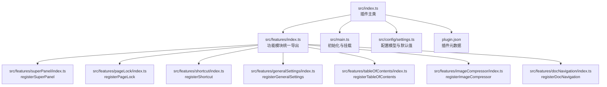
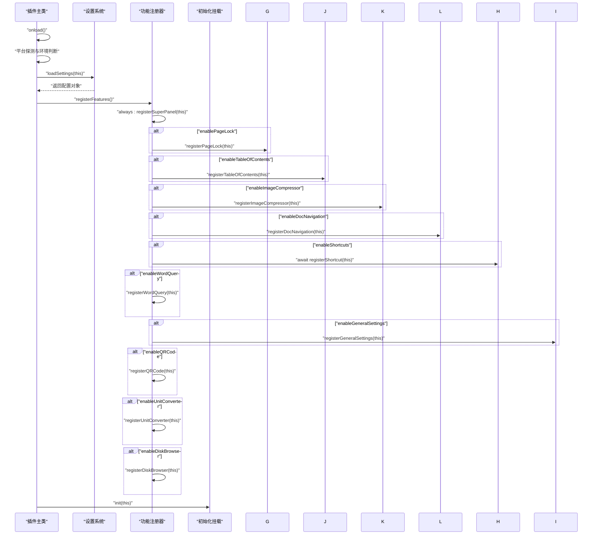
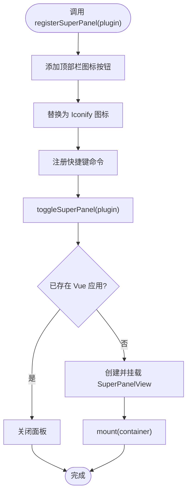
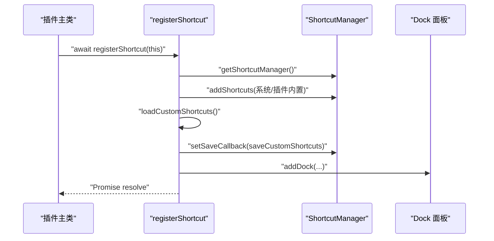
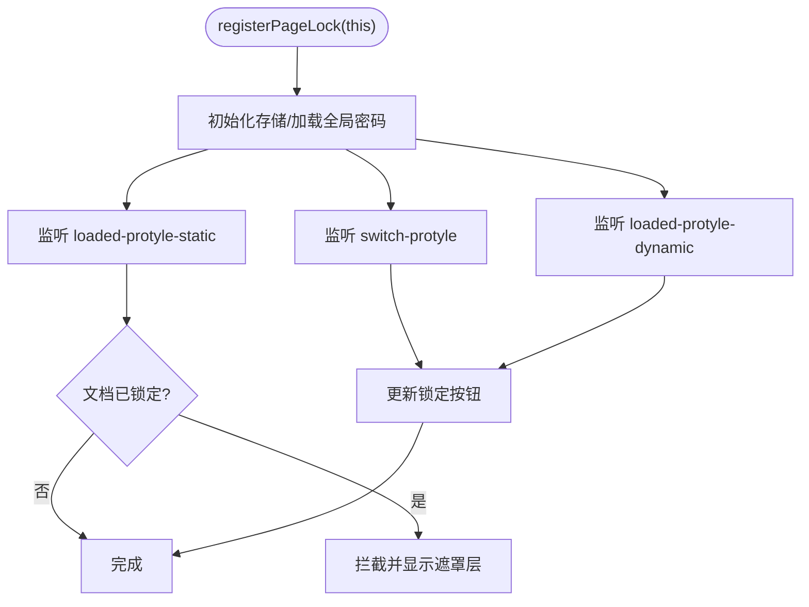
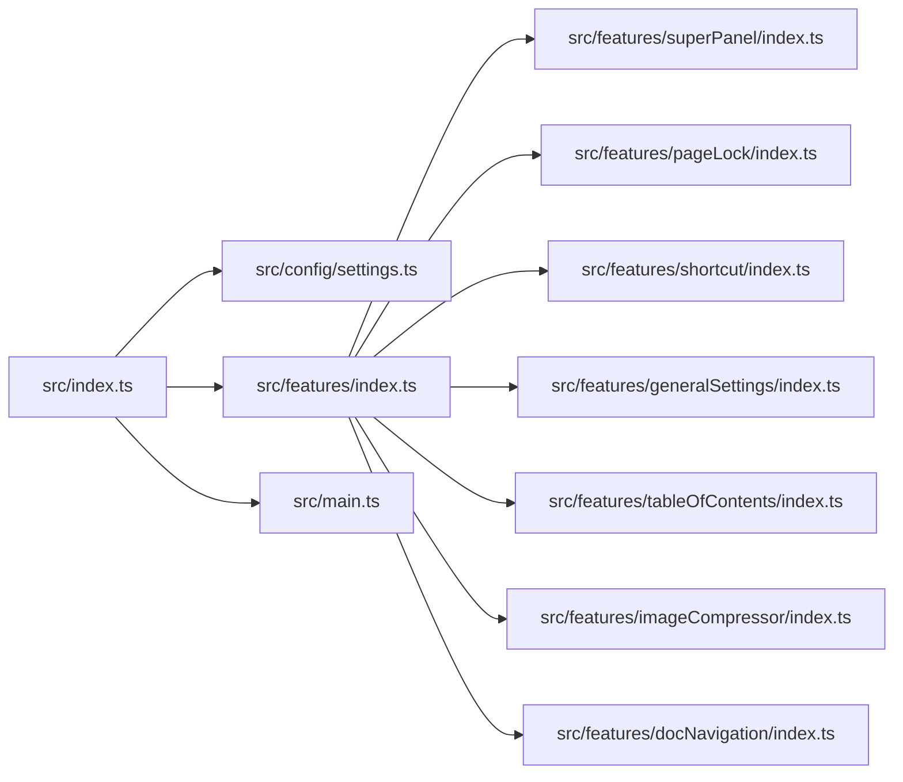

# 功能注册流程

<cite>
**本文引用的文件**
- [src/index.ts](file://src/index.ts)
- [src/features/index.ts](file://src/features/index.ts)
- [src/features/superPanel/index.ts](file://src/features/superPanel/index.ts)
- [src/features/pageLock/index.ts](file://src/features/pageLock/index.ts)
- [src/features/shortcut/index.ts](file://src/features/shortcut/index.ts)
- [src/features/generalSettings/index.ts](file://src/features/generalSettings/index.ts)
- [src/features/tableOfContents/index.ts](file://src/features/tableOfContents/index.ts)
- [src/features/imageCompressor/index.ts](file://src/features/imageCompressor/index.ts)
- [src/features/docNavigation/index.ts](file://src/features/docNavigation/index.ts)
- [src/main.ts](file://src/main.ts)
- [src/config/settings.ts](file://src/config/settings.ts)
- [src/types/index.d.ts](file://src/types/index.d.ts)
- [plugin.json](file://plugin.json)
</cite>

## 目录
1. [简介](#简介)
2. [项目结构](#项目结构)
3. [核心组件](#核心组件)
4. [架构总览](#架构总览)
5. [详细组件分析](#详细组件分析)
6. [依赖关系分析](#依赖关系分析)
7. [性能考量](#性能考量)
8. [故障排查指南](#故障排查指南)
9. [结论](#结论)

## 简介
本文件系统性阐述插件在 onload 生命周期内的功能注册流程，重点覆盖：
- onload 调用时机与执行上下文
- registerFeatures 的调用与执行顺序
- registerSuperPanel 作为“始终启用”的统一入口设计原理
- 各功能模块（如 registerPageLock、registerShortcut 等）基于配置的条件注册机制
- 异步注册流程（如 await registerShortcut(this)）
- registerX 函数接收插件实例的目的与绑定方式
- 关键日志输出在调试中的作用

## 项目结构
插件采用“功能模块化 + 统一入口”的组织方式：
- 插件主类位于 src/index.ts，负责生命周期与功能注册
- 功能模块集中于 src/features 下，每个模块提供 registerX 函数
- 功能模块统一导出于 src/features/index.ts
- 插件初始化与挂载位于 src/main.ts
- 配置模型与默认值位于 src/config/settings.ts
- 类型声明位于 src/types/index.d.ts

图表来源
- [src/index.ts](file://src/index.ts#L1-L140)
- [src/features/index.ts](file://src/features/index.ts#L1-L15)
- [src/main.ts](file://src/main.ts#L1-L45)
- [src/config/settings.ts](file://src/config/settings.ts#L1-L141)
- [plugin.json](file://plugin.json#L1-L34)

章节来源
- [src/index.ts](file://src/index.ts#L1-L140)
- [src/features/index.ts](file://src/features/index.ts#L1-L15)
- [src/main.ts](file://src/main.ts#L1-L45)
- [src/config/settings.ts](file://src/config/settings.ts#L1-L141)
- [plugin.json](file://plugin.json#L1-L34)

## 核心组件
- 插件主类（继承自 siyuan.Plugin）：在 onload 中完成平台探测、配置加载、功能注册与初始化挂载
- 功能模块注册器：每个模块提供 registerX(plugin) 函数，接收插件实例并将其能力绑定到思源环境
- 统一入口（超级面板）：始终启用，提供统一的功能入口与快捷操作
- 配置系统：基于 DEFAULT_SETTINGS 的布尔开关控制各模块是否注册

章节来源
- [src/index.ts](file://src/index.ts#L1-L140)
- [src/config/settings.ts](file://src/config/settings.ts#L1-L141)

## 架构总览
插件启动的关键序列如下：
1. onload 生命周期被触发
2. 平台与运行环境探测
3. 加载配置（loadSettings）
4. 调用 registerFeatures
5. 按配置条件逐一注册各功能模块
6. 初始化挂载（init）

图表来源
- [src/index.ts](file://src/index.ts#L39-L126)
- [src/features/index.ts](file://src/features/index.ts#L1-L15)
- [src/main.ts](file://src/main.ts#L21-L38)

## 详细组件分析

### onload 与 registerFeatures 执行时机与上下文
- onload 在插件加载完成后由思源调用，此时插件实例已具备 siyuan 环境能力（如 getFrontend、addTopBar、addCommand、eventBus 等）
- 插件主类在 onload 中完成：
  - 平台与运行环境探测（移动端、浏览器、本地、Electron、窗口模式）
  - 加载配置（loadSettings），得到包含各功能开关的 settings 对象
  - 调用 registerFeatures 进行模块注册
  - 最后调用 init(this) 完成 Vue 应用挂载与基础样式设置

章节来源
- [src/index.ts](file://src/index.ts#L39-L76)
- [src/config/settings.ts](file://src/config/settings.ts#L69-L96)
- [src/main.ts](file://src/main.ts#L21-L38)

### registerSuperPanel：始终启用的统一入口
- 设计目的：提供统一的功能入口与快捷操作，贯穿所有功能模块
- 实现要点：
  - 在顶部栏添加图标按钮（右侧），点击切换超级面板
  - 注册快捷键命令，支持通过快捷键快速打开
  - 通过 Vue 应用渲染 SuperPanelView，传递 settings、i18n、回调等
  - 通过自定义事件分发到具体功能（如插入索引、打开压缩器等）

图表来源
- [src/features/superPanel/index.ts](file://src/features/superPanel/index.ts#L17-L83)

章节来源
- [src/features/superPanel/index.ts](file://src/features/superPanel/index.ts#L17-L83)

### 条件注册：registerPageLock/registerTableOfContents/registerImageCompressor/registerDocNavigation/registerShortcut/registerGeneralSettings 等
- 注册策略：基于 settings.enableX 开关逐项判断，满足条件才调用对应 registerX(plugin)
- 特殊处理：registerShortcut 返回 Promise，因此在调用处使用 await，确保快捷键面板初始化完成后再继续

```mermaid
flowchart TD
Start(["registerFeatures()"]) --> SuperPanel["always: registerSuperPanel(this)"]
SuperPanel --> CheckPageLock{"settings.enablePageLock ?"}
CheckPageLock -- 是 --> RegPageLock["registerPageLock(this)"]
CheckPageLock -- 否 --> Next1["跳过"]
RegPageLock --> Next1
Next1 --> CheckTOC{"settings.enableTableOfContents ?"}
CheckTOC -- 是 --> RegTOC["registerTableOfContents(this)"]
CheckTOC -- 否 --> Next2["跳过"]
RegTOC --> Next2
Next2 --> CheckImg{"settings.enableImageCompressor ?"}
CheckImg -- 是 --> RegImg["registerImageCompressor(this)"]
CheckImg -- 否 --> Next3["跳过"]
RegImg --> Next3
Next3 --> CheckNav{"settings.enableDocNavigation ?"}
CheckNav -- 是 --> RegNav["registerDocNavigation(this)"]
CheckNav -- 否 --> Next4["跳过"]
RegNav --> Next4
Next4 --> CheckShort{"settings.enableShortcuts ?"}
CheckShort -- 是 --> AwaitShort["await registerShortcut(this)"]
CheckShort -- 否 --> Next5["跳过"]
AwaitShort --> Next5
Next5 --> CheckWord{"settings.enableWordQuery ?"}
CheckWord -- 是 --> RegWord["registerWordQuery(this)"]
CheckWord -- 否 --> Next6["跳过"]
RegWord --> Next6
Next6 --> CheckGen{"settings.enableGeneralSettings ?"}
CheckGen -- 是 --> RegGen["registerGeneralSettings(this)"]
CheckGen -- 否 --> Next7["跳过"]
RegGen --> Next7
Next7 --> CheckQR{"settings.enableQRCode ?"}
CheckQR -- 是 --> RegQR["registerQRCode(this)"]
CheckQR -- 否 --> Next8["跳过"]
RegQR --> Next8
Next8 --> CheckUnit{"settings.enableUnitConverter ?"}
CheckUnit -- 是 --> RegUnit["registerUnitConverter(this)"]
CheckUnit -- 否 --> Next9["跳过"]
RegUnit --> Next9
Next9 --> CheckDisk{"settings.enableDiskBrowser ?"}
CheckDisk -- 是 --> RegDisk["registerDiskBrowser(this)"]
CheckDisk -- 否 --> End(["完成"])
RegDisk --> End
```

图表来源
- [src/index.ts](file://src/index.ts#L80-L126)
- [src/features/index.ts](file://src/features/index.ts#L1-L15)

章节来源
- [src/index.ts](file://src/index.ts#L80-L126)

### registerShortcut 的异步处理机制
- registerShortcut 返回 Promise，内部完成：
  - 初始化快捷键管理器
  - 添加系统与插件内置快捷键
  - 加载自定义快捷键并持久化
  - 注册右侧 Dock 面板
- 调用方使用 await，确保快捷键面板在后续交互中可用

图表来源
- [src/features/shortcut/index.ts](file://src/features/shortcut/index.ts#L16-L41)
- [src/features/shortcut/index.ts](file://src/features/shortcut/index.ts#L263-L300)

章节来源
- [src/features/shortcut/index.ts](file://src/features/shortcut/index.ts#L16-L41)
- [src/features/shortcut/index.ts](file://src/features/shortcut/index.ts#L263-L300)

### registerPageLock：文档锁定与拦截
- 注册阶段：
  - 初始化存储与全局密码
  - 监听文档切换/加载事件，动态更新锁定按钮
  - 在文档树加载时拦截已锁定文档的显示
- 运行阶段：
  - 顶部标题栏注入锁定/解锁按钮
  - 通过遮罩层与样式控制锁定态 UI
  - 与通用设置联动（全局密码设置/更新）

图表来源
- [src/features/pageLock/index.ts](file://src/features/pageLock/index.ts#L71-L118)

章节来源
- [src/features/pageLock/index.ts](file://src/features/pageLock/index.ts#L71-L118)

### registerGeneralSettings：通用设置与事件广播
- 注册阶段：
  - 添加右侧 Dock 面板
  - 应用已保存的字体与代码块样式
  - 监听打开工作区与关闭所有页签事件
- 运行阶段：
  - 通过自定义事件向其他模块广播设置变更
  - 支持重置字体设置与恢复原生样式

章节来源
- [src/features/generalSettings/index.ts](file://src/features/generalSettings/index.ts#L1-L120)
- [src/features/generalSettings/index.ts](file://src/features/generalSettings/index.ts#L120-L213)
- [src/features/generalSettings/index.ts](file://src/features/generalSettings/index.ts#L214-L272)

### 其他模块（简述）
- registerTableOfContents：注册插入索引/引用/大纲的快捷键命令
- registerImageCompressor：注册打开图片压缩器的快捷键命令并通过全局事件触发
- registerDocNavigation：监听文档事件，动态注入层级导航 UI 并注入样式

章节来源
- [src/features/tableOfContents/index.ts](file://src/features/tableOfContents/index.ts#L1-L46)
- [src/features/imageCompressor/index.ts](file://src/features/imageCompressor/index.ts#L1-L31)
- [src/features/docNavigation/index.ts](file://src/features/docNavigation/index.ts#L1-L33)

## 依赖关系分析
- 插件主类依赖：
  - 配置系统（DEFAULT_SETTINGS、loadSettings/saveSettings）
  - 功能模块统一导出（features/index.ts）
  - 初始化挂载（main.ts）
- 功能模块依赖：
  - siyuan.Plugin API（addTopBar、addCommand、addDock、eventBus、saveData/loadData 等）
  - Vue（createApp、h 等）
  - 自定义工具（如图标替换、样式注入）
- 配置模型：
  - PluginSettings 接口定义各功能开关字段
  - DEFAULT_SETTINGS 提供默认值，loadSettings 合并持久化配置

图表来源
- [src/index.ts](file://src/index.ts#L1-L140)
- [src/features/index.ts](file://src/features/index.ts#L1-L15)
- [src/config/settings.ts](file://src/config/settings.ts#L1-L141)
- [src/main.ts](file://src/main.ts#L1-L45)

章节来源
- [src/index.ts](file://src/index.ts#L1-L140)
- [src/features/index.ts](file://src/features/index.ts#L1-L15)
- [src/config/settings.ts](file://src/config/settings.ts#L1-L141)

## 性能考量
- 防抖与去重：
  - 文档层级导航使用防抖（约 100ms）减少频繁 DOM 更新
  - processedDocs 集合避免同一文档重复处理
- 数据访问优化：
  - 一次性查询父/子文档，减少多次 API 调用
  - SQL 查询中使用 UNION 降低往返次数
- UI 注入策略：
  - 样式注入通过唯一 styleId 避免重复注入
  - DOM 操作尽量局部化，减少全局重绘

章节来源
- [src/features/docNavigation/index.ts](file://src/features/docNavigation/index.ts#L96-L134)
- [src/features/docNavigation/index.ts](file://src/features/docNavigation/index.ts#L135-L170)
- [src/features/docNavigation/index.ts](file://src/features/docNavigation/index.ts#L293-L303)

## 故障排查指南
- 关键日志定位：
  - “注册超级面板”：确认 registerSuperPanel 已执行
  - “注册页面锁定功能”、“注册目录插件功能”、“注册图片压缩功能”、“注册文档层级导航功能”、“注册快捷键模块”、“注册单词查询功能”、“注册通用设置功能”、“注册二维码生成功能”、“注册单位转换功能”、“注册本地磁盘浏览器功能”
- 常见问题：
  - enableShortcuts 未开启导致快捷键面板未出现：检查 settings.enableShortcuts
  - 页面锁定未生效：确认全局密码已设置；检查文档树事件监听与拦截逻辑
  - 文档层级导航不显示：确认当前文档存在父子关系；检查防抖与 processedDocs 逻辑
  - 通用设置样式未应用：检查 applySavedSettings 与 applyGlobalFontStyles 的执行顺序

章节来源
- [src/index.ts](file://src/index.ts#L80-L126)
- [src/features/pageLock/index.ts](file://src/features/pageLock/index.ts#L71-L118)
- [src/features/docNavigation/index.ts](file://src/features/docNavigation/index.ts#L135-L170)
- [src/features/generalSettings/index.ts](file://src/features/generalSettings/index.ts#L1-L120)

## 结论
本插件通过“统一入口 + 条件注册”的设计，在 onload 生命周期内完成平台探测、配置加载与功能装配。registerSuperPanel 作为始终启用的统一入口，确保用户始终能访问所有功能；其余功能模块基于配置开关按需注册，registerShortcut 的异步处理保证了快捷键面板的稳定初始化。通过日志输出与模块化结构，开发者能够清晰追踪注册流程并快速定位问题。