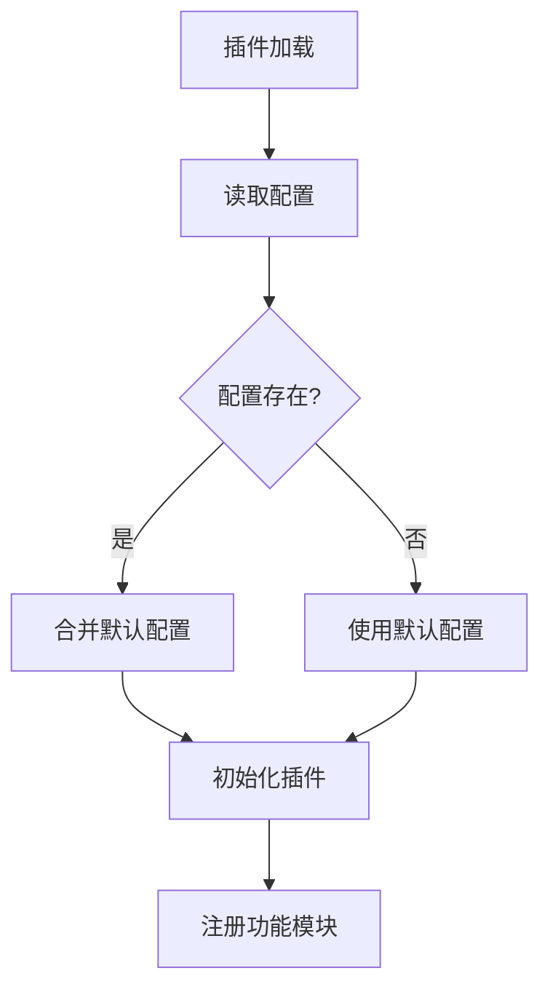
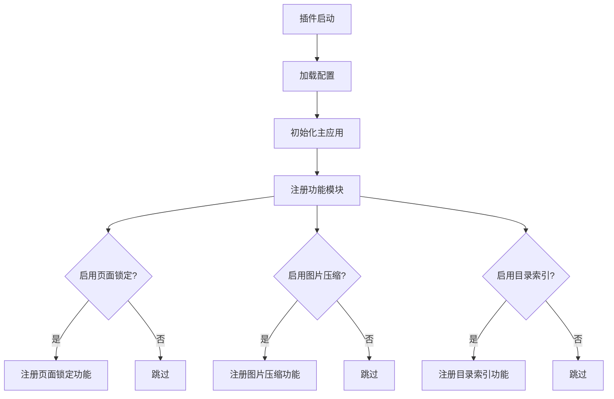
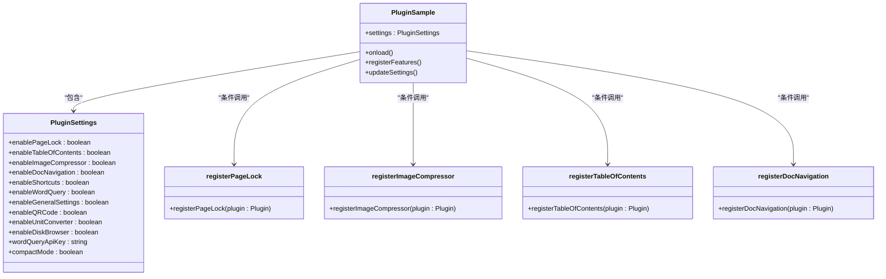
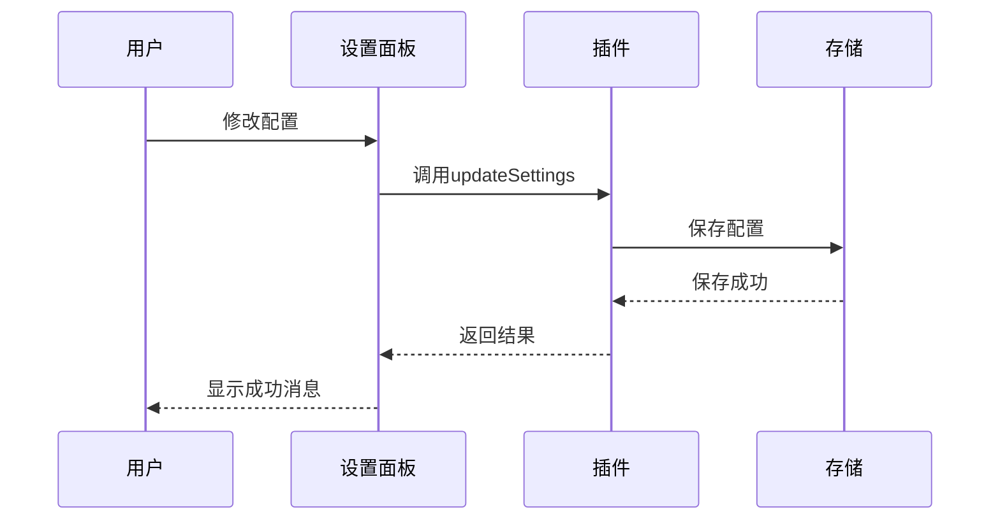
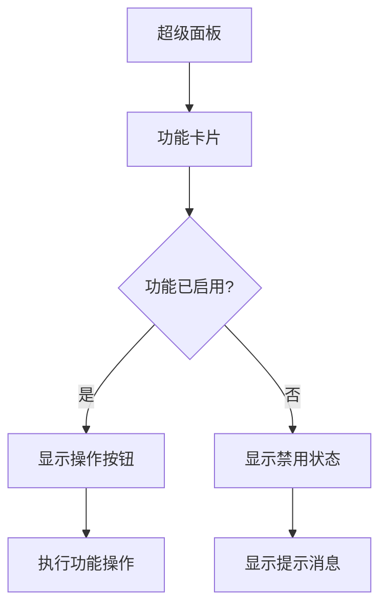

# 条件注册策略

<cite>
**本文档引用文件**   
- [settings.ts](file://src/config/settings.ts)
- [index.ts](file://src/index.ts)
- [main.ts](file://src/main.ts)
- [App.vue](file://src/App.vue)
- [FeatureCard.vue](file://src/features/superPanel/components/FeatureCard.vue)
- [SuperPanelView.vue](file://src/features/superPanel/SuperPanelView.vue)
- [pageLock/index.ts](file://src/features/pageLock/index.ts)
- [imageCompressor/index.ts](file://src/features/imageCompressor/index.ts)
- [tableOfContents/index.ts](file://src/features/tableOfContents/index.ts)
- [docNavigation/index.ts](file://src/features/docNavigation/index.ts)
</cite>

## 目录
1. [简介](#简介)
2. [配置驱动架构](#配置驱动架构)
3. [核心配置机制](#核心配置机制)
4. [功能模块注册流程](#功能模块注册流程)
5. [条件注册实现分析](#条件注册实现分析)
6. [配置变更与热加载](#配置变更与热加载)
7. [性能优化优势](#性能优化优势)
8. [用户界面集成](#用户界面集成)
9. [总结](#总结)

## 简介
本插件采用基于配置的功能启用机制，通过布尔型配置字段控制各个功能模块的动态加载与运行。这种设计实现了插件的轻量化运行和资源优化，确保未启用的功能不会产生任何性能开销。插件在启动时根据配置状态决定是否注册特定功能，从而实现了高度灵活和可定制的架构。

## 配置驱动架构
插件采用配置驱动的架构设计，将功能模块的启用状态与配置系统深度集成。通过`PluginSettings`接口定义的布尔字段，如`enablePageLock`、`enableImageCompressor`等，控制着各个功能模块的生命周期。这种设计模式使得插件能够根据用户的实际需求动态调整其行为，避免了不必要的资源消耗。

**Section sources**
- [settings.ts](file://src/config/settings.ts#L9-L20)
- [index.ts](file://src/index.ts#L37-L38)

## 核心配置机制
插件的核心配置机制基于`PluginSettings`接口和`DEFAULT_SETTINGS`常量。`PluginSettings`接口定义了所有可配置的功能选项，每个选项都是一个布尔值，用于控制对应功能的启用状态。`DEFAULT_SETTINGS`提供了这些配置项的默认值，确保插件在首次安装时具有合理的默认行为。

配置数据通过`loadSettings`和`saveSettings`函数进行持久化存储，使用插件提供的`plugin.loadData`和`plugin.saveData`方法将配置保存在本地存储中。这种机制保证了配置的持久性和可靠性。

**Diagram sources**
- [settings.ts](file://src/config/settings.ts#L69-L96)
- [index.ts](file://src/index.ts#L59-L64)

**Section sources**
- [settings.ts](file://src/config/settings.ts#L9-L50)

## 功能模块注册流程
插件的功能模块注册流程在`onload`生命周期方法中执行。首先加载用户配置，然后调用`registerFeatures`方法，该方法根据配置中的布尔值决定是否注册相应的功能模块。每个功能模块都有一个对应的注册函数，如`registerPageLock`、`registerImageCompressor`等，这些函数只在对应配置项为`true`时才会被调用。

这种条件注册模式确保了只有用户启用的功能才会被加载和初始化，大大减少了内存占用和启动时间。未启用的功能模块完全不会执行任何代码，实现了真正的按需加载。

**Diagram sources**
- [index.ts](file://src/index.ts#L59-L65)
- [index.ts](file://src/index.ts#L80-L126)

**Section sources**
- [index.ts](file://src/index.ts#L59-L126)

## 条件注册实现分析
条件注册的实现基于简单的if语句判断配置项的布尔值。例如，在`registerFeatures`方法中，通过`if (this.settings.enableImageCompressor)`判断是否启用图片压缩功能，如果为`true`则调用`registerImageCompressor(this)`进行注册。这种模式简单而有效，易于理解和维护。

每个功能模块的注册函数负责设置该功能所需的所有资源，包括事件监听器、UI组件、快捷键等。当配置项为`false`时，这些资源完全不会被创建，从而避免了任何性能开销。这种设计体现了"关注点分离"的原则，每个功能模块独立管理自己的初始化逻辑。

**Diagram sources**
- [index.ts](file://src/index.ts#L85-L101)
- [pageLock/index.ts](file://src/features/pageLock/index.ts#L74-L113)
- [imageCompressor/index.ts](file://src/features/imageCompressor/index.ts#L9-L20)
- [tableOfContents/index.ts](file://src/features/tableOfContents/index.ts#L11-L14)
- [docNavigation/index.ts](file://src/features/docNavigation/index.ts#L16-L32)

**Section sources**
- [index.ts](file://src/index.ts#L80-L126)

## 配置变更与热加载
配置变更通过`updateSettings`方法实现，该方法接收新的配置对象并将其保存到持久化存储中。虽然当前实现需要重启插件才能使配置完全生效，但部分功能支持热加载。例如，紧凑模式在配置变更后立即应用，通过修改DOM类名来即时改变界面样式。

配置变更的处理流程包括：更新内存中的配置对象、保存到持久化存储、通知相关组件更新状态。这种机制确保了配置的一致性和可靠性。未来可以通过事件系统实现更完善的热加载功能，使所有配置变更都能即时生效而无需重启。

**Diagram sources**
- [index.ts](file://src/index.ts#L131-L138)
- [App.vue](file://src/App.vue#L55-L64)
- [SettingPanel.vue](file://src/components/SettingPanel.vue#L213-L219)

**Section sources**
- [index.ts](file://src/index.ts#L131-L138)
- [App.vue](file://src/App.vue#L55-L64)

## 性能优化优势
基于配置的功能启用机制带来了显著的性能优化优势。首先，它实现了真正的按需加载，只有启用的功能才会消耗系统资源。其次，它减少了插件的启动时间，因为不需要初始化未使用的功能模块。最后，它降低了内存占用，提高了整体系统性能。

这种设计特别适合功能丰富的插件，因为它允许用户根据自己的需求定制插件行为，避免了"功能臃肿"的问题。对于只需要少数功能的用户，插件可以保持轻量化运行；对于需要全部功能的用户，插件也能提供完整的能力。

**Section sources**
- [index.ts](file://src/index.ts#L80-L126)
- [settings.ts](file://src/config/settings.ts#L37-L49)

## 用户界面集成
插件通过超级面板（Super Panel）将所有功能集成到统一的用户界面中。超级面板始终启用，作为所有功能的统一入口。在超级面板中，每个功能的状态（启用/禁用）通过`FeatureCard`组件的`enabled`属性反映，该属性直接绑定到配置中的对应布尔值。

当用户尝试使用未启用的功能时，系统会显示友好的提示消息，引导用户前往设置页面启用相应功能。这种设计既保持了界面的完整性，又清晰地传达了功能的可用状态，提供了良好的用户体验。

**Diagram sources**
- [SuperPanelView.vue](file://src/features/superPanel/SuperPanelView.vue#L69-L87)
- [FeatureCard.vue](file://src/features/superPanel/components/FeatureCard.vue#L53-L57)

**Section sources**
- [SuperPanelView.vue](file://src/features/superPanel/SuperPanelView.vue#L69-L87)
- [FeatureCard.vue](file://src/features/superPanel/components/FeatureCard.vue#L4-L18)

## 总结
基于配置的功能启用机制是一种高效、灵活的设计模式，它通过布尔型配置字段控制功能模块的动态加载。这种设计实现了插件的轻量化运行和资源优化，避免了未启用功能的性能开销。通过`PluginSettings`接口定义配置项，`DEFAULT_SETTINGS`提供默认值，`loadSettings`和`saveSettings`处理持久化，以及`updateSettings`方法同步状态，插件构建了一个完整、可靠的配置管理系统。

条件注册策略不仅提高了性能，还增强了用户体验，使用户能够根据自己的需求定制插件功能。未来可以进一步完善热加载机制，使配置变更能够即时生效，提供更加流畅的使用体验。