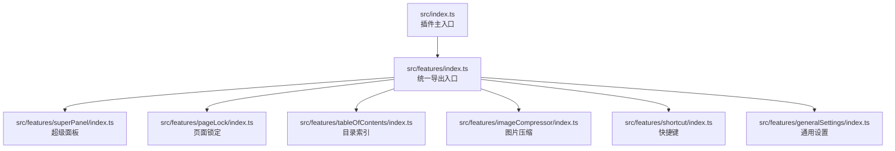
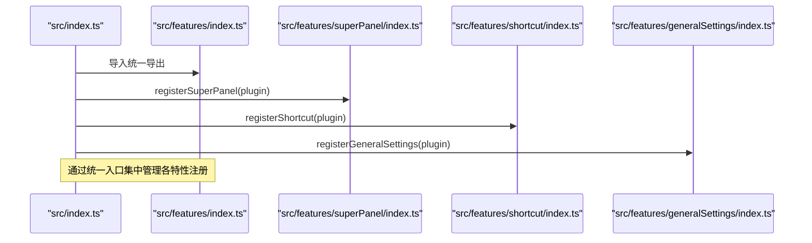
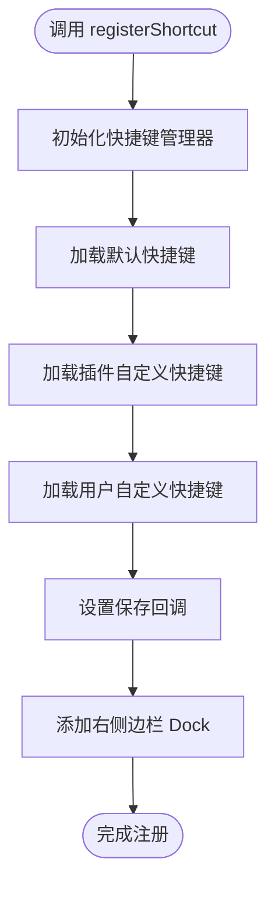
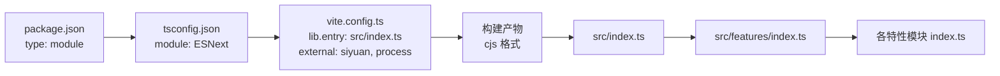

# 模块导出机制

<cite>
**本文引用的文件**
- [src/features/index.ts](file://src/features/index.ts)
- [src/index.ts](file://src/index.ts)
- [src/features/shortcut/index.ts](file://src/features/shortcut/index.ts)
- [src/features/generalSettings/index.ts](file://src/features/generalSettings/index.ts)
- [src/features/superPanel/index.ts](file://src/features/superPanel/index.ts)
- [src/features/pageLock/index.ts](file://src/features/pageLock/index.ts)
- [src/features/tableOfContents/index.ts](file://src/features/tableOfContents/index.ts)
- [src/features/imageCompressor/index.ts](file://src/features/imageCompressor/index.ts)
- [vite.config.ts](file://vite.config.ts)
- [package.json](file://package.json)
- [tsconfig.json](file://tsconfig.json)
</cite>

## 目录
1. [简介](#简介)
2. [项目结构](#项目结构)
3. [核心组件](#核心组件)
4. [架构总览](#架构总览)
5. [详细组件分析](#详细组件分析)
6. [依赖分析](#依赖分析)
7. [性能考量](#性能考量)
8. [故障排查指南](#故障排查指南)
9. [结论](#结论)
10. [附录](#附录)

## 简介
本文件围绕 src/features/index.ts 的统一导出模式展开，系统阐述其如何通过 export { registerX } from './featureName' 的形式实现功能模块的集中管理与解耦；说明该设计如何简化 src/index.ts 中的导入语句，提升代码可维护性；结合具体示例（如 export { registerShortcut, addCustomShortcut, addCustomShortcuts, getShortcutManager, type ShortcutInfo }），解释命名导出的灵活性与对 API 暴露的控制能力；并讨论该机制如何支持 Tree-shaking 优化，减少最终打包体积；最后强调统一入口对新开发者理解项目结构的帮助，并给出最佳实践建议。

## 项目结构
- 功能模块按特性分层组织于 src/features 下，每个特性目录包含自身的 index.ts 作为该特性的统一入口。
- src/features/index.ts 作为“功能模块统一导出”入口，聚合各特性模块的导出项，形成对外统一的 API。
- src/index.ts 作为插件主入口，通过从 src/features 导入统一导出，集中注册各功能模块。

图表来源
- [src/index.ts](file://src/index.ts#L1-L140)
- [src/features/index.ts](file://src/features/index.ts#L1-L15)
- [src/features/superPanel/index.ts](file://src/features/superPanel/index.ts#L1-L138)
- [src/features/pageLock/index.ts](file://src/features/pageLock/index.ts#L1-L573)
- [src/features/tableOfContents/index.ts](file://src/features/tableOfContents/index.ts#L1-L410)
- [src/features/imageCompressor/index.ts](file://src/features/imageCompressor/index.ts#L1-L31)
- [src/features/shortcut/index.ts](file://src/features/shortcut/index.ts#L1-L326)
- [src/features/generalSettings/index.ts](file://src/features/generalSettings/index.ts#L1-L414)

章节来源
- [src/index.ts](file://src/index.ts#L1-L140)
- [src/features/index.ts](file://src/features/index.ts#L1-L15)

## 核心组件
- 统一导出入口：src/features/index.ts 将各特性模块的注册函数与工具函数集中导出，形成稳定的外部 API。
- 特性模块：每个特性模块在其 index.ts 中定义 registerX 函数以及必要的工具函数/类型，供统一入口再导出。
- 主入口使用：src/index.ts 从 src/features 导入统一导出，按配置条件注册各功能模块。

章节来源
- [src/features/index.ts](file://src/features/index.ts#L1-L15)
- [src/index.ts](file://src/index.ts#L1-L140)

## 架构总览
统一导出模式的核心价值在于：
- 解耦：特性模块内部实现细节被封装在各自 index.ts 中，外部仅依赖统一导出。
- 简化：主入口只需从统一入口导入，避免分散的相对路径导入。
- 控制：通过统一入口决定导出哪些 API，便于版本演进与兼容性管理。
- 可维护：新增/移除特性只需修改统一入口，不影响主入口调用方。

图表来源
- [src/index.ts](file://src/index.ts#L1-L140)
- [src/features/index.ts](file://src/features/index.ts#L1-L15)
- [src/features/superPanel/index.ts](file://src/features/superPanel/index.ts#L1-L138)
- [src/features/shortcut/index.ts](file://src/features/shortcut/index.ts#L1-L326)
- [src/features/generalSettings/index.ts](file://src/features/generalSettings/index.ts#L1-L414)

## 详细组件分析

### 统一导出入口：src/features/index.ts
- 设计要点
  - 使用命名导出（export { ... } from '...') 将各特性模块的注册函数与工具函数重新导出，形成稳定 API。
  - 通过集中导出，主入口 src/index.ts 的导入语句简洁清晰，仅需一行导入所有特性注册函数。
  - 支持导出类型声明（type X from '.../types'），便于上层使用类型约束。
- 示例参考
  - 快捷键模块导出：registerShortcut、addCustomShortcut、addCustomShortcuts、getShortcutManager、类型 ShortcutInfo。
  - 通用设置模块导出：registerGeneralSettings。
  - 其他模块导出：registerPageLock、registerTableOfContents、registerImageCompressor、registerDocNavigation、registerWordQuery、registerQRCode、registerUnitConverter、registerSuperPanel、registerDiskBrowser。

章节来源
- [src/features/index.ts](file://src/features/index.ts#L1-L15)

### 主入口：src/index.ts 如何受益于统一导出
- 导入简化：从 '@/features' 一次性导入所有 registerX，避免在主入口中维护大量分散的导入语句。
- 条件注册：基于配置开关按需注册特性，统一入口保证了注册调用的一致性与可扩展性。
- 可维护性：新增特性只需在统一入口添加导出，主入口无需改动或仅少量改动。

章节来源
- [src/index.ts](file://src/index.ts#L1-L140)

### 快捷键模块：命名导出的灵活性与 API 控制
- 命名导出的灵活性
  - registerShortcut：注册快捷键模块，负责初始化管理器、加载默认快捷键、挂载侧边栏 Dock。
  - addCustomShortcut / addCustomShortcuts：向管理器添加自定义快捷键，暴露易用的工具函数。
  - getShortcutManager：获取管理器实例，便于外部扩展与集成。
  - 类型导出：ShortcutInfo、ShortcutGroup 等类型，限制外部使用范围，增强类型安全。
- API 暴露控制
  - 仅导出必要的函数与类型，隐藏内部实现细节（如 manager.ts、storage.ts、types.ts）。
  - 通过统一入口集中管理导出，避免特性内部直接被外部依赖，降低耦合度。

图表来源
- [src/features/shortcut/index.ts](file://src/features/shortcut/index.ts#L1-L326)

章节来源
- [src/features/shortcut/index.ts](file://src/features/shortcut/index.ts#L1-L326)

### 通用设置模块：注册函数与实例管理
- registerGeneralSettings：创建并初始化 GeneralSettings 实例，挂载右侧边栏 Dock，应用已保存设置。
- 通过统一入口导出，主入口可按需注册，且实例可复用（例如在其他模块中访问）。

章节来源
- [src/features/generalSettings/index.ts](file://src/features/generalSettings/index.ts#L1-L414)

### 超级面板模块：统一入口的典型用法
- registerSuperPanel：在顶部栏添加入口图标与快捷键，打开 Vue 面板，统一调度各功能动作。
- 该模块始终启用，体现统一入口对“必须启用”的功能的集中管理能力。

章节来源
- [src/features/superPanel/index.ts](file://src/features/superPanel/index.ts#L1-L138)

### 页面锁定模块：事件驱动与 DOM 交互
- registerPageLock：监听文档切换与加载事件，动态注入锁定按钮，拦截锁定页面内容，提供解锁流程。
- 通过统一入口导出，主入口可按配置开关注册。

章节来源
- [src/features/pageLock/index.ts](file://src/features/pageLock/index.ts#L1-L573)

### 目录索引模块：命令注册与内容生成
- registerTableOfContents：注册多个快捷键命令，根据当前光标位置与文档上下文生成索引、引用或大纲内容。
- 通过统一入口导出，主入口可按配置开关注册。

章节来源
- [src/features/tableOfContents/index.ts](file://src/features/tableOfContents/index.ts#L1-L410)

### 图片压缩模块：命令触发与事件分发
- registerImageCompressor：注册快捷键命令，通过全局事件触发打开图片压缩器。
- 通过统一入口导出，主入口可按配置开关注册。

章节来源
- [src/features/imageCompressor/index.ts](file://src/features/imageCompressor/index.ts#L1-L31)

## 依赖分析
- 统一导出入口与特性模块
  - src/features/index.ts 仅负责 re-export，不引入特性内部实现，降低耦合。
  - 特性模块各自维护内部依赖（如 Vue、siyuan API、类型等），通过统一入口暴露必要 API。
- 主入口与统一入口
  - src/index.ts 仅依赖 src/features/index.ts 的导出，不关心具体实现细节，降低主入口复杂度。
- 构建与打包
  - vite.config.ts 将 src/index.ts 作为库入口，输出为 cjs 格式，external 排除 siyuan、process 等运行时依赖，有利于 Tree-shaking。
  - package.json 指定 type 为 module，tsconfig.json 使用 ESNext 模块解析，配合构建配置，有助于按需打包。

图表来源
- [package.json](file://package.json#L1-L46)
- [tsconfig.json](file://tsconfig.json#L1-L56)
- [vite.config.ts](file://vite.config.ts#L1-L157)
- [src/index.ts](file://src/index.ts#L1-L140)
- [src/features/index.ts](file://src/features/index.ts#L1-L15)

章节来源
- [vite.config.ts](file://vite.config.ts#L1-L157)
- [package.json](file://package.json#L1-L46)
- [tsconfig.json](file://tsconfig.json#L1-L56)

## 性能考量
- Tree-shaking 支持
  - 统一导出入口采用命名导出与 re-export，构建工具可识别未使用的导出，从而在打包阶段剔除未使用代码。
  - vite.config.ts 将 src/index.ts 作为库入口，external 排除 siyuan、process 等运行时依赖，避免将这些依赖打包进插件包，减少体积。
- 按需加载
  - 主入口按配置开关注册特性，未启用的特性不会被加载，进一步减少运行时开销。
- 最小化与压缩
  - 开发模式下可关闭压缩便于调试；生产模式下建议开启压缩与 Tree-shaking，以获得更小的包体积。

章节来源
- [vite.config.ts](file://vite.config.ts#L90-L156)
- [src/index.ts](file://src/index.ts#L1-L140)

## 故障排查指南
- 导入错误
  - 若主入口导入失败，请检查 src/features/index.ts 是否正确 re-export 了目标函数或类型。
- 运行时异常
  - 若某特性未生效，确认主入口的条件判断与配置项是否正确，以及该特性是否在统一入口中导出。
- 类型问题
  - 若使用了未导出的类型，请在统一入口补充类型导出，或在上层通过模块路径直接导入类型（不推荐）。

章节来源
- [src/features/index.ts](file://src/features/index.ts#L1-L15)
- [src/index.ts](file://src/index.ts#L1-L140)

## 结论
src/features/index.ts 的统一导出模式通过命名导出与 re-export，实现了功能模块的集中管理与解耦，显著简化了主入口的导入与注册逻辑，提升了可维护性与可扩展性。结合 vite 的 Tree-shaking 与 external 配置，该模式有效减少了最终打包体积。对于新开发者而言，统一入口提供了清晰的 API 边界与使用路径，降低了理解成本。建议在新增特性时遵循统一入口导出规范，并明确导出的 API 与类型，以保持一致的工程实践。

## 附录
- 最佳实践建议
  - 新增特性：在特性目录的 index.ts 中提供清晰的 registerX 函数与必要的工具函数/类型，然后在 src/features/index.ts 中集中 re-export。
  - API 控制：仅导出必要的函数与类型，隐藏内部实现细节，避免直接暴露内部模块。
  - 条件注册：在主入口按配置开关注册特性，确保未启用的特性不会被加载。
  - 类型管理：通过统一入口导出类型，避免上层直接依赖内部类型路径。
  - 构建优化：保持 external 配置与 Tree-shaking 开启，减少打包体积。