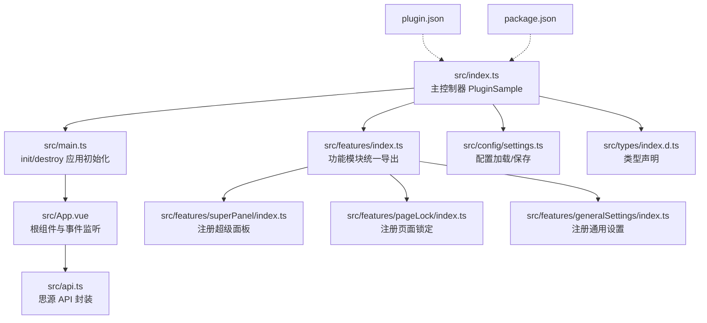
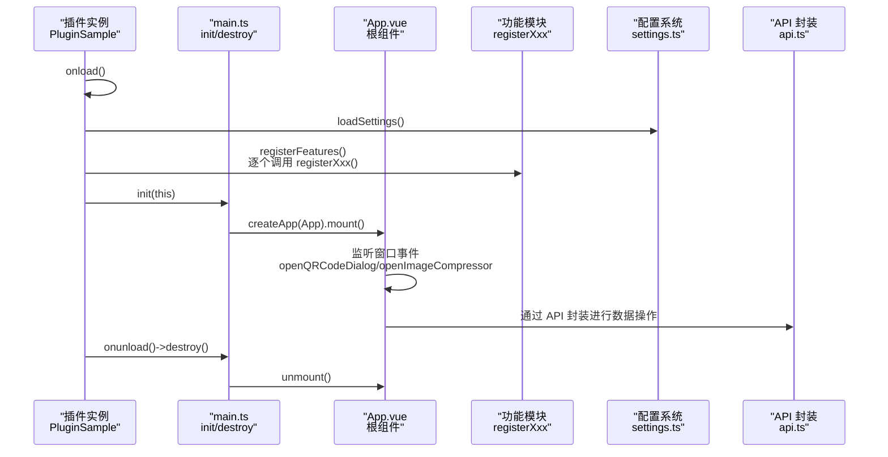
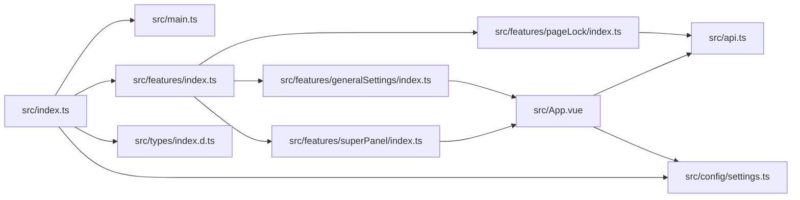
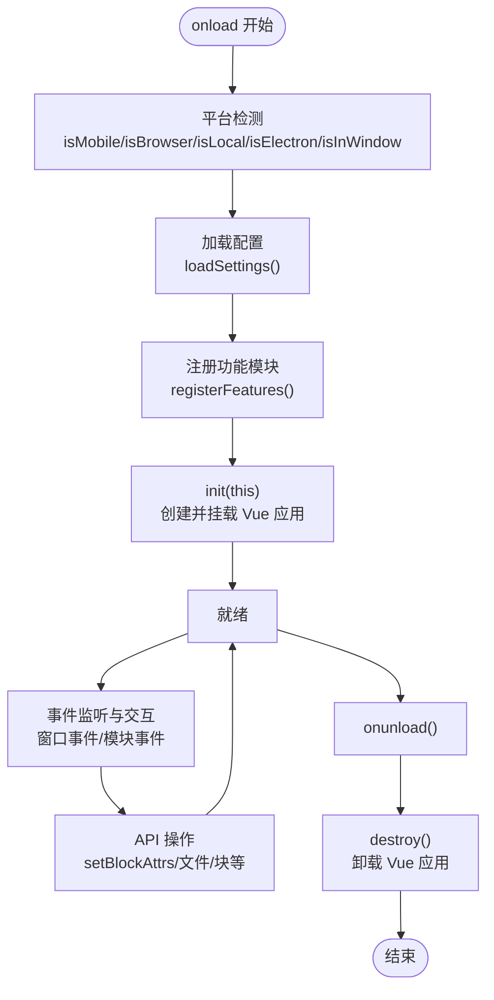
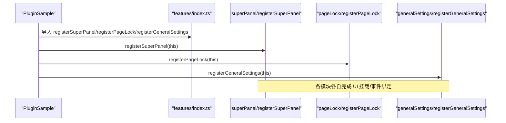

# 技术架构

<cite>
**本文引用的文件**
- [src/index.ts](file://src/index.ts)
- [src/main.ts](file://src/main.ts)
- [src/App.vue](file://src/App.vue)
- [src/features/index.ts](file://src/features/index.ts)
- [src/features/superPanel/index.ts](file://src/features/superPanel/index.ts)
- [src/features/pageLock/index.ts](file://src/features/pageLock/index.ts)
- [src/features/generalSettings/index.ts](file://src/features/generalSettings/index.ts)
- [src/api.ts](file://src/api.ts)
- [src/config/settings.ts](file://src/config/settings.ts)
- [src/types/index.d.ts](file://src/types/index.d.ts)
- [src/utils/index.ts](file://src/utils/index.ts)
- [plugin.json](file://plugin.json)
- [package.json](file://package.json)
</cite>

## 目录
1. [简介](#简介)
2. [项目结构](#项目结构)
3. [核心组件](#核心组件)
4. [架构总览](#架构总览)
5. [详细组件分析](#详细组件分析)
6. [依赖关系分析](#依赖关系分析)
7. [性能考量](#性能考量)
8. [故障排查指南](#故障排查指南)
9. [结论](#结论)
10. [附录](#附录)

## 简介
本项目采用 MVVM 架构与模块化设计，围绕插件生命周期（onload/onunload）组织功能模块，通过统一的主控制器协调各功能子模块，并以 Vue 应用承载视图层与交互逻辑。插件通过 src/index.ts 的 PluginSample 类作为主控制器，负责平台检测、配置加载、功能模块注册与卸载；通过 src/main.ts 的 init/destroy 函数完成 Vue 应用的挂载与卸载；通过 src/features/index.ts 实现功能模块的统一导出与注册机制。数据流从用户操作经事件总线传递到功能模块，最终与思源 API 交互，实现对笔记本、文档、块、属性等资源的操作。

## 项目结构
- 核心入口：src/index.ts（主控制器）
- 视图与应用：src/App.vue（根组件）、src/main.ts（应用初始化/卸载）
- 功能模块：src/features 下按功能拆分的模块，每个模块提供 registerXxx 导出函数
- 配置与类型：src/config/settings.ts（配置管理）、src/types/index.d.ts（类型声明）
- 工具与 API：src/utils/index.ts（通用工具）、src/api.ts（思源 API 封装）
- 插件元信息：plugin.json、package.json

图表来源
- [src/index.ts](file://src/index.ts#L1-L140)
- [src/main.ts](file://src/main.ts#L1-L45)
- [src/App.vue](file://src/App.vue#L1-L216)
- [src/features/index.ts](file://src/features/index.ts#L1-L15)
- [src/features/superPanel/index.ts](file://src/features/superPanel/index.ts#L1-L138)
- [src/features/pageLock/index.ts](file://src/features/pageLock/index.ts#L1-L573)
- [src/features/generalSettings/index.ts](file://src/features/generalSettings/index.ts#L1-L414)
- [src/api.ts](file://src/api.ts#L1-L496)
- [src/config/settings.ts](file://src/config/settings.ts#L1-L141)
- [src/types/index.d.ts](file://src/types/index.d.ts#L1-L142)
- [plugin.json](file://plugin.json#L1-L34)
- [package.json](file://package.json#L1-L46)

章节来源
- [src/index.ts](file://src/index.ts#L1-L140)
- [src/main.ts](file://src/main.ts#L1-L45)
- [src/features/index.ts](file://src/features/index.ts#L1-L15)
- [plugin.json](file://plugin.json#L1-L34)
- [package.json](file://package.json#L1-L46)

## 核心组件
- 主控制器 PluginSample（src/index.ts）
  - 负责平台检测、配置加载、功能模块注册、卸载清理
  - 提供 openSetting、updateSettings 等能力
- Vue 应用初始化/卸载（src/main.ts）
  - usePlugin：全局注入插件实例
  - init：创建并挂载根组件，支持紧凑模式
  - destroy：卸载并移除 DOM
- 根组件 App（src/App.vue）
  - 管理设置面板、图片压缩器、二维码对话框等
  - 通过事件总线与功能模块交互
- 功能模块统一导出（src/features/index.ts）
  - 汇聚各模块 registerXxx 方法，便于集中注册
- 配置管理（src/config/settings.ts）
  - 定义插件配置接口、默认值、加载/保存逻辑
- API 封装（src/api.ts）
  - 对思源 API 进行封装，提供笔记本、文档、块、属性、文件等常用操作

章节来源
- [src/index.ts](file://src/index.ts#L1-L140)
- [src/main.ts](file://src/main.ts#L1-L45)
- [src/App.vue](file://src/App.vue#L1-L216)
- [src/features/index.ts](file://src/features/index.ts#L1-L15)
- [src/config/settings.ts](file://src/config/settings.ts#L1-L141)
- [src/api.ts](file://src/api.ts#L1-L496)

## 架构总览
MVVM 架构要点：
- Model：配置与数据模型（settings、类型声明）
- View：Vue 组件（App.vue 及各功能模块的子组件）
- ViewModel：主控制器与应用初始化逻辑（PluginSample、main.ts）

模块化设计要点：
- 功能模块独立：每个功能模块提供 registerXxx，内部自行挂载 UI 或监听事件
- 统一导出：features/index.ts 汇聚导出，简化主控制器注册流程
- 生命周期：onload 注册，onunload 卸载，init/destroy 控制 Vue 应用

图表来源
- [src/index.ts](file://src/index.ts#L39-L71)
- [src/main.ts](file://src/main.ts#L21-L45)
- [src/App.vue](file://src/App.vue#L133-L149)
- [src/features/index.ts](file://src/features/index.ts#L1-L15)
- [src/config/settings.ts](file://src/config/settings.ts#L62-L96)
- [src/api.ts](file://src/api.ts#L1-L496)

## 详细组件分析

### 主控制器 PluginSample（src/index.ts）
职责与流程：
- 平台检测：根据前端类型、运行环境判断移动端/浏览器/本地/Electron 等
- 配置加载：加载插件配置并合并默认值
- 功能注册：按配置条件注册各功能模块（超级面板始终启用）
- 卸载清理：调用 destroy 卸载 Vue 应用
- 设置更新：保存新配置并返回结果

关键点：
- 平台判定与 isElectron 检测
- 配置加载/保存（settings.ts）
- 条件注册（features/index.ts 导出的 registerXxx）

章节来源
- [src/index.ts](file://src/index.ts#L39-L139)
- [src/config/settings.ts](file://src/config/settings.ts#L62-L96)
- [src/features/index.ts](file://src/features/index.ts#L1-L15)

### Vue 应用初始化（src/main.ts）
职责与流程：
- usePlugin：单例式注入插件实例，供组件层通过 usePlugin 获取
- init：创建根组件 App，注入紧凑模式样式，挂载到 body
- destroy：卸载并移除挂载节点

关键点：
- 紧凑模式样式注入（基于 settings.compactMode）
- 挂载节点命名与清理

章节来源
- [src/main.ts](file://src/main.ts#L1-L45)

### 根组件 App（src/App.vue）
职责与流程：
- 管理设置面板、图片压缩器、二维码对话框等
- 通过 window.addEventListener 监听事件，触发对应 UI 展示
- 通过 usePlugin 获取插件实例，调用 updateSettings 保存配置
- 暴露 window._sy_plugin_sample.openSetting/openQRCodeDialog

关键点：
- 事件监听与转发（openQRCodeDialog、openImageCompressor）
- 与插件设置联动（showSettings、pluginSettings）

章节来源
- [src/App.vue](file://src/App.vue#L1-L216)

### 功能模块统一导出（src/features/index.ts）
职责与流程：
- 汇聚各功能模块的 registerXxx 导出，便于主控制器集中注册
- 包含超级面板、页面锁定、通用设置、图片压缩、文档导航、快捷键、单词查询、二维码、单位转换、磁盘浏览器等

关键点：
- 通过 export { registerXxx } 形式统一导出
- 便于主控制器按需注册

章节来源
- [src/features/index.ts](file://src/features/index.ts#L1-L15)

### 超级面板（src/features/superPanel/index.ts）
职责与流程：
- 注册右上角顶部栏图标与快捷键
- 打开/关闭超级面板（Vue 应用挂载于 body）
- 处理功能动作（如插入索引、插入大纲、插入引用、打开图片压缩器），通过 window.dispatchEvent 分发命令或打开 UI

关键点：
- 顶部栏图标替换（使用图标库）
- 事件分发（executeCommand/openImageCompressor）

章节来源
- [src/features/superPanel/index.ts](file://src/features/superPanel/index.ts#L1-L138)

### 页面锁定（src/features/pageLock/index.ts）
职责与流程：
- 监听文档切换/加载事件，动态在标题栏右侧注入锁定按钮
- 通过 storage 记录锁定状态，拦截锁定文档内容显示
- 支持全局密码设置/更新/解锁，与 API 交互设置块属性
- 注入样式，保证与原生 UI 融合

关键点：
- 事件总线监听（switch-protyle/loaded-protyle-*）
- DOM 操作与遮罩层插入
- 与 api.setBlockAttrs 配合实现锁定标识

章节来源
- [src/features/pageLock/index.ts](file://src/features/pageLock/index.ts#L1-L573)
- [src/api.ts](file://src/api.ts#L284-L294)

### 通用设置（src/features/generalSettings/index.ts）
职责与流程：
- 注册右侧 Dock，渲染通用设置面板
- 应用字体/代码块样式到思源元素
- 监听工作区打开与关闭所有页签事件，执行相应操作
- 通过自定义事件向其他模块广播设置变更

关键点：
- Dock 初始化与 Vue 应用挂载
- 样式应用与重置逻辑
- 事件广播（general-settings-changed）

章节来源
- [src/features/generalSettings/index.ts](file://src/features/generalSettings/index.ts#L1-L414)

### 配置管理（src/config/settings.ts）
职责与流程：
- 定义插件配置接口与默认值
- 提供 loadSettings/saveSettings/loadFontSettings/saveFontSettings/resetFontSettings
- 与插件数据存储交互（plugin.loadData/saveData）

关键点：
- 默认配置与合并策略
- 字体设置本地存储

章节来源
- [src/config/settings.ts](file://src/config/settings.ts#L1-L141)

### API 封装（src/api.ts）
职责与流程：
- 对思源 API 进行封装，覆盖笔记本、文件树、块、属性、文件、SQL、模板、导出、转换、通知、网络、系统等接口
- 统一错误处理与返回格式

关键点：
- 基于 fetchSyncPost 的请求封装
- 针对不同 API 的参数与返回类型

章节来源
- [src/api.ts](file://src/api.ts#L1-L496)

### 类型声明（src/types/index.d.ts）
职责与流程：
- 定义常用类型（DocumentId、BlockId、NotebookId、Block、SyFrontendTypes 等）
- 扩展 Window 接口，暴露插件实例与全局方法

关键点：
- 与插件生命周期钩子、事件总线配合
- 平台类型枚举

章节来源
- [src/types/index.d.ts](file://src/types/index.d.ts#L1-L142)

### 工具函数（src/utils/index.ts）
职责与流程：
- 提供将 Vue 组件转为 DOM 的通用工具（getDomByVueComponent）

关键点：
- 便于在非组件场景快速挂载组件

章节来源
- [src/utils/index.ts](file://src/utils/index.ts#L1-L9)

## 依赖关系分析

图表来源
- [src/index.ts](file://src/index.ts#L1-L140)
- [src/main.ts](file://src/main.ts#L1-L45)
- [src/features/index.ts](file://src/features/index.ts#L1-L15)
- [src/features/superPanel/index.ts](file://src/features/superPanel/index.ts#L1-L138)
- [src/features/pageLock/index.ts](file://src/features/pageLock/index.ts#L1-L573)
- [src/features/generalSettings/index.ts](file://src/features/generalSettings/index.ts#L1-L414)
- [src/App.vue](file://src/App.vue#L1-L216)
- [src/api.ts](file://src/api.ts#L1-L496)
- [src/config/settings.ts](file://src/config/settings.ts#L1-L141)
- [src/types/index.d.ts](file://src/types/index.d.ts#L1-L142)

章节来源
- [src/index.ts](file://src/index.ts#L1-L140)
- [src/features/index.ts](file://src/features/index.ts#L1-L15)

## 性能考量
- 模块按需注册：通过配置开关避免不必要的模块初始化，减少 DOM 与事件绑定数量
- 事件总线解耦：功能模块通过 window.dispatchEvent 与 App.vue 通信，降低耦合度
- Vue 应用生命周期：init/destroy 精准控制挂载与卸载，避免内存泄漏
- API 请求封装：统一错误处理与返回格式，减少重复逻辑

[本节为通用指导，无需列出具体文件来源]

## 故障排查指南
- 插件未加载或功能不生效
  - 检查 onload 中 registerFeatures 是否被调用
  - 确认 settings 中对应模块开关已开启
- Vue 应用未挂载或卸载异常
  - 检查 init/destroy 是否成对调用
  - 确认挂载节点 id 与名称一致
- 事件未触发或 UI 未响应
  - 检查 App.vue 中事件监听是否注册
  - 确认功能模块是否正确分发事件（如 openImageCompressor/openQRCodeDialog）
- 页面锁定无效
  - 检查全局密码是否设置
  - 确认 DOM 注入位置与样式是否正确
- API 调用失败
  - 检查 api.ts 封装与返回值
  - 确认网络与权限

章节来源
- [src/index.ts](file://src/index.ts#L39-L71)
- [src/main.ts](file://src/main.ts#L21-L45)
- [src/App.vue](file://src/App.vue#L133-L149)
- [src/features/pageLock/index.ts](file://src/features/pageLock/index.ts#L1-L573)
- [src/api.ts](file://src/api.ts#L1-L496)

## 结论
该插件以 MVVM 架构与模块化设计为核心，通过主控制器集中管理生命周期与配置，借助 features/index.ts 实现功能模块的统一导出与注册，Vue 应用承载视图与事件处理，API 封装提供稳定的底层交互。整体架构清晰、扩展性强，适合持续迭代与功能扩展。

[本节为总结性内容，无需列出具体文件来源]

## 附录

### 插件生命周期与控制流（流程图）

图表来源
- [src/index.ts](file://src/index.ts#L39-L71)
- [src/main.ts](file://src/main.ts#L21-L45)
- [src/App.vue](file://src/App.vue#L133-L149)
- [src/api.ts](file://src/api.ts#L284-L294)

### 功能注册流程示例（序列图）

图表来源
- [src/index.ts](file://src/index.ts#L63-L126)
- [src/features/index.ts](file://src/features/index.ts#L1-L15)
- [src/features/superPanel/index.ts](file://src/features/superPanel/index.ts#L1-L138)
- [src/features/pageLock/index.ts](file://src/features/pageLock/index.ts#L1-L573)
- [src/features/generalSettings/index.ts](file://src/features/generalSettings/index.ts#L1-L414)