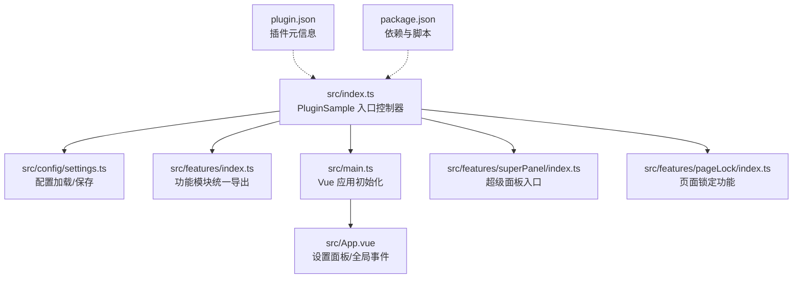
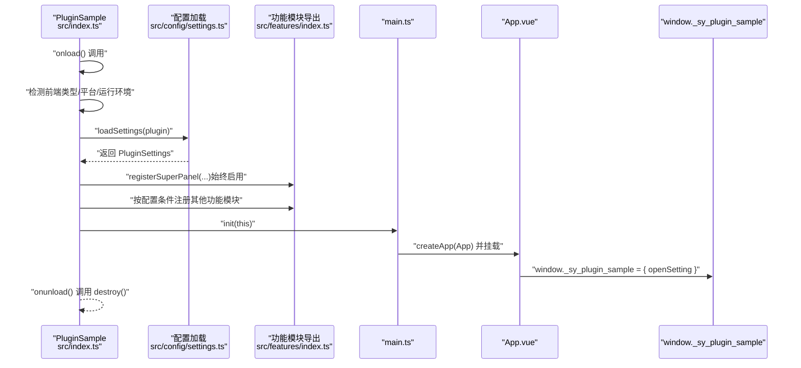
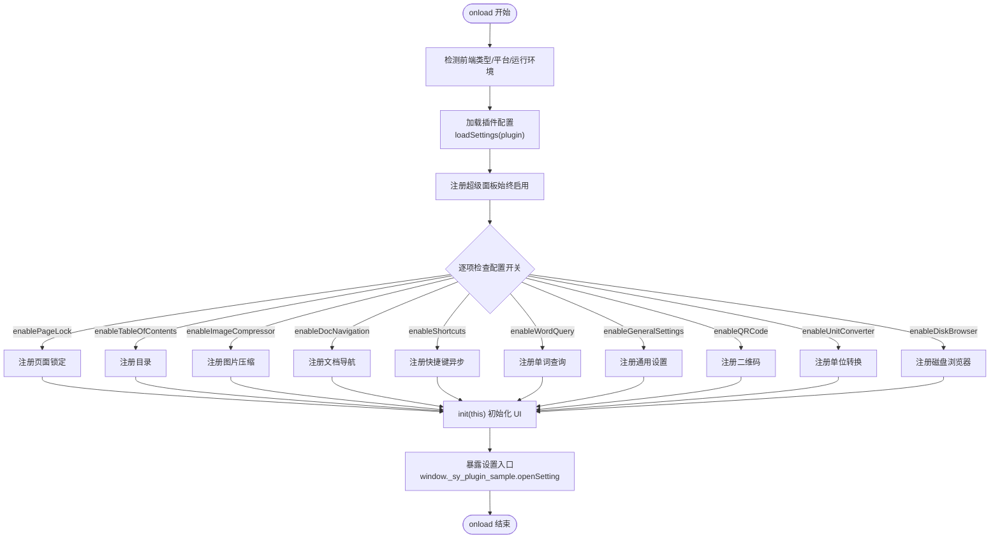
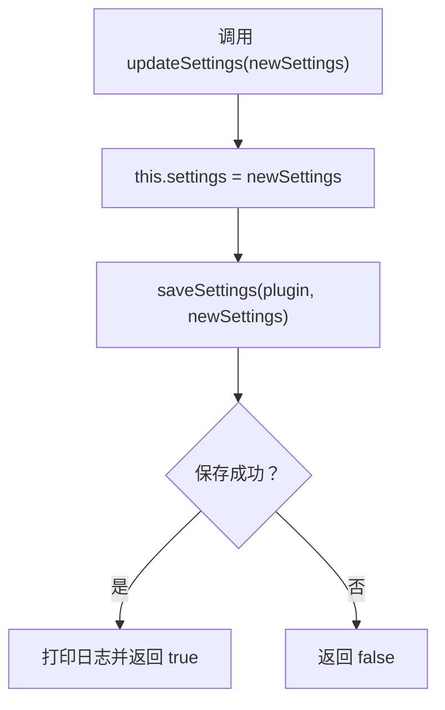
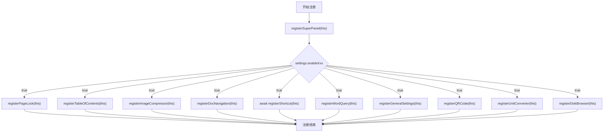
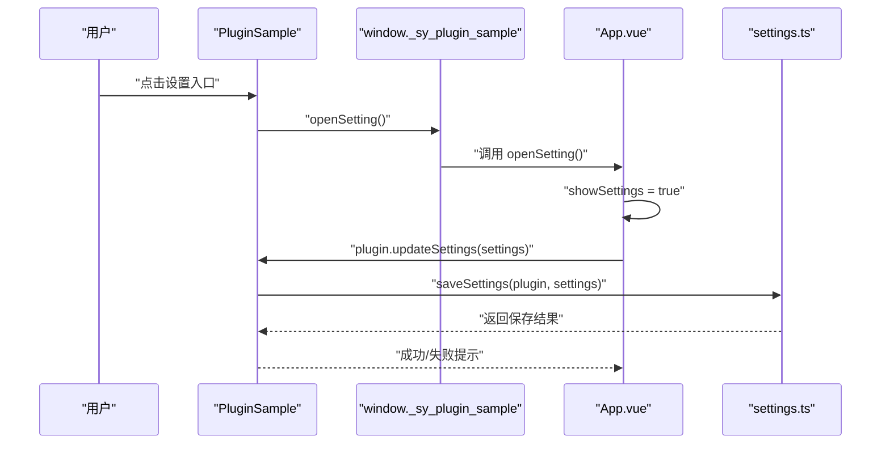
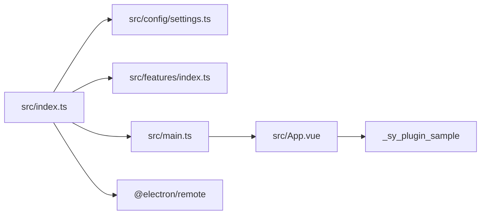

# 插件入口

<cite>
**本文引用的文件**
- [src/index.ts](file://src/index.ts)
- [src/main.ts](file://src/main.ts)
- [src/config/settings.ts](file://src/config/settings.ts)
- [src/features/index.ts](file://src/features/index.ts)
- [src/App.vue](file://src/App.vue)
- [src/features/superPanel/index.ts](file://src/features/superPanel/index.ts)
- [src/features/pageLock/index.ts](file://src/features/pageLock/index.ts)
- [plugin.json](file://plugin.json)
- [package.json](file://package.json)
</cite>

## 目录
1. [简介](#简介)
2. [项目结构](#项目结构)
3. [核心组件](#核心组件)
4. [架构总览](#架构总览)
5. [详细组件分析](#详细组件分析)
6. [依赖关系分析](#依赖关系分析)
7. [性能考量](#性能考量)
8. [故障排查指南](#故障排查指南)
9. [结论](#结论)
10. [附录](#附录)

## 简介
本文件围绕 PluginSample 类作为插件主控制器的实现进行深入解析，重点覆盖以下主题：
- onload 生命周期中如何检测运行环境（移动端、浏览器、Electron、本地窗口等），并加载插件配置。
- this.settings 属性如何通过 loadSettings 函数初始化。
- registerFeatures 方法如何依据配置条件性注册功能模块。
- openSetting 方法如何通过 window._sy_plugin_sample 全局对象暴露设置界面入口。
- 插件启动时的完整执行流程与关键步骤的技术细节及潜在错误点。

## 项目结构
该仓库采用“入口控制器 + 配置管理 + 功能模块 + UI 应用”的分层组织方式：
- 入口控制器：src/index.ts 定义 PluginSample 类，负责生命周期、环境检测、配置加载与功能注册。
- 配置管理：src/config/settings.ts 提供插件配置接口、默认值、加载/保存逻辑。
- 功能模块：src/features/* 下的各功能模块通过统一导出入口集中注册。
- UI 应用：src/main.ts 初始化 Vue 应用并挂载到页面；src/App.vue 提供设置面板与全局事件绑定。
- 插件元信息：plugin.json 定义插件名称、版本、兼容性等。
- 构建与依赖：package.json 管理依赖与构建脚本。

图表来源
- [src/index.ts](file://src/index.ts#L1-L139)
- [src/config/settings.ts](file://src/config/settings.ts#L1-L141)
- [src/features/index.ts](file://src/features/index.ts#L1-L15)
- [src/main.ts](file://src/main.ts#L1-L45)
- [src/App.vue](file://src/App.vue#L1-L216)
- [src/features/superPanel/index.ts](file://src/features/superPanel/index.ts#L1-L138)
- [src/features/pageLock/index.ts](file://src/features/pageLock/index.ts#L1-L573)
- [plugin.json](file://plugin.json#L1-L34)
- [package.json](file://package.json#L1-L46)

章节来源
- [src/index.ts](file://src/index.ts#L1-L139)
- [src/config/settings.ts](file://src/config/settings.ts#L1-L141)
- [src/features/index.ts](file://src/features/index.ts#L1-L15)
- [src/main.ts](file://src/main.ts#L1-L45)
- [src/App.vue](file://src/App.vue#L1-L216)
- [plugin.json](file://plugin.json#L1-L34)
- [package.json](file://package.json#L1-L46)

## 核心组件
- PluginSample（入口控制器）
  - 负责环境检测、配置加载、功能注册与 UI 初始化。
  - 提供 openSetting 方法通过 window._sy_plugin_sample 暴露设置入口。
- 配置管理（settings.ts）
  - 定义 PluginSettings 接口与默认值，提供 loadSettings/saveSettings。
- 功能模块（features/index.ts）
  - 统一导出各功能模块的注册函数，供入口控制器按需调用。
- UI 应用（main.ts + App.vue）
  - main.ts 将 Vue 应用挂载到 body，App.vue 提供设置面板与全局事件监听。
- 插件元信息（plugin.json）
  - 定义插件名称、版本、兼容性等，影响加载与发布行为。

章节来源
- [src/index.ts](file://src/index.ts#L1-L139)
- [src/config/settings.ts](file://src/config/settings.ts#L1-L141)
- [src/features/index.ts](file://src/features/index.ts#L1-L15)
- [src/main.ts](file://src/main.ts#L1-L45)
- [src/App.vue](file://src/App.vue#L1-L216)
- [plugin.json](file://plugin.json#L1-L34)

## 架构总览
下图展示了 PluginSample 从 onload 到 UI 初始化的整体流程，以及关键对象之间的交互关系。

图表来源
- [src/index.ts](file://src/index.ts#L39-L71)
- [src/config/settings.ts](file://src/config/settings.ts#L67-L96)
- [src/features/index.ts](file://src/features/index.ts#L1-L15)
- [src/main.ts](file://src/main.ts#L21-L45)
- [src/App.vue](file://src/App.vue#L133-L149)

## 详细组件分析

### PluginSample 类与生命周期
- 环境检测
  - 通过 getFrontend() 获取前端类型，据此设置 isMobile、isBrowser、isInWindow 等布尔标志。
  - 通过 location.href 判断本地开发（localhost/127.0.0.1）。
  - 通过尝试 require("@electron/remote") 判定是否运行于 Electron 环境。
- 配置加载
  - 调用 loadSettings(this) 返回 PluginSettings，若无保存数据则回退至默认值。
- 功能注册
  - 始终注册超级面板（统一入口）。
  - 根据 settings 中的布尔开关逐项注册对应功能模块。
  - 某些模块（如快捷键）可能异步等待初始化完成后再继续。
- UI 初始化
  - 调用 init(this)，main.ts 中创建并挂载 Vue 应用。
- 设置入口
  - openSetting() 通过 window._sy_plugin_sample.openSetting 打开设置面板。

图表来源
- [src/index.ts](file://src/index.ts#L39-L126)
- [src/config/settings.ts](file://src/config/settings.ts#L67-L96)
- [src/features/index.ts](file://src/features/index.ts#L1-L15)
- [src/main.ts](file://src/main.ts#L21-L45)
- [src/App.vue](file://src/App.vue#L133-L149)

章节来源
- [src/index.ts](file://src/index.ts#L39-L126)
- [src/config/settings.ts](file://src/config/settings.ts#L67-L96)
- [src/features/index.ts](file://src/features/index.ts#L1-L15)
- [src/main.ts](file://src/main.ts#L21-L45)
- [src/App.vue](file://src/App.vue#L133-L149)

### 配置加载与更新
- loadSettings(plugin)
  - 从插件数据存储中读取已保存的配置；若为空则返回默认值。
  - 合并默认值与已保存值，保证字段完整性。
- saveSettings(plugin, settings)
  - 将当前配置写入插件数据存储，返回保存结果。
- updateSettings(newSettings)
  - 更新内存中的 settings，并调用 saveSettings；成功后打印日志并返回布尔值。

图表来源
- [src/index.ts](file://src/index.ts#L128-L139)
- [src/config/settings.ts](file://src/config/settings.ts#L84-L96)

章节来源
- [src/index.ts](file://src/index.ts#L128-L139)
- [src/config/settings.ts](file://src/config/settings.ts#L67-L96)

### 功能模块注册策略
- 超级面板（始终启用）
  - 通过 registerSuperPanel(this) 注册，提供统一入口与快捷键。
- 条件注册
  - 依据 settings.enableXxx 开关逐项注册，包括页面锁定、目录、图片压缩、文档导航、快捷键、单词查询、通用设置、二维码、单位转换、磁盘浏览器等。
- 异步注册
  - 快捷键模块可能包含异步初始化逻辑，因此在调用处使用 await。

图表来源
- [src/index.ts](file://src/index.ts#L80-L126)
- [src/features/index.ts](file://src/features/index.ts#L1-L15)

章节来源
- [src/index.ts](file://src/index.ts#L80-L126)
- [src/features/index.ts](file://src/features/index.ts#L1-L15)

### 设置入口暴露与 UI 交互
- openSetting()
  - 通过 window._sy_plugin_sample.openSetting 调用，内部由 App.vue 在 mounted 阶段绑定。
- App.vue
  - 在 mounted 中创建 window._sy_plugin_sample，并暴露 openSetting/openQRCodeDialog。
  - 监听全局事件（如 openImageCompressor、openQRCodeDialog）以触发相应 UI。
  - 通过 usePlugin() 获取 PluginSample 实例，从而访问 settings 与 updateSettings。

图表来源
- [src/index.ts](file://src/index.ts#L73-L75)
- [src/App.vue](file://src/App.vue#L133-L149)
- [src/config/settings.ts](file://src/config/settings.ts#L84-L96)

章节来源
- [src/index.ts](file://src/index.ts#L73-L75)
- [src/App.vue](file://src/App.vue#L133-L149)
- [src/config/settings.ts](file://src/config/settings.ts#L84-L96)

### 运行环境检测细节
- 前端类型
  - 通过 getFrontend() 返回字符串，判断是否为 mobile/browser-mobile。
- 浏览器/本地/窗口
  - 通过 location.href 包含 localhost/127.0.0.1 判断本地开发。
  - 通过包含 window.html 判断是否处于特定窗口页面。
- Electron
  - 通过 require("@electron/remote") 成功与否判断是否运行在 Electron 环境。

章节来源
- [src/index.ts](file://src/index.ts#L39-L57)

### 插件实例化与属性初始化顺序（代码片段路径）
- 插件类定义与属性声明
  - [src/index.ts](file://src/index.ts#L23-L38)
- onload 生命周期与初始化流程
  - [src/index.ts](file://src/index.ts#L39-L67)
- 配置加载与合并默认值
  - [src/config/settings.ts](file://src/config/settings.ts#L67-L82)
- 功能模块注册
  - [src/index.ts](file://src/index.ts#L80-L126)
- UI 初始化与设置入口暴露
  - [src/main.ts](file://src/main.ts#L21-L45)
  - [src/App.vue](file://src/App.vue#L133-L149)

章节来源
- [src/index.ts](file://src/index.ts#L23-L67)
- [src/config/settings.ts](file://src/config/settings.ts#L67-L82)
- [src/main.ts](file://src/main.ts#L21-L45)
- [src/App.vue](file://src/App.vue#L133-L149)

## 依赖关系分析
- 入口控制器依赖
  - 配置模块：loadSettings/saveSettings。
  - 功能模块：统一导出的注册函数。
  - UI 初始化：main.ts 的 init/destroy。
- UI 依赖
  - App.vue 依赖 i18n、事件总线与插件实例。
- 运行时依赖
  - Electron remote：用于检测 Electron 环境。
  - Vue runtime：用于渲染设置面板与功能 UI。

图表来源
- [src/index.ts](file://src/index.ts#L1-L139)
- [src/config/settings.ts](file://src/config/settings.ts#L1-L141)
- [src/features/index.ts](file://src/features/index.ts#L1-L15)
- [src/main.ts](file://src/main.ts#L1-L45)
- [src/App.vue](file://src/App.vue#L1-L216)

章节来源
- [src/index.ts](file://src/index.ts#L1-L139)
- [src/config/settings.ts](file://src/config/settings.ts#L1-L141)
- [src/features/index.ts](file://src/features/index.ts#L1-L15)
- [src/main.ts](file://src/main.ts#L1-L45)
- [src/App.vue](file://src/App.vue#L1-L216)

## 性能考量
- 按需注册：仅在 settings.enableXxx 为 true 时注册对应功能，避免不必要的资源占用。
- 异步注册：快捷键模块的异步等待不会阻塞主线程，但需注意注册顺序与依赖。
- UI 初始化：main.ts 在 init 中仅在 settings.compactMode 时添加紧凑模式类，避免多余 DOM 操作。
- 配置读写：loadSettings 与 saveSettings 通过插件数据存储与本地存储分别处理，减少重复 IO。

[本节为通用建议，无需列出具体文件来源]

## 故障排查指南
- 环境检测失败
  - 若 getFrontend() 返回值异常，可能导致 isMobile/isBrowser 判断不准确。检查前端类型与 location.href 判断逻辑。
  - Electron 检测依赖 @electron/remote，若未安装或打包不包含该模块，isElectron 将恒为 false。
- 配置加载/保存失败
  - loadSettings/saveSettings 包裹了 try/catch 并返回默认值或 false，便于快速定位问题。
  - 若配置未生效，请确认插件数据存储键名一致且未被外部修改。
- 功能模块未注册
  - 检查 settings.enableXxx 对应开关是否为 true。
  - 确认 registerXxx 函数已正确导出并在入口中调用。
- 设置入口不可用
  - 确认 App.vue 已在 mounted 中绑定 window._sy_plugin_sample。
  - 确认 openSetting() 调用链路正确，且未被覆盖。

章节来源
- [src/index.ts](file://src/index.ts#L39-L57)
- [src/config/settings.ts](file://src/config/settings.ts#L67-L96)
- [src/App.vue](file://src/App.vue#L133-L149)

## 结论
PluginSample 作为插件主控制器，通过明确的生命周期与环境检测，结合配置驱动的功能注册策略，实现了高度模块化的插件体系。其设计遵循“最小耦合、按需加载”的原则，既保证了易扩展性，也兼顾了运行时性能。通过 window._sy_plugin_sample 暴露设置入口，配合 Vue 应用与事件机制，形成了清晰、可维护的启动与交互流程。

[本节为总结性内容，无需列出具体文件来源]

## 附录
- 插件元信息与兼容性
  - plugin.json 中定义了插件名称、版本、兼容的前后端版本等，影响加载与发布行为。
- 构建与依赖
  - package.json 管理依赖与构建脚本，确保开发与发布的稳定性。

章节来源
- [plugin.json](file://plugin.json#L1-L34)
- [package.json](file://package.json#L1-L46)