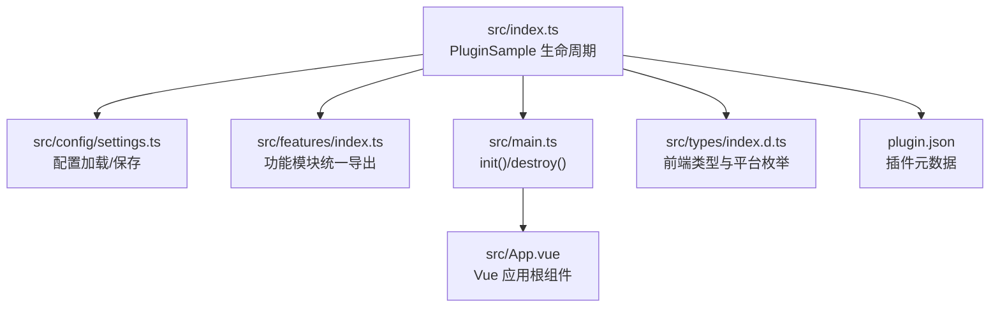
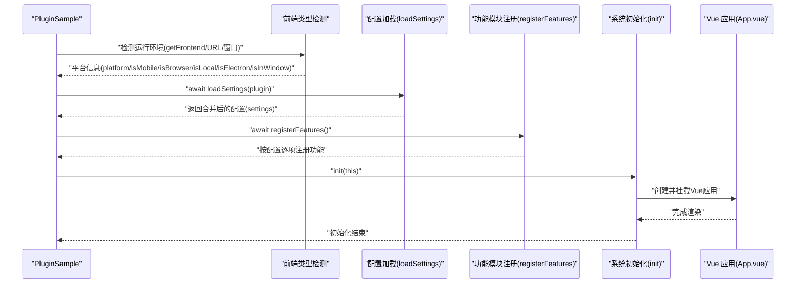
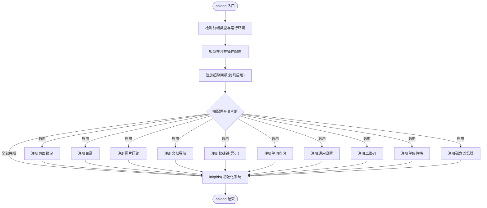
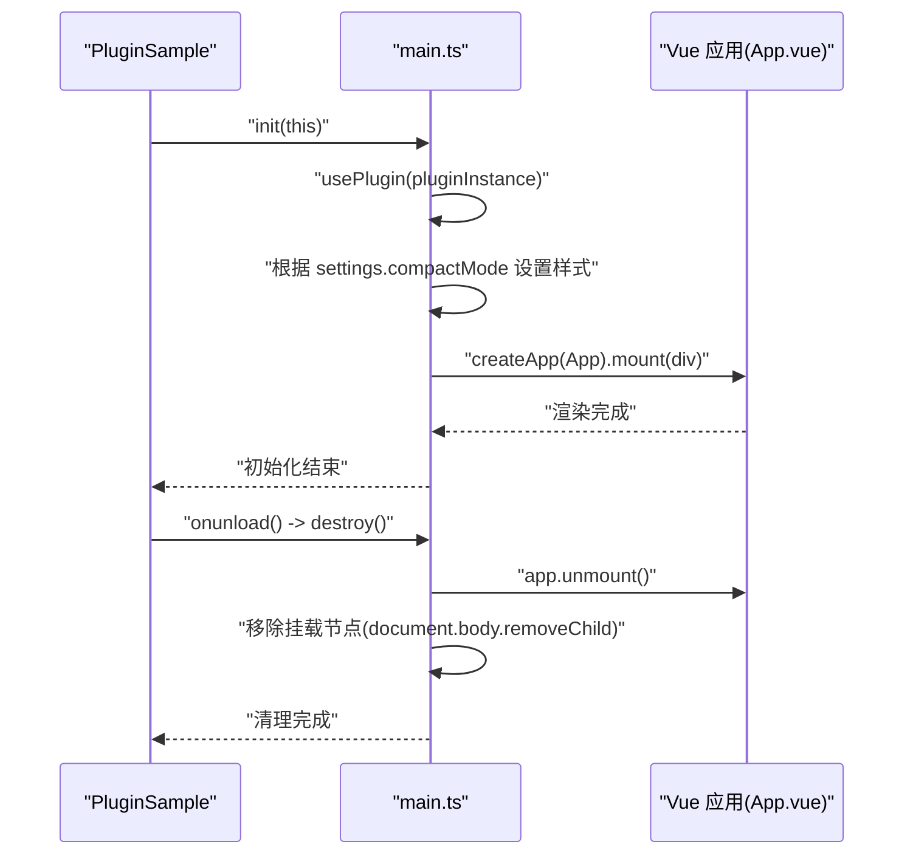
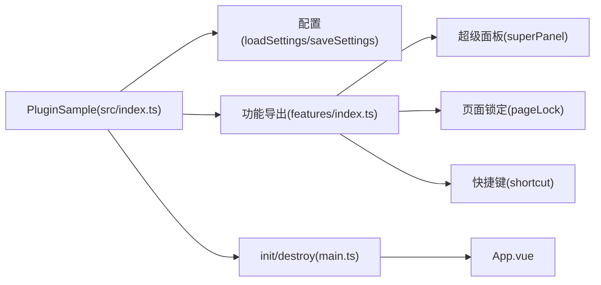

# 生命周期管理

<cite>
**本文引用的文件**
- [src/index.ts](file://src/index.ts)
- [src/main.ts](file://src/main.ts)
- [src/config/settings.ts](file://src/config/settings.ts)
- [src/features/index.ts](file://src/features/index.ts)
- [src/features/superPanel/index.ts](file://src/features/superPanel/index.ts)
- [src/features/pageLock/index.ts](file://src/features/pageLock/index.ts)
- [src/features/shortcut/index.ts](file://src/features/shortcut/index.ts)
- [src/App.vue](file://src/App.vue)
- [src/types/index.d.ts](file://src/types/index.d.ts)
- [src/api.ts](file://src/api.ts)
- [plugin.json](file://plugin.json)
- [README.md](file://README.md)
</cite>

## 目录
1. [简介](#简介)
2. [项目结构](#项目结构)
3. [核心组件](#核心组件)
4. [架构总览](#架构总览)
5. [详细组件分析](#详细组件分析)
6. [依赖关系分析](#依赖关系分析)
7. [性能考量](#性能考量)
8. [故障排查指南](#故障排查指南)
9. [结论](#结论)
10. [附录](#附录)

## 简介
本文围绕 PluginSample 类的生命周期钩子 onload 与 onunload 展开，系统梳理插件初始化流程（运行环境检测、配置加载、功能模块注册、系统初始化），并结合实际代码路径说明 async/await 的使用与错误处理最佳实践；同时给出 onunload 的资源清理与状态重置策略，提供生命周期执行时序图与调试技巧，帮助开发者扩展自定义生命周期行为。

## 项目结构
该仓库采用“插件主类 + 配置管理 + 功能模块 + Vue 应用”的分层架构：
- 插件主类负责生命周期与平台环境识别
- 配置模块负责插件设置的持久化与合并
- 功能模块按需注册，遵循统一导出接口
- Vue 应用在 onload 中初始化并挂载到 DOM

图表来源
- [src/index.ts](file://src/index.ts#L39-L71)
- [src/config/settings.ts](file://src/config/settings.ts#L70-L96)
- [src/features/index.ts](file://src/features/index.ts#L1-L15)
- [src/main.ts](file://src/main.ts#L21-L45)
- [src/App.vue](file://src/App.vue#L1-L216)
- [src/types/index.d.ts](file://src/types/index.d.ts#L131-L142)
- [plugin.json](file://plugin.json#L1-L34)

章节来源
- [src/index.ts](file://src/index.ts#L39-L71)
- [src/main.ts](file://src/main.ts#L21-L45)
- [src/config/settings.ts](file://src/config/settings.ts#L70-L96)
- [src/features/index.ts](file://src/features/index.ts#L1-L15)
- [src/types/index.d.ts](file://src/types/index.d.ts#L131-L142)
- [plugin.json](file://plugin.json#L1-L34)

## 核心组件
- PluginSample：插件主类，继承自 siyuan.Plugin，实现 onload/onunload 生命周期
- 配置模块：提供 loadSettings/saveSettings 与默认配置合并
- 功能模块：通过 registerXXX 统一注册，部分模块异步初始化
- Vue 应用：在 init 中创建并挂载，destroy 中卸载

章节来源
- [src/index.ts](file://src/index.ts#L39-L71)
- [src/config/settings.ts](file://src/config/settings.ts#L70-L96)
- [src/features/index.ts](file://src/features/index.ts#L1-L15)
- [src/main.ts](file://src/main.ts#L21-L45)

## 架构总览
生命周期由 PluginSample 驱动，onload 完成环境探测、配置加载、功能注册与系统初始化；onunload 调用 destroy 进行资源回收。

图表来源
- [src/index.ts](file://src/index.ts#L39-L71)
- [src/config/settings.ts](file://src/config/settings.ts#L70-L96)
- [src/main.ts](file://src/main.ts#L21-L38)
- [src/App.vue](file://src/App.vue#L1-L216)

## 详细组件分析

### PluginSample.onload 生命周期详解
- 平台与环境识别
  - 通过 getFrontend 与 URL 判定 desktop/mobile/browser 等前端类型
  - 通过 require 机制判断 Electron 环境
  - 通过 URL 片段判断 window.html 环境
- 配置加载
  - 使用 loadSettings 异步加载插件设置，若无数据则回退默认配置
- 功能模块注册
  - 超级面板始终注册
  - 其余模块按 settings.xxx 开关条件注册，部分模块（如快捷键）内部可能异步加载数据
- 系统初始化
  - 调用 init(this)，绑定插件实例、设置紧凑模式、创建并挂载 Vue 应用

图表来源
- [src/index.ts](file://src/index.ts#L39-L71)
- [src/index.ts](file://src/index.ts#L80-L126)
- [src/config/settings.ts](file://src/config/settings.ts#L70-L96)
- [src/main.ts](file://src/main.ts#L21-L38)

章节来源
- [src/index.ts](file://src/index.ts#L39-L71)
- [src/index.ts](file://src/index.ts#L80-L126)
- [src/config/settings.ts](file://src/config/settings.ts#L70-L96)
- [src/main.ts](file://src/main.ts#L21-L38)

### 配置加载与合并策略
- 默认配置 DEFAULT_SETTINGS 提供全量开关与默认值
- loadSettings 从插件数据存储读取，若为空则返回默认配置
- saveSettings 将当前配置写回存储，返回布尔结果
- 该策略确保首次使用与缺失数据场景下的健壮性

章节来源
- [src/config/settings.ts](file://src/config/settings.ts#L37-L50)
- [src/config/settings.ts](file://src/config/settings.ts#L70-L96)

### 功能模块注册机制
- 统一导出 registerXXX，便于集中管理
- 条件注册：仅当 settings.enableXxx 为真时才调用对应 registerXXX
- 特殊模块（如快捷键）内部可能异步加载自定义数据，因此在调用处使用 await

章节来源
- [src/features/index.ts](file://src/features/index.ts#L1-L15)
- [src/index.ts](file://src/index.ts#L80-L126)
- [src/features/shortcut/index.ts](file://src/features/shortcut/index.ts#L16-L41)

### 系统初始化 init 与 onunload 资源清理
- init(this)
  - 绑定插件实例，读取 settings.compactMode 并应用紧凑模式样式
  - 创建容器元素并挂载 Vue 应用，注入到文档主体
- onunload
  - 调用 destroy()，卸载 Vue 应用并移除挂载节点
  - 注意：destroy 中使用 this.name 访问插件名称，应在 init 中确保 this 绑定正确

图表来源
- [src/index.ts](file://src/index.ts#L69-L71)
- [src/main.ts](file://src/main.ts#L21-L45)
- [src/App.vue](file://src/App.vue#L1-L216)

章节来源
- [src/index.ts](file://src/index.ts#L69-L71)
- [src/main.ts](file://src/main.ts#L21-L45)

### 平台与运行环境检测
- 前端类型：SyFrontendTypes 枚举覆盖 desktop/window、mobile、browser-desktop/mobile
- 环境判定：isMobile/isBrowser/isLocal/isElectron/isInWindow 基于 getFrontend 与 URL 片段
- 作用：为不同平台提供差异化行为与 UI 适配

章节来源
- [src/types/index.d.ts](file://src/types/index.d.ts#L131-L142)
- [src/index.ts](file://src/index.ts#L40-L55)

### 异步与错误处理最佳实践
- 使用 async/await 串行化关键步骤，避免竞态
  - 配置加载与功能注册顺序固定，确保后续模块依赖已就绪
- 错误捕获与降级
  - 配置加载/保存均包含 try/catch，失败时返回默认值或提示
  - 快捷键模块内部也使用 try/catch 包裹异步数据加载
- 日志与可观测性
  - 关键步骤打印日志，便于定位问题
  - README 提供调试技巧（开发者工具、Vue DevTools、热重载）

章节来源
- [src/config/settings.ts](file://src/config/settings.ts#L70-L96)
- [src/features/shortcut/index.ts](file://src/features/shortcut/index.ts#L16-L41)
- [README.md](file://README.md#L315-L335)

### 生命周期钩子执行时序与调试要点
- 执行顺序
  1) 环境检测
  2) 配置加载与合并
  3) 功能模块注册（含异步）
  4) init 系统初始化
- 调试建议
  - 使用浏览器开发者工具查看 Console 输出
  - 使用 Vue DevTools 观察 App.vue 的状态变化
  - 修改代码后利用热重载快速验证

章节来源
- [src/index.ts](file://src/index.ts#L39-L71)
- [src/main.ts](file://src/main.ts#L21-L38)
- [README.md](file://README.md#L315-L335)

## 依赖关系分析
- PluginSample 依赖
  - 配置模块：loadSettings/saveSettings
  - 功能模块：registerXXX 统一导出
  - Vue 应用：init/destroy
  - 类型定义：SyFrontendTypes
- 功能模块内部依赖
  - 快捷键模块：内部管理器与自定义存储
  - 页面锁定模块：事件总线、存储与 DOM 操作

图表来源
- [src/index.ts](file://src/index.ts#L39-L71)
- [src/config/settings.ts](file://src/config/settings.ts#L70-L96)
- [src/features/index.ts](file://src/features/index.ts#L1-L15)
- [src/main.ts](file://src/main.ts#L21-L45)
- [src/App.vue](file://src/App.vue#L1-L216)

章节来源
- [src/index.ts](file://src/index.ts#L39-L71)
- [src/features/index.ts](file://src/features/index.ts#L1-L15)
- [src/main.ts](file://src/main.ts#L21-L45)

## 性能考量
- 按需注册：仅启用的功能才会创建与挂载，减少初始开销
- 异步加载：配置与自定义数据异步读取，避免阻塞主线程
- DOM 操作最小化：init 仅创建一次容器并挂载，destroy 一次性卸载
- 紧凑模式：通过样式类减少不必要的布局重排

## 故障排查指南
- 插件加载失败
  - 检查 plugin.json 的 minAppVersion 与实际版本兼容性
  - 确认 .env 中 VITE_SIYUAN_WORKSPACE_PATH 配置正确
- 配置异常
  - 若配置读取失败，系统将回退默认配置；可在 Console 查看错误日志
- 快捷键模块无法显示
  - 确认 registerShortcut 已被调用且自定义数据加载成功
- Vue 应用未渲染
  - 检查 init 中容器创建与挂载逻辑，确认 DOM 已准备
- 卸载后残留
  - 确保 onunload 正确调用 destroy，检查容器移除逻辑

章节来源
- [plugin.json](file://plugin.json#L1-L34)
- [README.md](file://README.md#L396-L416)
- [src/config/settings.ts](file://src/config/settings.ts#L70-L96)
- [src/features/shortcut/index.ts](file://src/features/shortcut/index.ts#L16-L41)
- [src/main.ts](file://src/main.ts#L21-L45)

## 结论
PluginSample 的生命周期设计清晰、职责明确：onload 完成环境识别、配置加载、功能注册与系统初始化；onunload 通过 destroy 完成资源清理。配合统一的配置管理与模块化功能注册，既保证了可维护性，又提供了良好的扩展空间。建议在新增功能时遵循现有模式，使用 async/await 串联关键步骤，并完善错误处理与日志输出，以提升稳定性与可观测性。

## 附录
- 自定义生命周期行为建议
  - 在 onload 中增加平台特定初始化（如移动端样式适配）
  - 在 onunload 中补充事件解绑与定时器清理
  - 为关键模块提供可选的异步初始化回调，便于扩展
- 参考实现路径
  - 环境检测与平台类型：[src/index.ts](file://src/index.ts#L40-L55)、[src/types/index.d.ts](file://src/types/index.d.ts#L131-L142)
  - 配置加载与保存：[src/config/settings.ts](file://src/config/settings.ts#L70-L96)
  - 功能模块注册：[src/index.ts](file://src/index.ts#L80-L126)、[src/features/index.ts](file://src/features/index.ts#L1-L15)
  - 系统初始化与卸载：[src/main.ts](file://src/main.ts#L21-L45)
  - 超级面板注册与交互：[src/features/superPanel/index.ts](file://src/features/superPanel/index.ts#L17-L41)
  - 页面锁定注册与拦截：[src/features/pageLock/index.ts](file://src/features/pageLock/index.ts#L74-L118)
  - 快捷键注册与异步数据加载：[src/features/shortcut/index.ts](file://src/features/shortcut/index.ts#L16-L41)
  - Vue 应用入口与公开方法：[src/App.vue](file://src/App.vue#L133-L149)