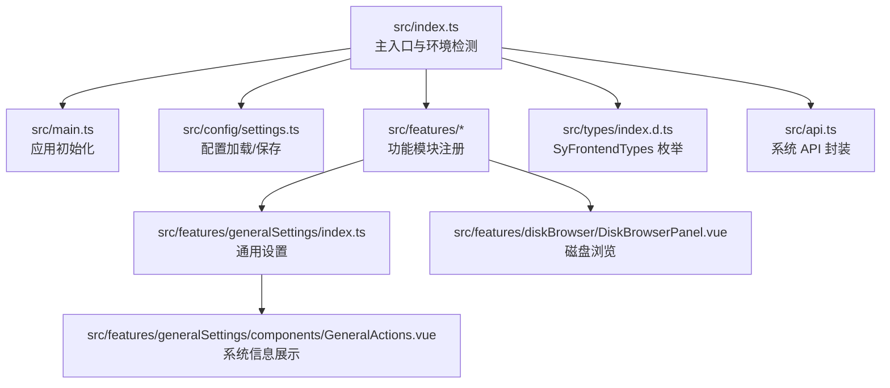
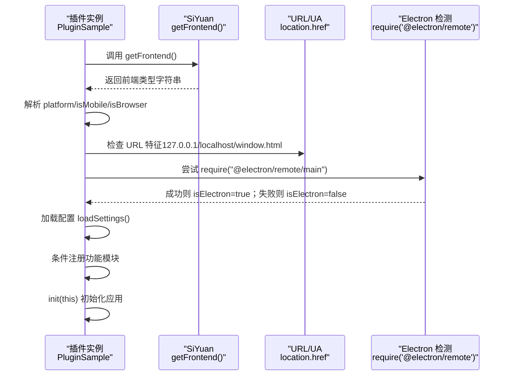
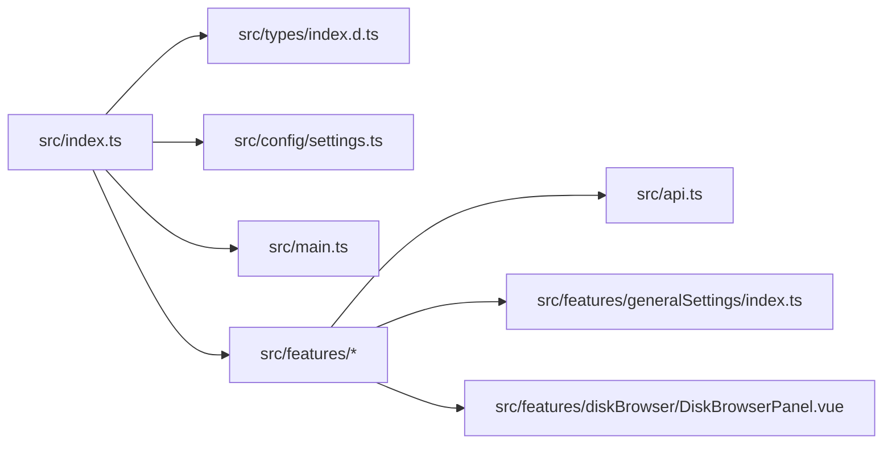

# 运行环境检测

<cite>
**本文引用的文件**
- [src/index.ts](file://src/index.ts)
- [src/types/index.d.ts](file://src/types/index.d.ts)
- [src/main.ts](file://src/main.ts)
- [src/features/generalSettings/index.ts](file://src/features/generalSettings/index.ts)
- [src/features/generalSettings/components/GeneralActions.vue](file://src/features/generalSettings/components/GeneralActions.vue)
- [src/features/diskBrowser/DiskBrowserPanel.vue](file://src/features/diskBrowser/DiskBrowserPanel.vue)
- [src/api.ts](file://src/api.ts)
</cite>

## 目录
1. [简介](#简介)
2. [项目结构](#项目结构)
3. [核心组件](#核心组件)
4. [架构总览](#架构总览)
5. [详细组件分析](#详细组件分析)
6. [依赖关系分析](#依赖关系分析)
7. [性能考量](#性能考量)
8. [故障排查指南](#故障排查指南)
9. [结论](#结论)
10. [附录](#附录)

## 简介
本文件围绕插件运行环境检测的实现原理展开，重点解析主入口类在 onload 生命周期中如何通过 getFrontend() 获取前端类型，并据此设置 isMobile、isBrowser、isLocal、isElectron、isInWindow 等环境标识属性。文档将结合仓库中的实现，给出基于 URL 特征与 User-Agent 的判断逻辑说明，解释 try-catch 检测 Electron 环境的技术细节，并阐述这些标识在功能模块条件注册与 UI 适配中的实际应用。最后提供可靠性分析、边界情况处理建议，以及针对移动端、桌面端、浏览器端的兼容性优化策略。

## 项目结构
本项目采用“主入口 + 功能模块 + 类型与配置”的分层组织方式：
- 主入口负责环境检测、配置加载、功能模块注册与应用初始化
- 功能模块按职责拆分，如通用设置、页面锁定、目录索引、图片压缩、磁盘浏览等
- 类型定义集中于 types 目录，明确前端类型枚举与常用数据结构
- API 封装位于 api.ts，提供对思源内部接口的统一访问

图表来源
- [src/index.ts](file://src/index.ts#L1-L140)
- [src/main.ts](file://src/main.ts#L1-L45)
- [src/features/generalSettings/index.ts](file://src/features/generalSettings/index.ts#L1-L414)
- [src/features/generalSettings/components/GeneralActions.vue](file://src/features/generalSettings/components/GeneralActions.vue#L56-L156)
- [src/features/diskBrowser/DiskBrowserPanel.vue](file://src/features/diskBrowser/DiskBrowserPanel.vue#L240-L273)
- [src/types/index.d.ts](file://src/types/index.d.ts#L131-L141)
- [src/api.ts](file://src/api.ts#L483-L495)

章节来源
- [src/index.ts](file://src/index.ts#L1-L140)
- [src/types/index.d.ts](file://src/types/index.d.ts#L131-L141)

## 核心组件
- 主入口类 PluginSample：在 onload 中完成环境检测、配置加载、功能模块注册与应用初始化
- 环境标识属性：
  - isMobile：移动端或浏览器移动端
  - isBrowser：浏览器端（含桌面浏览器与移动端浏览器）
  - isLocal：本地开发（URL 包含 127.0.0.1 或 localhost）
  - isInWindow：URL 包含 window.html（特定窗口页面）
  - isElectron：通过 require("@electron/remote")/require("@electron/remote/main") 成功与否判定
  - platform：getFrontend() 返回的前端类型，受 SyFrontendTypes 枚举约束
- 平台类型枚举 SyFrontendTypes：desktop、desktop-window、mobile、browser-desktop、browser-mobile

章节来源
- [src/index.ts](file://src/index.ts#L23-L67)
- [src/types/index.d.ts](file://src/types/index.d.ts#L131-L141)

## 架构总览
下图展示了环境检测在主流程中的位置与影响范围：

图表来源
- [src/index.ts](file://src/index.ts#L39-L67)

## 详细组件分析

### 环境检测实现与逻辑
- 前端类型获取与解析
  - 通过 getFrontend() 获取前端类型字符串，并赋值给 platform
  - isMobile：当 platform 为 "mobile" 或 "browser-mobile"
  - isBrowser：platform 包含 "browser"
- 本地开发与窗口页面识别
  - isLocal：location.href 包含 "127.0.0.1" 或 "localhost"
  - isInWindow：location.href 包含 "window.html"
- Electron 环境检测
  - 使用 try-catch 包裹 require("@electron/remote").require("@electron/remote/main")
  - 成功则 isElectron=true，否则为 false
- URL 特征与 User-Agent 的补充用途
  - 通用设置面板的“系统信息”中，通过 navigator.userAgent 推断宿主操作系统（Windows/macOS/Linux/Android/iOS/Unknown），用于 UI 展示与调试

章节来源
- [src/index.ts](file://src/index.ts#L39-L67)
- [src/features/generalSettings/components/GeneralActions.vue](file://src/features/generalSettings/components/GeneralActions.vue#L107-L124)

### 环境标识在功能模块中的应用
- 条件注册
  - 主入口根据用户配置决定是否注册各功能模块（例如页面锁定、目录索引、图片压缩、通用设置、二维码、单位转换、磁盘浏览等）。虽然此处未直接使用 isMobile/isBrowser 等布尔值进行分支，但这些标识可用于模块内的 UI 适配与能力开关
- UI 适配与行为差异
  - 通用设置模块在“打开工作区”时，会优先从 siyuan 全局配置或 dataDir 推导工作区路径；若检测到 window.require 存在，则尝试使用 Electron 的 shell.openPath 打开路径，否则提示非 Electron 环境
  - 磁盘浏览模块在 Electron 环境下可通过 child_process 执行系统命令获取磁盘信息，这体现了 isElectron 的实际价值

章节来源
- [src/index.ts](file://src/index.ts#L80-L126)
- [src/features/generalSettings/index.ts](file://src/features/generalSettings/index.ts#L285-L333)
- [src/features/diskBrowser/DiskBrowserPanel.vue](file://src/features/diskBrowser/DiskBrowserPanel.vue#L240-L273)

### Electron 环境检测的特殊技术
- 技术要点
  - 通过 require("@electron/remote/main") 的存在性判断是否处于 Electron 环境
  - 使用 try-catch 包裹，避免在非 Electron 环境抛错导致插件异常
- 实际意义
  - 为后续功能（如打开系统资源、执行系统命令）提供安全的前置判断，避免在浏览器或移动端环境中误用 Electron API

章节来源
- [src/index.ts](file://src/index.ts#L49-L55)
- [src/features/generalSettings/index.ts](file://src/features/generalSettings/index.ts#L306-L319)

### 基于 URL 特征与 User-Agent 的判断逻辑说明
- URL 特征
  - isLocal：通过 location.href 是否包含 "127.0.0.1" 或 "localhost" 判断本地开发
  - isInWindow：通过 location.href 是否包含 "window.html" 判断特定窗口页面
- User-Agent 推断
  - 通用设置面板通过 navigator.userAgent 的关键字匹配推断宿主平台（Windows/macOS/Linux/Android/iOS/Unknown）

章节来源
- [src/index.ts](file://src/index.ts#L44-L47)
- [src/features/generalSettings/components/GeneralActions.vue](file://src/features/generalSettings/components/GeneralActions.vue#L116-L124)

### 环境标识在功能模块中的潜在应用建议
- UI 适配
  - 在需要区分移动端与桌面端的组件中，可依据 isMobile/isBrowser 切换布局或交互方式
- 能力开关
  - 在需要系统级能力（如打开文件夹、执行系统命令）时，仅在 Electron 环境启用相关功能
- 开发调试
  - isLocal 可用于在本地开发时启用额外的日志或调试功能

（以上为基于现有实现的建议性应用方向，具体实现需在各功能模块中自行引入环境标识）

## 依赖关系分析
- 主入口依赖
  - SiYuan 提供的 getFrontend() 用于获取前端类型
  - 配置模块用于加载/保存插件设置
  - 功能模块导出统一注册函数
- 功能模块依赖
  - 通用设置模块依赖 api.ts 的系统 API（version、currentTime）
  - 磁盘浏览模块依赖 Electron 的 child_process 与 shell（在 Electron 环境下）
- 类型依赖
  - SyFrontendTypes 枚举约束 platform 的取值范围

图表来源
- [src/index.ts](file://src/index.ts#L1-L140)
- [src/types/index.d.ts](file://src/types/index.d.ts#L131-L141)
- [src/api.ts](file://src/api.ts#L483-L495)
- [src/features/generalSettings/index.ts](file://src/features/generalSettings/index.ts#L1-L414)
- [src/features/diskBrowser/DiskBrowserPanel.vue](file://src/features/diskBrowser/DiskBrowserPanel.vue#L240-L273)

章节来源
- [src/index.ts](file://src/index.ts#L1-L140)
- [src/api.ts](file://src/api.ts#L483-L495)

## 性能考量
- 环境检测成本极低：字符串比较与一次 require 调用，几乎无性能负担
- URL 特征检测与 User-Agent 解析均为轻量级操作
- Electron 检测使用 try-catch 包裹，避免异常传播带来的额外开销
- 建议
  - 将环境标识作为只读属性缓存，避免重复计算
  - 在功能模块中按需使用环境标识，减少不必要的分支判断

## 故障排查指南
- Electron 环境检测失败
  - 现象：isElectron 始终为 false
  - 排查：确认运行环境是否为 Electron；检查 require 依赖是否可用；核对打包配置是否将 Electron 作为外部依赖（external）
- URL 特征误判
  - 现象：isLocal 或 isInWindow 误判
  - 排查：检查当前页面 URL 是否包含预期片段；考虑网络代理或自定义路由导致的 URL 变化
- User-Agent 推断不准确
  - 现象：平台识别为 Unknown
  - 排查：某些 UA 可能被修改或伪装；必要时结合其他特征（如系统 API）辅助判断

章节来源
- [src/index.ts](file://src/index.ts#L49-L55)
- [src/features/generalSettings/components/GeneralActions.vue](file://src/features/generalSettings/components/GeneralActions.vue#L116-L124)

## 结论
本项目的环境检测实现简洁可靠：通过 getFrontend() 获取前端类型，结合 URL 特征与 try-catch 的 Electron 检测，形成完整的环境标识体系。这些标识为功能模块的条件注册与 UI 适配提供了基础支撑。建议在后续开发中，将环境标识纳入各功能模块的配置与 UI 分支逻辑，以提升跨平台一致性与用户体验。

## 附录
- 平台类型枚举 SyFrontendTypes
  - desktop、desktop-window、mobile、browser-desktop、browser-mobile
- 常用环境标识
  - isMobile：移动端或浏览器移动端
  - isBrowser：浏览器端（含桌面浏览器与移动端浏览器）
  - isLocal：本地开发（URL 包含 127.0.0.1 或 localhost）
  - isInWindow：URL 包含 window.html
  - isElectron：Electron 环境检测结果
  - platform：前端类型字符串

章节来源
- [src/types/index.d.ts](file://src/types/index.d.ts#L131-L141)
- [src/index.ts](file://src/index.ts#L23-L67)