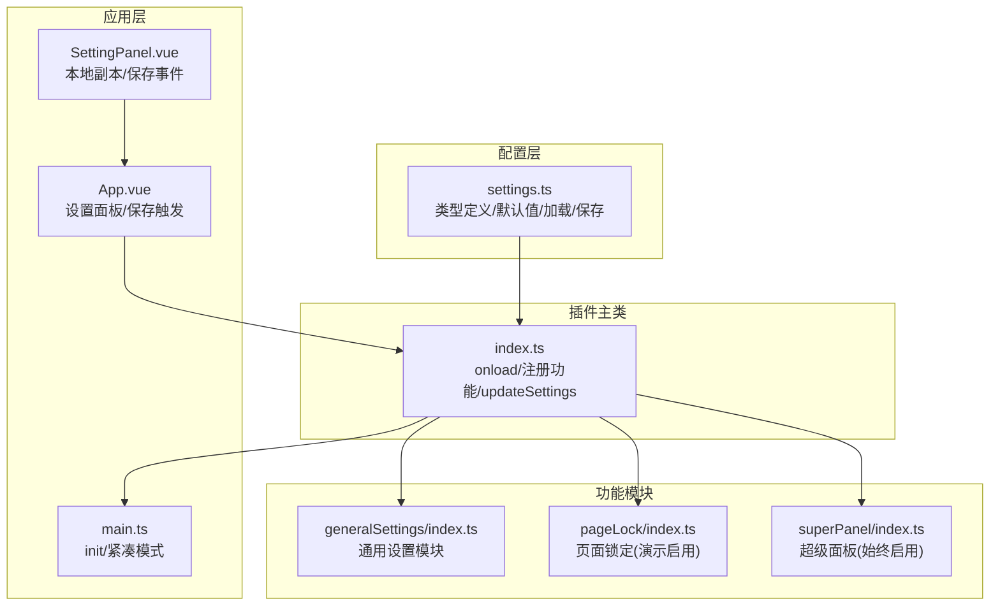
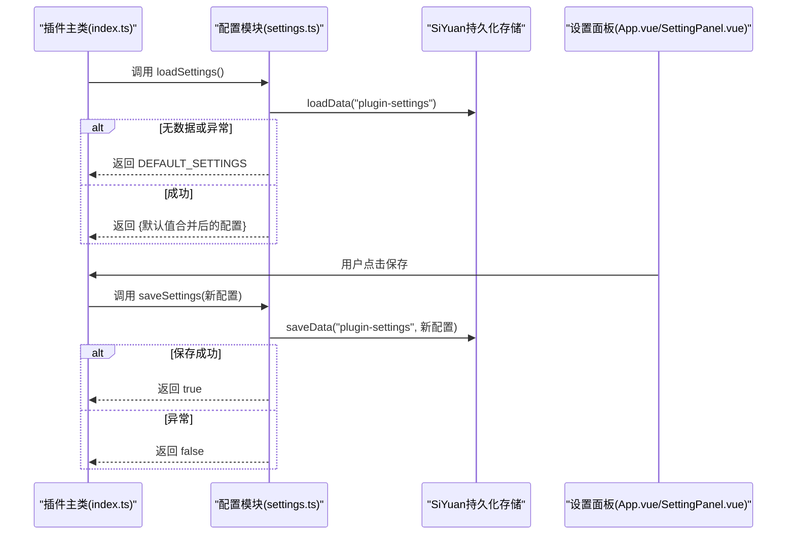
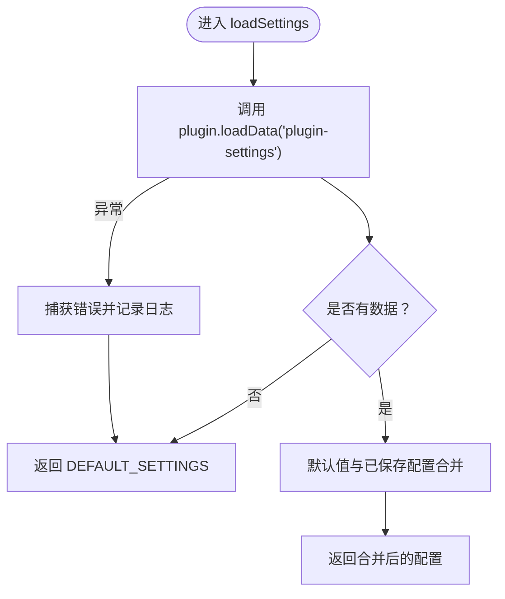
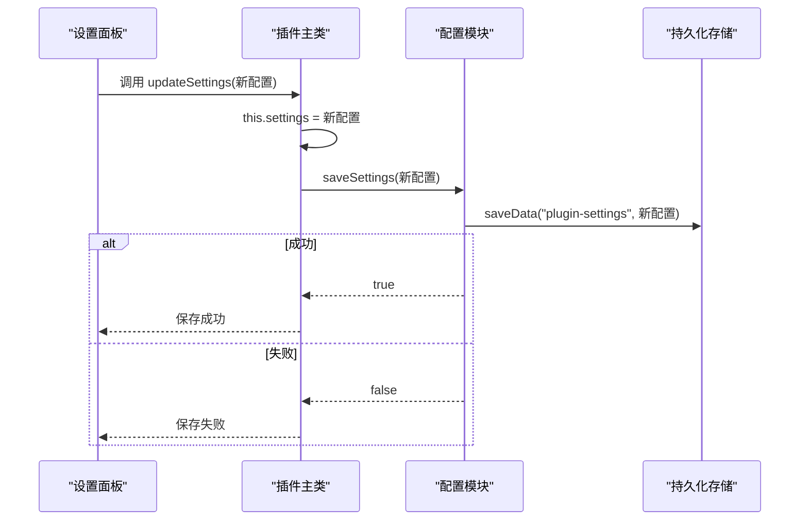
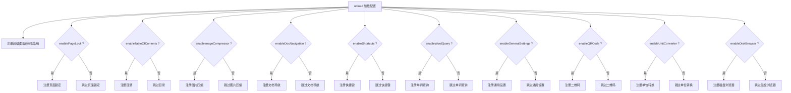
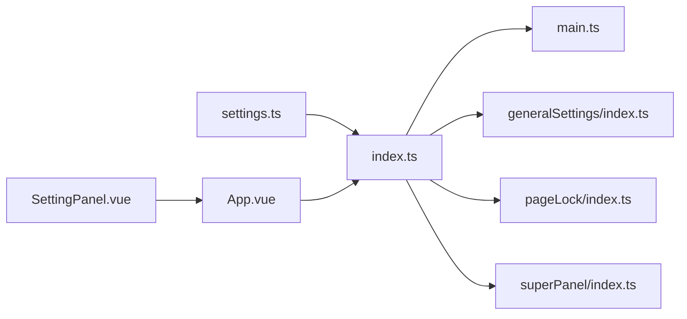

# 配置加载机制

<cite>
**本文引用的文件**
- [src/index.ts](file://src/index.ts)
- [src/main.ts](file://src/main.ts)
- [src/config/settings.ts](file://src/config/settings.ts)
- [src/App.vue](file://src/App.vue)
- [src/components/SettingPanel.vue](file://src/components/SettingPanel.vue)
- [src/features/generalSettings/index.ts](file://src/features/generalSettings/index.ts)
- [src/features/pageLock/index.ts](file://src/features/pageLock/index.ts)
- [src/features/superPanel/index.ts](file://src/features/superPanel/index.ts)
</cite>

## 目录
1. [简介](#简介)
2. [项目结构](#项目结构)
3. [核心组件](#核心组件)
4. [架构总览](#架构总览)
5. [详细组件分析](#详细组件分析)
6. [依赖关系分析](#依赖关系分析)
7. [性能考量](#性能考量)
8. [故障排查指南](#故障排查指南)
9. [结论](#结论)
10. [附录](#附录)

## 简介
本文件围绕插件配置系统展开，重点解析以下内容：
- loadSettings 如何从持久化存储中读取配置并初始化 this.settings
- updateSettings 如何实现配置的更新与保存
- PluginSettings 类型定义与默认值处理逻辑
- 配置数据的序列化/反序列化过程与错误恢复机制
- 基于配置条件启用功能模块的实现模式
- 配置管理最佳实践：类型安全访问、默认配置维护、变更响应处理

## 项目结构
配置系统主要由以下部分组成：
- 配置定义与默认值：src/config/settings.ts
- 插件主类与生命周期：src/index.ts
- 应用初始化与紧凑模式：src/main.ts
- 设置面板与保存流程：src/App.vue、src/components/SettingPanel.vue
- 通用设置模块（字体、代码块等）：src/features/generalSettings/index.ts
- 功能模块注册与条件启用：src/index.ts
- 页面锁定模块（演示配置驱动的功能启用）：src/features/pageLock/index.ts
- 超级面板（统一入口，始终启用）：src/features/superPanel/index.ts

图表来源
- [src/config/settings.ts](file://src/config/settings.ts#L1-L140)
- [src/index.ts](file://src/index.ts#L1-L140)
- [src/main.ts](file://src/main.ts#L1-L45)
- [src/App.vue](file://src/App.vue#L1-L216)
- [src/components/SettingPanel.vue](file://src/components/SettingPanel.vue#L1-L257)
- [src/features/generalSettings/index.ts](file://src/features/generalSettings/index.ts#L1-L414)
- [src/features/pageLock/index.ts](file://src/features/pageLock/index.ts#L1-L573)
- [src/features/superPanel/index.ts](file://src/features/superPanel/index.ts#L1-L138)

章节来源
- [src/config/settings.ts](file://src/config/settings.ts#L1-L140)
- [src/index.ts](file://src/index.ts#L1-L140)
- [src/main.ts](file://src/main.ts#L1-L45)
- [src/App.vue](file://src/App.vue#L1-L216)
- [src/components/SettingPanel.vue](file://src/components/SettingPanel.vue#L1-L257)
- [src/features/generalSettings/index.ts](file://src/features/generalSettings/index.ts#L1-L414)
- [src/features/pageLock/index.ts](file://src/features/pageLock/index.ts#L1-L573)
- [src/features/superPanel/index.ts](file://src/features/superPanel/index.ts#L1-L138)

## 核心组件
- 配置类型与默认值
  - PluginSettings 接口定义了所有可配置项，包含功能开关、API 密钥、紧凑模式等字段
  - DEFAULT_SETTINGS 提供全量默认值，确保新用户首次使用即有合理行为
- 配置加载与保存
  - loadSettings：从插件持久化存储读取配置；若无数据或读取异常，则回退到默认值
  - saveSettings：将当前配置写回插件持久化存储；异常时返回失败并记录日志
- 插件主类与生命周期
  - onload：加载配置并注册功能模块；根据配置决定启用哪些功能
  - updateSettings：更新内存中的 this.settings，并调用 saveSettings 保存
- 应用初始化
  - init：根据 settings.compactMode 切换紧凑模式类名

章节来源
- [src/config/settings.ts](file://src/config/settings.ts#L1-L140)
- [src/index.ts](file://src/index.ts#L1-L140)
- [src/main.ts](file://src/main.ts#L1-L45)

## 架构总览
配置系统遵循“类型定义—默认值—持久化存储—运行时实例”的闭环：
- 类型定义：PluginSettings 明确字段与语义
- 默认值：DEFAULT_SETTINGS 作为“白纸”上的“基线”
- 持久化：SiYuan 插件 API 的 loadData/saveData 作为存储介质
- 运行时：插件主类在 onload 时加载配置，updateSettings 时更新并保存

图表来源
- [src/index.ts](file://src/index.ts#L1-L140)
- [src/config/settings.ts](file://src/config/settings.ts#L1-L140)
- [src/App.vue](file://src/App.vue#L1-L216)
- [src/components/SettingPanel.vue](file://src/components/SettingPanel.vue#L1-L257)

## 详细组件分析

### 配置类型定义与默认值处理
- PluginSettings 字段覆盖功能开关、API 密钥、紧凑模式等
- DEFAULT_SETTINGS 提供全量默认值，保证首次加载与异常恢复时的行为一致性
- DEFAULT_FONT_SETTINGS 用于通用设置模块的字体配置，默认值与 PluginSettings 分离，避免污染主配置

章节来源
- [src/config/settings.ts](file://src/config/settings.ts#L1-L140)

### loadSettings：从持久化存储读取并初始化 this.settings
- 读取键名："plugin-settings"
- 读取流程：
  - 调用 plugin.loadData 读取
  - 若返回空值，直接返回 DEFAULT_SETTINGS
  - 若返回对象，采用“默认值优先”的合并策略，确保新增字段有默认值
- 异常处理：捕获错误并记录日志，最终仍返回 DEFAULT_SETTINGS，保证健壮性

图表来源
- [src/config/settings.ts](file://src/config/settings.ts#L66-L82)

章节来源
- [src/config/settings.ts](file://src/config/settings.ts#L66-L82)
- [src/index.ts](file://src/index.ts#L1-L140)

### updateSettings：配置更新与保存
- 更新流程：
  - 将新配置赋值给 this.settings
  - 调用 saveSettings(plugin, settings)
  - 保存成功后记录日志，返回 true；失败返回 false
- 该方法是唯一对外暴露的“写入入口”，保证配置变更的一致性与可观测性

图表来源
- [src/index.ts](file://src/index.ts#L128-L139)
- [src/config/settings.ts](file://src/config/settings.ts#L84-L96)
- [src/App.vue](file://src/App.vue#L49-L70)
- [src/components/SettingPanel.vue](file://src/components/SettingPanel.vue#L209-L236)

章节来源
- [src/index.ts](file://src/index.ts#L128-L139)
- [src/App.vue](file://src/App.vue#L49-L70)
- [src/components/SettingPanel.vue](file://src/components/SettingPanel.vue#L209-L236)

### 序列化/反序列化与错误恢复机制
- 主配置（PluginSettings）
  - 通过 SiYuan 插件 API 的 loadData/saveData 直接存取对象，无需手动 JSON 序列化
  - loadSettings 已内置“默认值合并”与异常捕获，实现自动恢复
- 通用设置（字体等）
  - 通用设置模块使用 localStorage 存储，涉及 JSON.parse/JSON.stringify
  - loadFontSettings：读取 localStorage 并 JSON.parse，再与 DEFAULT_FONT_SETTINGS 合并
  - saveFontSettings：JSON.stringify 后写入 localStorage
  - resetFontSettings：移除键名，清理 DOM 样式与 CSS 变量

章节来源
- [src/config/settings.ts](file://src/config/settings.ts#L84-L140)
- [src/features/generalSettings/index.ts](file://src/features/generalSettings/index.ts#L1-L414)

### 基于配置条件启用功能模块的实现模式
- 插件主类在 onload 中加载配置后，按 this.settings 的布尔开关逐项注册对应功能模块
- 超级面板（SuperPanel）始终注册，作为统一入口
- 页面锁定（PageLock）模块在注册时并不依赖 this.settings，但其 UI 与交互会受配置影响（例如全局密码存在与否），这体现了“配置驱动 UI 行为”的常见模式

图表来源
- [src/index.ts](file://src/index.ts#L80-L126)
- [src/features/superPanel/index.ts](file://src/features/superPanel/index.ts#L1-L138)
- [src/features/pageLock/index.ts](file://src/features/pageLock/index.ts#L71-L118)

章节来源
- [src/index.ts](file://src/index.ts#L80-L126)
- [src/features/superPanel/index.ts](file://src/features/superPanel/index.ts#L1-L138)
- [src/features/pageLock/index.ts](file://src/features/pageLock/index.ts#L71-L118)

### 设置面板与保存流程
- SettingPanel.vue 维护本地配置副本 localSettings，避免直接修改插件实例的 settings
- 用户点击保存时，向父组件 App.vue 发出 save 事件，携带 localSettings
- App.vue 调用 plugin.updateSettings，保存成功后更新本地副本并提示用户

章节来源
- [src/components/SettingPanel.vue](file://src/components/SettingPanel.vue#L1-L257)
- [src/App.vue](file://src/App.vue#L1-L216)

## 依赖关系分析
- 插件主类依赖配置模块提供的类型与加载/保存函数
- 应用初始化依赖插件主类的 settings（如紧凑模式）
- 设置面板依赖插件主类的 updateSettings 完成保存
- 通用设置模块与页面锁定模块各自维护独立的持久化策略（SiYuan API 与 localStorage）

图表来源
- [src/config/settings.ts](file://src/config/settings.ts#L1-L140)
- [src/index.ts](file://src/index.ts#L1-L140)
- [src/main.ts](file://src/main.ts#L1-L45)
- [src/App.vue](file://src/App.vue#L1-L216)
- [src/components/SettingPanel.vue](file://src/components/SettingPanel.vue#L1-L257)
- [src/features/generalSettings/index.ts](file://src/features/generalSettings/index.ts#L1-L414)
- [src/features/pageLock/index.ts](file://src/features/pageLock/index.ts#L1-L573)
- [src/features/superPanel/index.ts](file://src/features/superPanel/index.ts#L1-L138)

## 性能考量
- 配置读取与保存均为异步 I/O，建议在插件启动阶段一次性完成，避免频繁重复读取
- 合并策略采用浅拷贝合并，复杂度 O(n)，n 为字段数量，通常可忽略
- 通用设置模块使用 localStorage，注意避免在高频场景中频繁写入，必要时进行节流/防抖
- 紧凑模式在初始化时一次性切换，避免后续重复 DOM 操作

[本节为通用指导，不直接分析具体文件]

## 故障排查指南
- 加载失败
  - 现象：控制台打印“加载配置失败”，但插件仍能正常运行
  - 处理：确认插件持久化存储可用；检查 loadData 返回值；必要时删除损坏的键值
- 保存失败
  - 现象：控制台打印“保存配置失败”，保存返回 false
  - 处理：检查 saveData 权限与存储空间；重试保存；必要时降级为本地临时配置
- 通用设置字体样式未生效
  - 现象：字体设置已保存，但编辑器/阅读模式样式未改变
  - 处理：确认 applySavedSettings 已执行；检查 CSS 变量与选择器是否匹配；必要时重置字体设置
- 页面锁定功能不可用
  - 现象：页面锁定按钮不可用或无法弹出密码输入
  - 处理：确认 enablePageLock 已开启；确认全局密码已设置；检查事件监听与 DOM 注入

章节来源
- [src/config/settings.ts](file://src/config/settings.ts#L66-L96)
- [src/features/generalSettings/index.ts](file://src/features/generalSettings/index.ts#L1-L414)
- [src/features/pageLock/index.ts](file://src/features/pageLock/index.ts#L1-L573)

## 结论
该配置系统通过明确的类型定义、完善的默认值与健壮的错误恢复机制，实现了“从持久化存储到运行时实例”的可靠闭环。loadSettings 与 updateSettings 形成了清晰的读写边界，配合基于配置的条件注册模式，使得功能模块的启用/禁用具备可预测性与可维护性。同时，通用设置模块展示了不同持久化介质（SiYuan API 与 localStorage）的混合使用方式，为复杂场景提供了参考。

[本节为总结，不直接分析具体文件]

## 附录

### 最佳实践清单
- 类型安全
  - 使用 PluginSettings 作为唯一配置类型，避免隐式字段
  - 在 UI 层维护本地副本（如 SettingPanel.vue），仅在保存时提交完整配置
- 默认配置维护
  - DEFAULT_SETTINGS 作为“基线”，新增字段必须提供默认值
  - 通过“默认值优先”的合并策略，确保向后兼容
- 配置变更响应
  - updateSettings 为唯一写入口，集中处理保存与日志
  - 对于 UI 级别的即时反馈，可在保存成功后再更新本地副本
- 条件启用模式
  - 在 onload 中按 this.settings 的布尔开关注册功能模块
  - 对于始终启用的功能（如超级面板），在任何条件下都应注册
- 持久化策略
  - 主配置使用插件 API 的 loadData/saveData，无需手动序列化
  - 通用设置等使用 localStorage 时，注意 JSON.parse/JSON.stringify 的异常捕获与回退

[本节为通用指导，不直接分析具体文件]