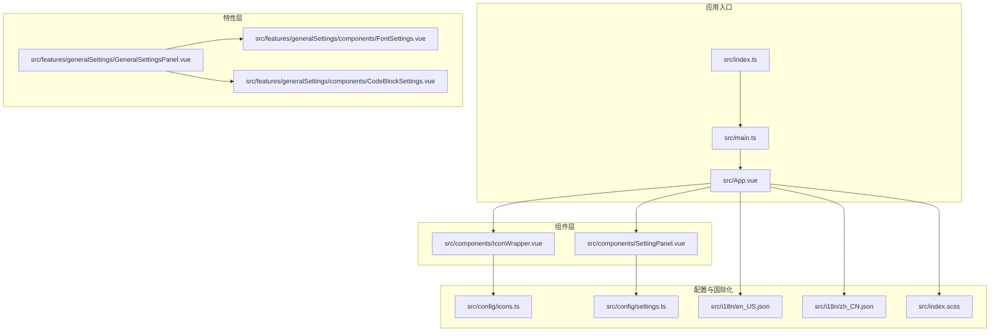
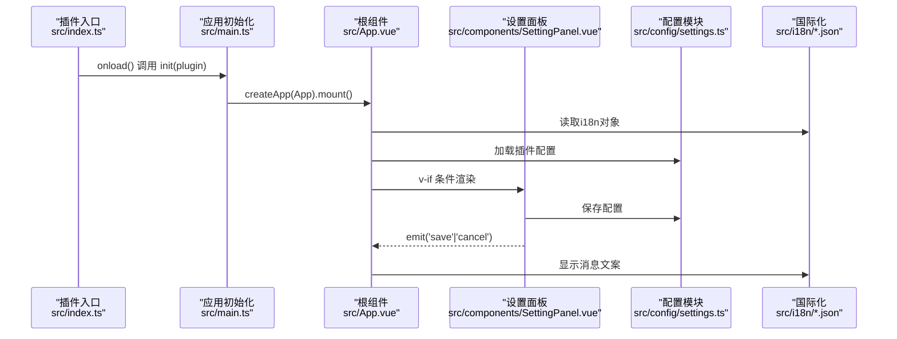
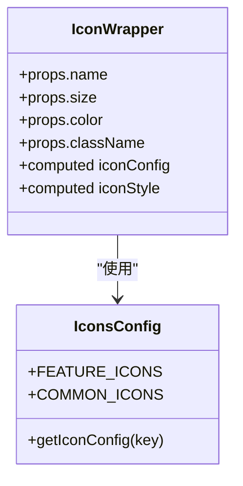
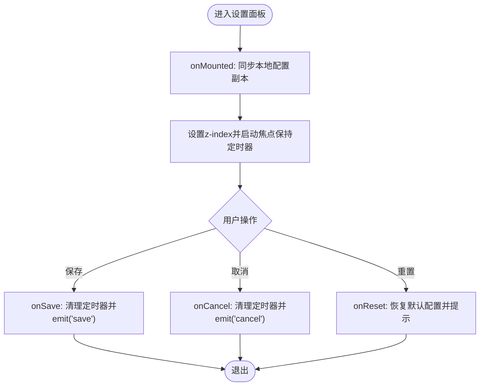
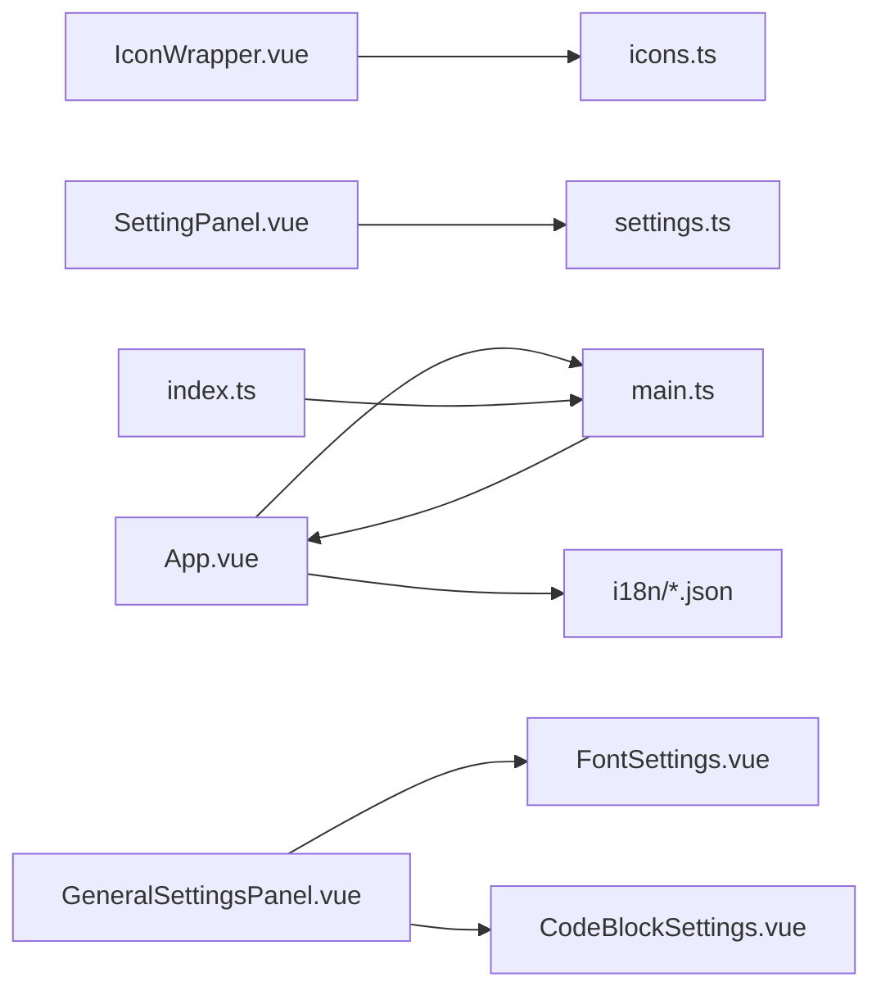

# Vue组件开发

<cite>
**本文引用的文件**
- [src/components/IconWrapper.vue](file://src/components/IconWrapper.vue)
- [src/components/SettingPanel.vue](file://src/components/SettingPanel.vue)
- [src/App.vue](file://src/App.vue)
- [src/main.ts](file://src/main.ts)
- [src/index.ts](file://src/index.ts)
- [src/config/icons.ts](file://src/config/icons.ts)
- [src/config/settings.ts](file://src/config/settings.ts)
- [src/i18n/en_US.json](file://src/i18n/en_US.json)
- [src/i18n/zh_CN.json](file://src/i18n/zh_CN.json)
- [src/index.scss](file://src/index.scss)
- [src/features/generalSettings/GeneralSettingsPanel.vue](file://src/features/generalSettings/GeneralSettingsPanel.vue)
- [src/features/generalSettings/components/FontSettings.vue](file://src/features/generalSettings/components/FontSettings.vue)
- [src/features/generalSettings/components/CodeBlockSettings.vue](file://src/features/generalSettings/components/CodeBlockSettings.vue)
</cite>

## 目录
1. [简介](#简介)
2. [项目结构](#项目结构)
3. [核心组件](#核心组件)
4. [架构总览](#架构总览)
5. [组件详解](#组件详解)
6. [依赖关系分析](#依赖关系分析)
7. [性能考量](#性能考量)
8. [故障排查指南](#故障排查指南)
9. [结论](#结论)
10. [附录](#附录)

## 简介
本文件面向插件中Vue组件的开发实践，围绕单文件组件（SFC）的结构与最佳实践展开，结合仓库中的IconWrapper.vue与SettingPanel.vue，系统讲解template、script、style三部分的组织方式；说明如何使用TypeScript进行类型安全的组件开发，包括props、emits与响应式状态的定义；阐述组件样式管理策略（Sass/SCSS）、CSS类名命名约定与主题变量的使用；并通过组件间通信、插槽使用与UI状态管理的实际示例，展示组件如何与插件实例和i18n系统集成，确保一致的用户体验。

## 项目结构
该项目采用“按特性分层”的组织方式：
- 组件层：src/components 下存放通用UI组件（如图标包装器、设置面板）
- 特性层：src/features 下按功能模块划分（如通用设置、图片压缩、二维码等）
- 配置层：src/config 下集中管理图标与设置配置
- 国际化：src/i18n 下提供多语言词条
- 样式：src/index.scss 提供全局样式与主题变量
- 应用入口：src/App.vue 作为根组件，src/main.ts 初始化挂载，src/index.ts 作为插件入口

图表来源
- [src/index.ts](file://src/index.ts#L1-L140)
- [src/main.ts](file://src/main.ts#L1-L45)
- [src/App.vue](file://src/App.vue#L1-L216)
- [src/components/IconWrapper.vue](file://src/components/IconWrapper.vue#L1-L60)
- [src/components/SettingPanel.vue](file://src/components/SettingPanel.vue#L1-L427)
- [src/features/generalSettings/GeneralSettingsPanel.vue](file://src/features/generalSettings/GeneralSettingsPanel.vue#L1-L231)
- [src/features/generalSettings/components/FontSettings.vue](file://src/features/generalSettings/components/FontSettings.vue#L1-L732)
- [src/features/generalSettings/components/CodeBlockSettings.vue](file://src/features/generalSettings/components/CodeBlockSettings.vue#L1-L1052)
- [src/config/icons.ts](file://src/config/icons.ts#L1-L194)
- [src/config/settings.ts](file://src/config/settings.ts#L1-L141)
- [src/i18n/en_US.json](file://src/i18n/en_US.json#L1-L312)
- [src/i18n/zh_CN.json](file://src/i18n/zh_CN.json#L1-L317)
- [src/index.scss](file://src/index.scss#L1-L464)

章节来源
- [src/index.ts](file://src/index.ts#L1-L140)
- [src/main.ts](file://src/main.ts#L1-L45)
- [src/App.vue](file://src/App.vue#L1-L216)

## 核心组件
本节聚焦两个关键组件：IconWrapper.vue 与 SettingPanel.vue，分别代表“图标封装”和“设置面板”的典型实现。

- IconWrapper.vue
  - 作用：基于统一图标配置，动态渲染Iconify图标，支持尺寸、颜色、类名的灵活定制
  - 类型安全：通过类型别名与接口约束，确保name、size、color、className等参数的正确性
  - 响应式：使用computed组合式API计算最终样式与类名
  - 样式：scoped样式限定作用域，同时提供默认SVG基础样式
  - 依赖：依赖图标配置模块与Iconify组件

- SettingPanel.vue
  - 作用：插件设置面板，负责展示与编辑插件配置，提供保存、取消、重置等交互
  - 类型安全：明确props与emits的类型签名，保证父子通信的类型一致性
  - 响应式：使用ref与生命周期钩子管理本地配置副本与焦点保持逻辑
  - 样式：scoped + Sass，提供覆盖滚动条、布局、交互态等细节
  - 依赖：依赖插件配置模块与消息提示API

章节来源
- [src/components/IconWrapper.vue](file://src/components/IconWrapper.vue#L1-L60)
- [src/components/SettingPanel.vue](file://src/components/SettingPanel.vue#L1-L427)
- [src/config/icons.ts](file://src/config/icons.ts#L1-L194)
- [src/config/settings.ts](file://src/config/settings.ts#L1-L141)

## 架构总览
下图展示了插件初始化、应用挂载、组件渲染与用户交互的关键流程。

图表来源
- [src/index.ts](file://src/index.ts#L1-L140)
- [src/main.ts](file://src/main.ts#L1-L45)
- [src/App.vue](file://src/App.vue#L1-L216)
- [src/components/SettingPanel.vue](file://src/components/SettingPanel.vue#L1-L427)
- [src/config/settings.ts](file://src/config/settings.ts#L1-L141)
- [src/i18n/en_US.json](file://src/i18n/en_US.json#L1-L312)
- [src/i18n/zh_CN.json](file://src/i18n/zh_CN.json#L1-L317)

## 组件详解

### IconWrapper.vue 组件分析
- SFC结构
  - template：使用Icon组件，绑定iconConfig.icon、iconStyle与className
  - script setup + TypeScript：定义Props接口，使用defineProps与computed
  - style scoped：为SVG提供默认样式，保证图标垂直居中与尺寸一致
- 类型安全
  - Props接口约束name、size、color、className字段
  - 通过getIconConfig返回的IconConfig类型确保icon/color/size可用
- 响应式与计算
  - iconConfig：根据name计算对应图标配置
  - iconStyle：根据props与配置计算最终样式（尺寸、颜色），优先使用传入props
- 样式管理
  - scoped样式限定SVG作用域
  - 通过类名className扩展样式（如主题色、尺寸类）

图表来源
- [src/components/IconWrapper.vue](file://src/components/IconWrapper.vue#L1-L60)
- [src/config/icons.ts](file://src/config/icons.ts#L1-L194)

章节来源
- [src/components/IconWrapper.vue](file://src/components/IconWrapper.vue#L1-L60)
- [src/config/icons.ts](file://src/config/icons.ts#L1-L194)

### SettingPanel.vue 组件分析
- SFC结构
  - template：包含标题、描述、多项开关设置、底部操作区与提示信息
  - script setup + TypeScript：定义Props与Emits接口，使用ref、onMounted/onBeforeUnmount
  - style lang="scss" scoped：提供覆盖滚动条、布局、交互态等样式
- 类型安全
  - Props包含settings与i18n
  - Emits声明save与cancel事件，携带参数类型
- 响应式与生命周期
  - localSettings：本地配置副本，避免直接修改父组件传入的settings
  - onMounted：确保面板在最上层，焦点保持在面板内
  - onBeforeUnmount：清理定时器，避免内存泄漏
- 交互逻辑
  - onSave：清理定时器后emit('save', settings)
  - onCancel：清理定时器后emit('cancel')
  - onReset：恢复默认配置并提示

图表来源
- [src/components/SettingPanel.vue](file://src/components/SettingPanel.vue#L1-L427)

章节来源
- [src/components/SettingPanel.vue](file://src/components/SettingPanel.vue#L1-L427)

### 组件间通信与插槽使用
- 父子通信
  - SettingPanel通过props接收父组件传递的settings与i18n
  - SettingPanel通过defineEmits声明save与cancel事件，父组件在App.vue中监听并处理
- 插槽使用
  - 通用设置面板（GeneralSettingsPanel.vue）内部通过具名插槽组合多个子组件（字体设置、代码块美化、密码设置、通用操作），实现模块化与可扩展
- 暴露方法
  - 通用设置面板通过defineExpose暴露方法，便于父组件调用

章节来源
- [src/components/SettingPanel.vue](file://src/components/SettingPanel.vue#L1-L427)
- [src/App.vue](file://src/App.vue#L1-L216)
- [src/features/generalSettings/GeneralSettingsPanel.vue](file://src/features/generalSettings/GeneralSettingsPanel.vue#L1-L231)

### UI状态管理与主题集成
- 状态管理
  - SettingPanel使用ref维护localSettings，确保与父组件settings同步
  - 通用设置面板内部使用watch监听设置变化并向上游emit('change')
- 主题与样式
  - 使用SCSS变量与CSS自定义属性（如--codeblock-font-size、--codeblock-padding）实现主题化
  - 通过body.classList切换代码块风格类名，实现运行时样式切换
  - 紧凑模式通过html.siyuan-compact-mode全局样式减少间距与字号

章节来源
- [src/features/generalSettings/components/CodeBlockSettings.vue](file://src/features/generalSettings/components/CodeBlockSettings.vue#L1-L1052)
- [src/index.scss](file://src/index.scss#L1-L464)

### 与插件实例和i18n系统的集成
- 插件实例集成
  - main.ts通过usePlugin绑定插件实例，App.vue通过usePlugin获取插件对象
  - 插件入口index.ts在onload中加载配置并注册功能模块，App.vue通过插件对象调用updateSettings保存配置
- i18n集成
  - App.vue直接将plugin.i18n传入子组件，子组件通过props接收并渲染国际化文案
  - 通用设置面板内部也接收i18n并向下传递给子组件

章节来源
- [src/main.ts](file://src/main.ts#L1-L45)
- [src/App.vue](file://src/App.vue#L1-L216)
- [src/index.ts](file://src/index.ts#L1-L140)
- [src/i18n/en_US.json](file://src/i18n/en_US.json#L1-L312)
- [src/i18n/zh_CN.json](file://src/i18n/zh_CN.json#L1-L317)

## 依赖关系分析
- 组件依赖
  - IconWrapper依赖icons.ts提供的图标配置与Iconify组件
  - SettingPanel依赖settings.ts提供的配置接口与消息提示API
- 应用依赖
  - App.vue依赖main.ts导出的usePlugin与插件实例，依赖i18n词条
  - index.ts负责插件生命周期与功能注册，init/main.ts负责应用挂载

图表来源
- [src/components/IconWrapper.vue](file://src/components/IconWrapper.vue#L1-L60)
- [src/components/SettingPanel.vue](file://src/components/SettingPanel.vue#L1-L427)
- [src/App.vue](file://src/App.vue#L1-L216)
- [src/main.ts](file://src/main.ts#L1-L45)
- [src/index.ts](file://src/index.ts#L1-L140)
- [src/config/icons.ts](file://src/config/icons.ts#L1-L194)
- [src/config/settings.ts](file://src/config/settings.ts#L1-L141)
- [src/i18n/en_US.json](file://src/i18n/en_US.json#L1-L312)
- [src/i18n/zh_CN.json](file://src/i18n/zh_CN.json#L1-L317)
- [src/features/generalSettings/GeneralSettingsPanel.vue](file://src/features/generalSettings/GeneralSettingsPanel.vue#L1-L231)
- [src/features/generalSettings/components/FontSettings.vue](file://src/features/generalSettings/components/FontSettings.vue#L1-L732)
- [src/features/generalSettings/components/CodeBlockSettings.vue](file://src/features/generalSettings/components/CodeBlockSettings.vue#L1-L1052)

章节来源
- [src/components/IconWrapper.vue](file://src/components/IconWrapper.vue#L1-L60)
- [src/components/SettingPanel.vue](file://src/components/SettingPanel.vue#L1-L427)
- [src/App.vue](file://src/App.vue#L1-L216)
- [src/main.ts](file://src/main.ts#L1-L45)
- [src/index.ts](file://src/index.ts#L1-L140)

## 性能考量
- 组件渲染
  - 使用computed计算样式与类名，避免重复计算
  - 在SettingPanel中使用定时器维持焦点，注意在onBeforeUnmount中清理，避免内存泄漏
- 样式优化
  - 使用SCSS变量与CSS自定义属性，减少重复样式定义
  - 通过body.classList切换主题类名，避免频繁DOM操作
- 数据持久化
  - 通用设置面板将配置写入localStorage，减少网络请求与服务端依赖

[本节为通用指导，无需列出具体文件来源]

## 故障排查指南
- 设置面板无法关闭或焦点异常
  - 检查onMounted是否正确设置z-index与焦点保持定时器
  - 确认onBeforeUnmount是否清理定时器
  - 参考路径：[src/components/SettingPanel.vue](file://src/components/SettingPanel.vue#L1-L427)
- 图标不显示或颜色不生效
  - 检查name是否在icons.ts中存在，确认getIconConfig返回有效配置
  - 确认props.color优先级高于配置中的color
  - 参考路径：[src/components/IconWrapper.vue](file://src/components/IconWrapper.vue#L1-L60)，[src/config/icons.ts](file://src/config/icons.ts#L1-L194)
- 配置保存失败
  - 检查settings.ts中的saveSettings返回值与错误日志
  - 确认App.vue中调用plugin.updateSettings后的消息提示
  - 参考路径：[src/config/settings.ts](file://src/config/settings.ts#L1-L141)，[src/App.vue](file://src/App.vue#L1-L216)
- 国际化文案缺失
  - 检查i18n词条是否存在，确认App.vue是否正确传递i18n对象
  - 参考路径：[src/i18n/en_US.json](file://src/i18n/en_US.json#L1-L312)，[src/i18n/zh_CN.json](file://src/i18n/zh_CN.json#L1-L317)，[src/App.vue](file://src/App.vue#L1-L216)

章节来源
- [src/components/SettingPanel.vue](file://src/components/SettingPanel.vue#L1-L427)
- [src/components/IconWrapper.vue](file://src/components/IconWrapper.vue#L1-L60)
- [src/config/icons.ts](file://src/config/icons.ts#L1-L194)
- [src/config/settings.ts](file://src/config/settings.ts#L1-L141)
- [src/i18n/en_US.json](file://src/i18n/en_US.json#L1-L312)
- [src/i18n/zh_CN.json](file://src/i18n/zh_CN.json#L1-L317)
- [src/App.vue](file://src/App.vue#L1-L216)

## 结论
本项目在Vue组件开发方面体现了以下最佳实践：
- SFC结构清晰：template、script、style职责分明，配合TypeScript提升类型安全性
- 组件通信规范：通过props与emits明确父子通信契约，结合defineExpose暴露必要方法
- 响应式与生命周期：合理使用ref/computed与生命周期钩子，确保状态与DOM行为一致
- 样式主题化：通过SCSS变量与CSS自定义属性实现主题化与运行时切换
- 插件与i18n集成：通过插件实例与i18n词条，确保一致的用户体验与多语言支持

[本节为总结性内容，无需列出具体文件来源]

## 附录
- 命名约定建议
  - 组件类名采用语义化前缀（如settings-、font-、codeblock-），便于样式隔离与查找
  - SCSS变量采用--b3-theme-*或--codeblock-*命名，体现主题与组件域
- 开发建议
  - 在组件中尽量使用withDefaults与defineProps/defineEmits的TS签名，提升可读性与可维护性
  - 对于复杂交互（如SettingPanel），务必在onBeforeUnmount清理副作用
  - 对于样式切换（如代码块风格），通过类名切换与CSS变量结合，避免频繁DOM操作

[本节为通用指导，无需列出具体文件来源]