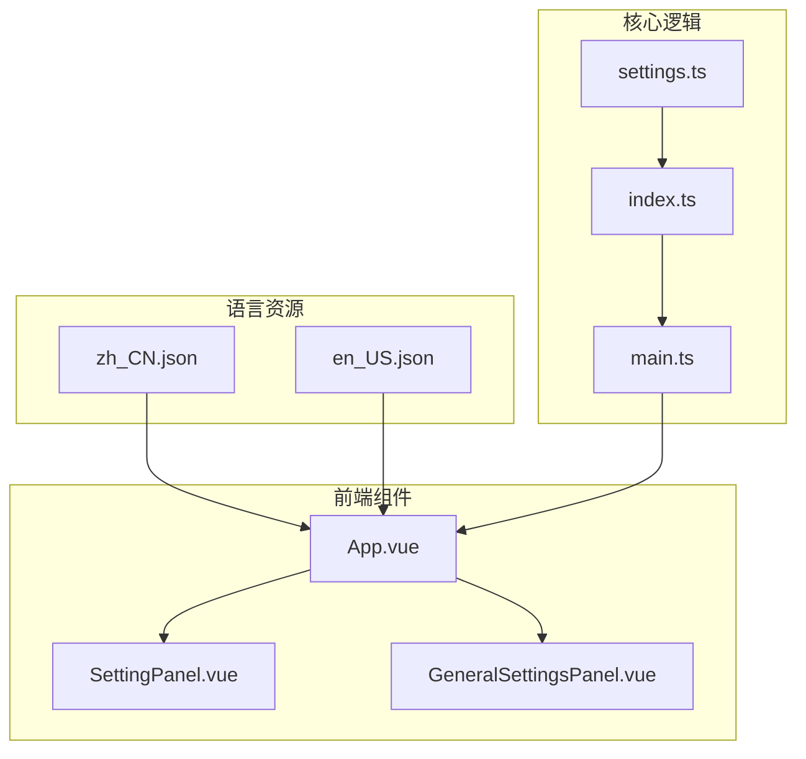
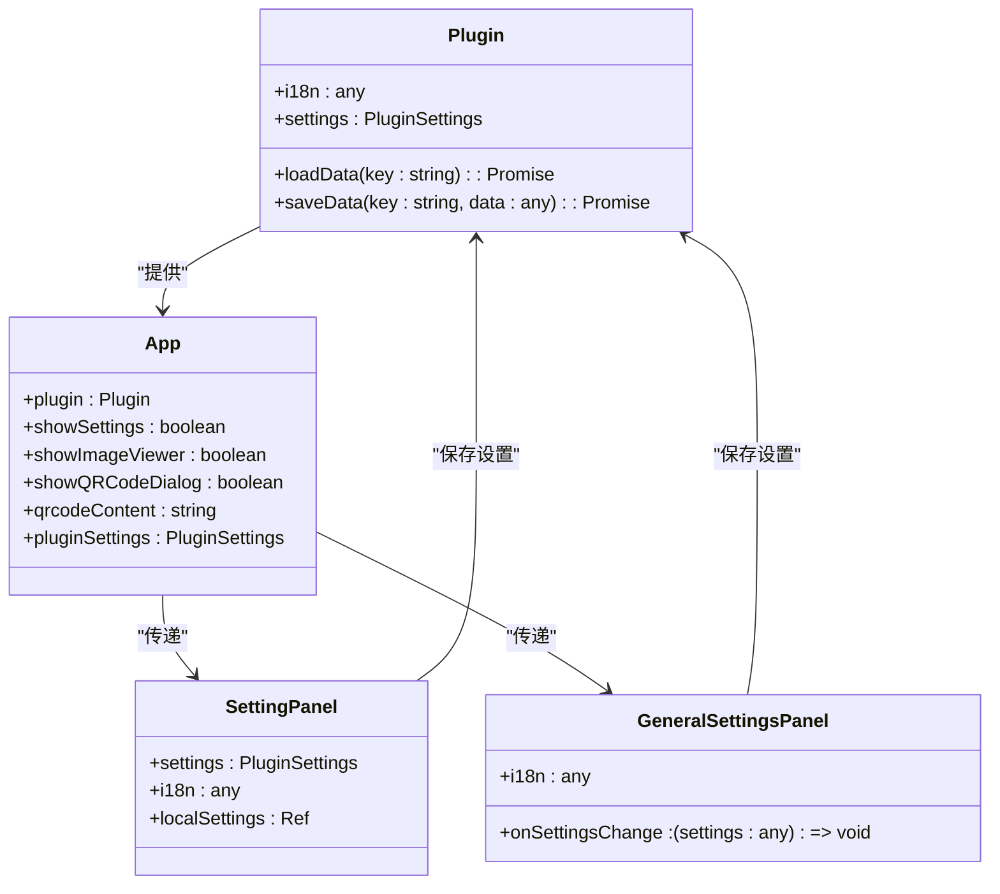
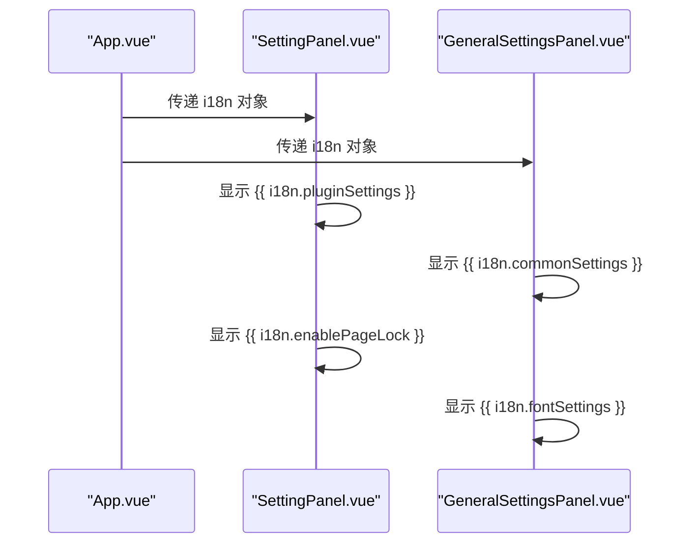
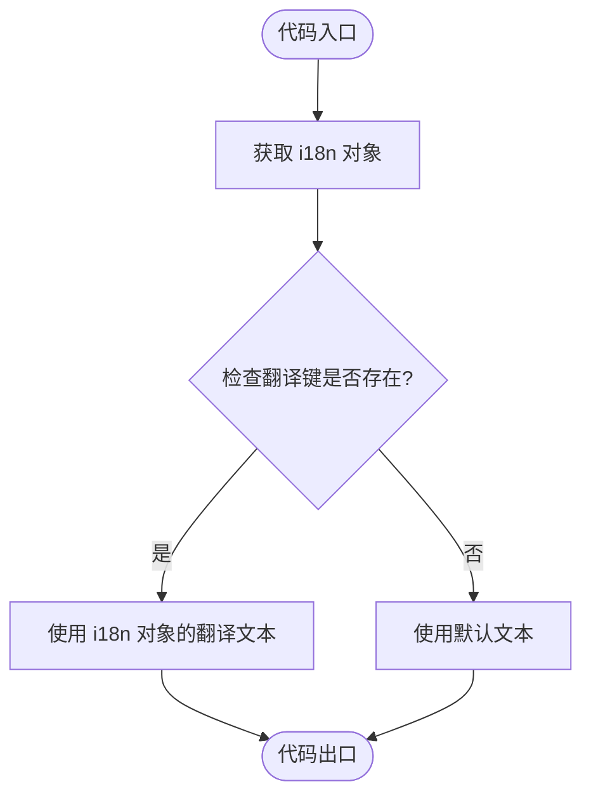

# 多语言支持

<cite>
**本文档引用的文件**
- [zh_CN.json](file://src/i18n/zh_CN.json)
- [en_US.json](file://src/i18n/en_US.json)
- [main.ts](file://src/main.ts)
- [App.vue](file://src/App.vue)
- [SettingPanel.vue](file://src/components/SettingPanel.vue)
- [GeneralSettingsPanel.vue](file://src/features/generalSettings/GeneralSettingsPanel.vue)
- [index.ts](file://src/index.ts)
- [settings.ts](file://src/config/settings.ts)
- [vite.config.ts](file://vite.config.ts)
</cite>

## 目录
1. [简介](#简介)
2. [项目结构](#项目结构)
3. [核心组件](#核心组件)
4. [架构概述](#架构概述)
5. [详细组件分析](#详细组件分析)
6. [依赖分析](#依赖分析)
7. [性能考虑](#性能考虑)
8. [故障排除指南](#故障排除指南)
9. [结论](#结论)
10. [附录](#附录) (如有必要)

## 简介
本文档详细介绍了思源插件的多语言支持系统，重点阐述了插件的国际化实现机制。文档将深入分析zh_CN.json和en_US.json语言包的结构设计，包括功能模块、设置项和用户界面文本的翻译键组织方式。同时，文档将解释如何在Vue组件和TypeScript代码中通过this.i18n访问翻译文本，以及语言资源的加载和切换机制。通过实际代码示例展示多语言文本的使用模式，如i18n.generalSettings.appearance.title。最后，文档将说明语言包的维护流程和新增翻译项的最佳实践，确保用户界面文本的完整性和一致性。

## 项目结构
本插件的多语言支持系统主要由语言包文件、Vue组件和TypeScript代码三部分组成。语言包文件位于src/i18n目录下，包含zh_CN.json和en_US.json两个文件，分别对应中文和英文的翻译文本。Vue组件通过props接收i18n对象，实现多语言文本的显示。TypeScript代码通过插件实例的i18n属性访问翻译文本。



**图示来源**
- [zh_CN.json](file://src/i18n/zh_CN.json)
- [en_US.json](file://src/i18n/en_US.json)
- [App.vue](file://src/App.vue)
- [main.ts](file://src/main.ts)
- [index.ts](file://src/index.ts)
- [settings.ts](file://src/config/settings.ts)

**章节来源**
- [zh_CN.json](file://src/i18n/zh_CN.json)
- [en_US.json](file://src/i18n/en_US.json)
- [App.vue](file://src/App.vue)
- [main.ts](file://src/main.ts)
- [index.ts](file://src/index.ts)
- [settings.ts](file://src/config/settings.ts)

## 核心组件
多语言支持系统的核心组件包括语言包文件、Vue组件和TypeScript代码。语言包文件采用JSON格式，包含所有用户界面文本的翻译。Vue组件通过props接收i18n对象，使用双大括号语法{{ }}显示翻译文本。TypeScript代码通过插件实例的i18n属性访问翻译文本，实现动态文本的国际化。

**章节来源**
- [zh_CN.json](file://src/i18n/zh_CN.json)
- [en_US.json](file://src/i18n/en_US.json)
- [App.vue](file://src/App.vue)
- [main.ts](file://src/main.ts)
- [index.ts](file://src/index.ts)

## 架构概述
多语言支持系统的架构基于Vue 3的组合式API和TypeScript类型系统。系统通过插件实例的i18n属性提供翻译文本，Vue组件通过props接收i18n对象，实现多语言文本的显示。语言包文件在构建时通过vite-static-copy插件复制到输出目录，确保语言资源的正确加载。



**图示来源**
- [App.vue](file://src/App.vue)
- [SettingPanel.vue](file://src/components/SettingPanel.vue)
- [GeneralSettingsPanel.vue](file://src/features/generalSettings/GeneralSettingsPanel.vue)
- [index.ts](file://src/index.ts)

**章节来源**
- [App.vue](file://src/App.vue)
- [SettingPanel.vue](file://src/components/SettingPanel.vue)
- [GeneralSettingsPanel.vue](file://src/features/generalSettings/GeneralSettingsPanel.vue)
- [index.ts](file://src/index.ts)

## 详细组件分析
### 语言包结构分析
语言包文件采用嵌套的JSON结构，按功能模块组织翻译键。根级别的键对应通用功能，如"addTopBarIcon"、"lockPage"等。功能模块的键采用嵌套对象的形式，如"imageCompressor"、"superPanel"等。这种结构设计使得翻译键具有良好的可读性和可维护性。

```mermaid
erDiagram
LANGUAGE_PACKAGE {
string addTopBarIcon PK
string lockPage
string unlockPage
string setPassword
string updatePassword
string enterPassword
string passwordPlaceholder
string oldPasswordPlaceholder
string newPasswordPlaceholder
string confirmPasswordPlaceholder
string passwordMismatch
string passwordEmpty
string oldPasswordError
string lockSuccess
string unlockSuccess
string passwordError
string confirm
string cancel
string pageLocked
string pleaseUnlock
string pleaseSetPasswordFirst
string passwordSetting
string passwordSettingDesc
string passwordSetSuccess
string passwordUpdateSuccess
string passwordSet
string passwordNotSet
string setPasswordDesc
string updatePasswordDesc
string updatePasswordHint
string setPasswordHint
string unlockHint
string pluginSettings
string pluginSettingsDesc
string enablePageLock
string enablePageLockDesc
string enableTableOfContents
string enableTableOfContentsDesc
string save
string resetSettings
string resetSettingsSuccess
string saveSettingsSuccess
string saveSettingsFailed
string settingsNotice
string tableOfContents
string insertIndex
string insertSubDocsRef
string insertSubDocsWithOutline
string insertCurrentOutline
string insertNotebookTree
string insertSubDocToc
string insertDocOutline
string insertNotebookToc
string insertCurrentDocOutline
string subDocumentToc
string notebookToc
string noActiveDocument
string insertSuccess
string insertFailed
string untitled
string noHeadings
string noSubDocuments
string noNotebook
string notebookNotFound
string noDocuments
}
IMAGE_COMPRESSOR {
string title PK
string opening
string scanImages
string scanning
string scanComplete
string foundImages
string selectImages
string selectAll
string deselectAll
string compress
string compressing
string compressComplete
string replace
string replacing
string replaceComplete
string quality
string maxSize
string maxDimension
string originalSize
string compressedSize
string compressionRatio
string saved
string statistics
string totalImages
string successCount
string failedCount
string totalSaved
}
SUPER_PANEL {
string title PK
string close
string settings
string enabled
string disabled
string featureDisabled
string tableOfContents
string tableOfContentsDesc
string imageCompressor
string imageCompressorDesc
string docNavigation
string docNavigationDesc
string pageLock
string pageLockDesc
string wordQuery
string wordQueryDesc
string qrCode
string qrCodeDesc
string unitConverter
string unitConverterDesc
string shortcuts
string shortcutsDesc
string diskBrowser
string diskBrowserDesc
}
LANGUAGE_PACKAGE ||--o{ IMAGE_COMPRESSOR : "包含"
LANGUAGE_PACKAGE ||--o{ SUPER_PANEL : "包含"
```



**图示来源**
- [zh_CN.json](file://src/i18n/zh_CN.json)
- [en_US.json](file://src/i18n/en_US.json)

**章节来源**
- [zh_CN.json](file://src/i18n/zh_CN.json)
- [en_US.json](file://src/i18n/en_US.json)

### Vue组件中的多语言实现
Vue组件通过props接收i18n对象，使用双大括号语法{{ }}显示翻译文本。组件中的文本内容直接引用i18n对象的属性，如{{ i18n.pluginSettings }}。对于嵌套的翻译键，使用点号分隔，如{{ i18n.imageCompressor.title }}。这种实现方式简洁明了，易于维护。



**图示来源**
- [App.vue](file://src/App.vue)
- [SettingPanel.vue](file://src/components/SettingPanel.vue)
- [GeneralSettingsPanel.vue](file://src/features/generalSettings/GeneralSettingsPanel.vue)

**章节来源**
- [App.vue](file://src/App.vue)
- [SettingPanel.vue](file://src/components/SettingPanel.vue)
- [GeneralSettingsPanel.vue](file://src/features/generalSettings/GeneralSettingsPanel.vue)

### TypeScript代码中的多语言实现
TypeScript代码通过插件实例的i18n属性访问翻译文本，实现动态文本的国际化。代码中使用插件实例的i18n属性，如plugin.i18n.saveSettingsSuccess，获取翻译文本。对于可能不存在的翻译键，使用逻辑或操作符||提供默认值，如plugin.i18n.saveSettingsSuccess || '配置保存成功,请重启插件生效'。



**图示来源**
- [App.vue](file://src/App.vue)
- [main.ts](file://src/main.ts)
- [index.ts](file://src/index.ts)

**章节来源**
- [App.vue](file://src/App.vue)
- [main.ts](file://src/main.ts)
- [index.ts](file://src/index.ts)

## 依赖分析
多语言支持系统的依赖关系主要体现在构建工具和运行时环境。构建工具vite通过vite-static-copy插件将语言包文件复制到输出目录，确保语言资源的正确加载。运行时环境通过插件实例的i18n属性提供翻译文本，Vue组件和TypeScript代码依赖插件实例获取翻译文本。

```mermaid
graph TD
subgraph "构建时依赖"
Vite[Vite]
ViteStaticCopy[vite-static-copy]
end
subgraph "运行时依赖"
Plugin[插件实例]
Vue[Vue 3]
TypeScript[TypeScript]
end
Vite --> ViteStaticCopy : "使用"
ViteStaticCopy --> zh_CN : "复制"
ViteStaticCopy --> en_US : "复制"
Plugin --> App : "提供 i18n"
Vue --> App : "渲染"
TypeScript --> App : "类型检查"
```

**图示来源**
- [vite.config.ts](file://vite.config.ts)
- [App.vue](file://src/App.vue)
- [main.ts](file://src/main.ts)
- [index.ts](file://src/index.ts)

**章节来源**
- [vite.config.ts](file://vite.config.ts)
- [App.vue](file://src/App.vue)
- [main.ts](file://src/main.ts)
- [index.ts](file://src/index.ts)

## 性能考虑
多语言支持系统的性能主要体现在语言包文件的加载和解析。语言包文件在构建时通过vite-static-copy插件复制到输出目录，避免了运行时的网络请求。语言包文件采用JSON格式，解析速度快，内存占用小。Vue组件通过props接收i18n对象，避免了重复的属性查找，提高了渲染性能。

## 故障排除指南
### 语言包加载失败
如果语言包文件未能正确加载，首先检查vite.config.ts中的vite-static-copy配置，确保src/i18n/**模式正确匹配语言包文件。其次，检查构建输出目录，确认语言包文件是否被正确复制。

### 翻译文本显示异常
如果翻译文本显示为undefined或默认值，首先检查i18n对象是否正确传递到组件。其次，检查翻译键是否正确，确保大小写和拼写无误。最后，检查语言包文件，确认翻译键是否存在。

### 新增翻译项未生效
如果新增的翻译项未能生效，首先检查语言包文件，确认新增的翻译键和值是否正确。其次，检查组件代码，确认是否正确引用了新的翻译键。最后，重新构建插件，确保语言包文件被正确复制。

**章节来源**
- [vite.config.ts](file://vite.config.ts)
- [zh_CN.json](file://src/i18n/zh_CN.json)
- [en_US.json](file://src/i18n/en_US.json)
- [App.vue](file://src/App.vue)

## 结论
本文档详细介绍了思源插件的多语言支持系统，包括语言包的结构设计、Vue组件和TypeScript代码中的多语言实现、构建工具的依赖关系以及性能考虑和故障排除指南。通过本文档，开发者可以深入了解多语言支持系统的实现机制，掌握新增翻译项的最佳实践，确保用户界面文本的完整性和一致性。

## 附录
### 语言包维护流程
1. 在src/i18n目录下打开zh_CN.json和en_US.json文件
2. 添加新的翻译键和值，确保键名具有良好的可读性和可维护性
3. 在Vue组件或TypeScript代码中引用新的翻译键
4. 重新构建插件，确保语言包文件被正确复制
5. 测试新翻译项的显示效果，确保正确无误

### 新增翻译项最佳实践
1. 使用有意义的键名，如"pluginSettings"而不是"ps"
2. 按功能模块组织翻译键，使用嵌套对象的形式
3. 保持中英文翻译的一致性，确保语义准确
4. 使用逻辑或操作符||提供默认值，提高代码的健壮性
5. 定期检查语言包文件，删除未使用的翻译键，保持文件的整洁