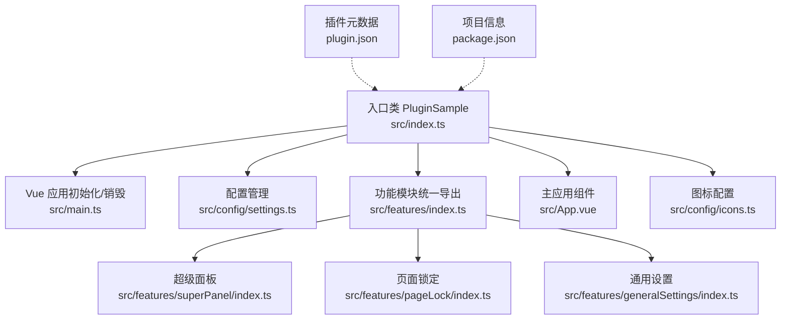
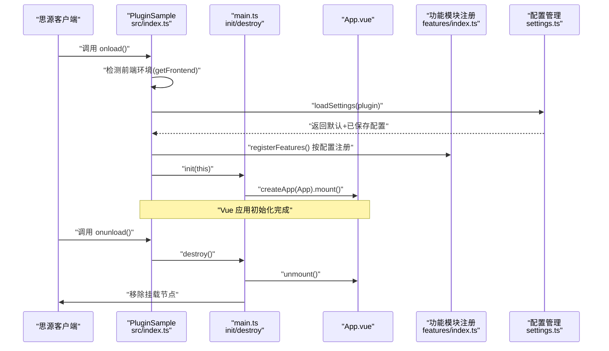
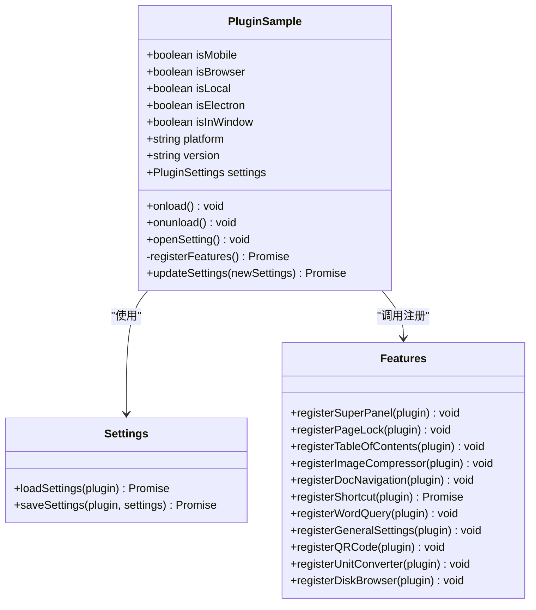
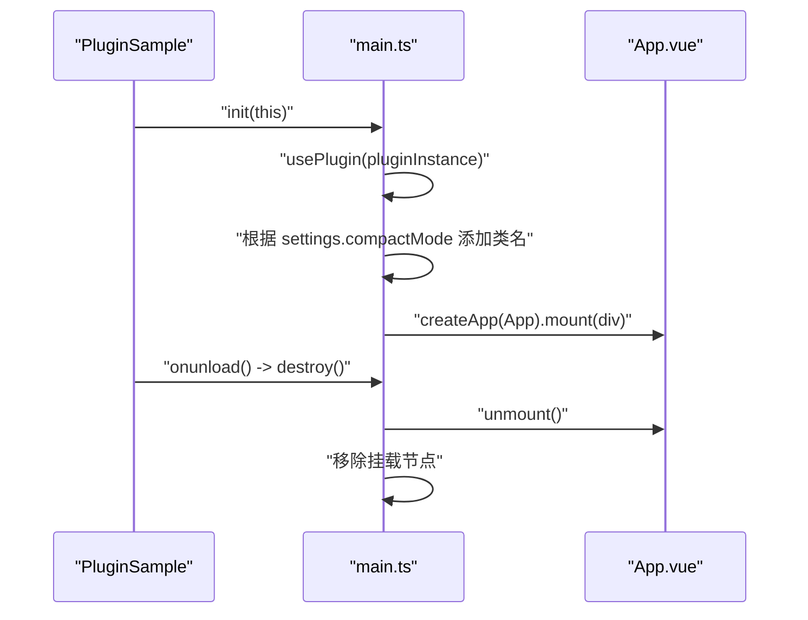
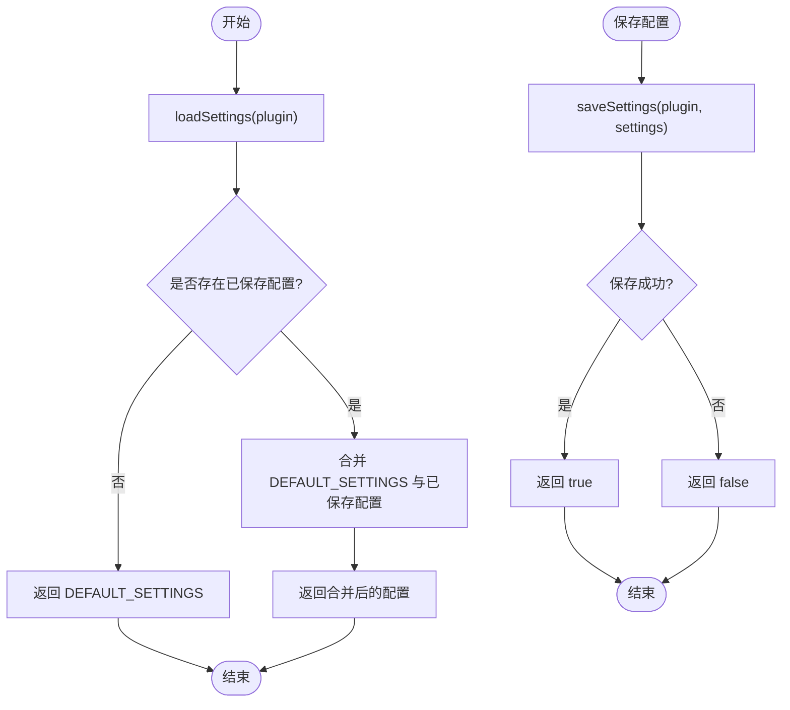
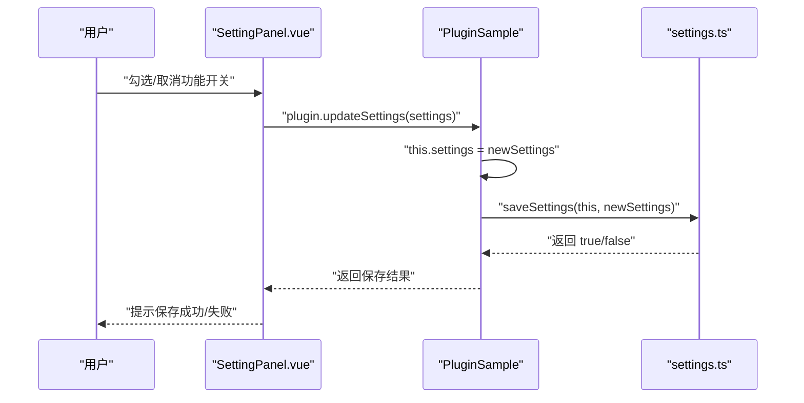
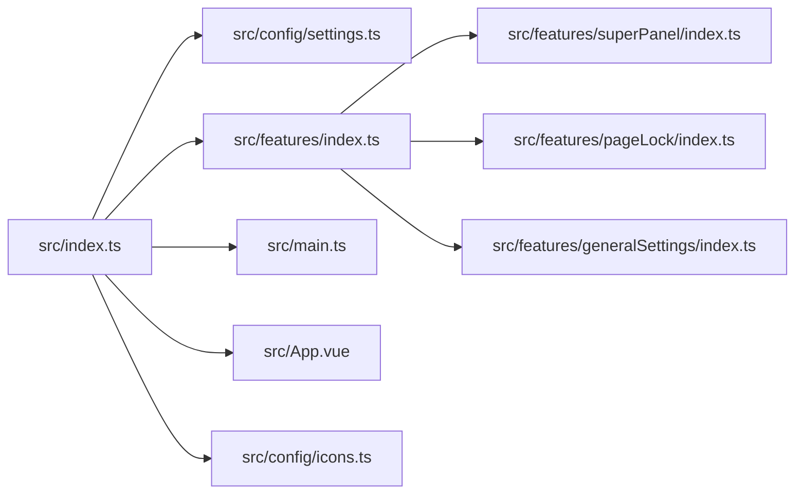

# 插件入口

<cite>
**本文引用的文件**
- [src/index.ts](file://src/index.ts)
- [src/main.ts](file://src/main.ts)
- [src/config/settings.ts](file://src/config/settings.ts)
- [src/features/index.ts](file://src/features/index.ts)
- [src/App.vue](file://src/App.vue)
- [src/features/superPanel/index.ts](file://src/features/superPanel/index.ts)
- [src/features/pageLock/index.ts](file://src/features/pageLock/index.ts)
- [src/features/generalSettings/index.ts](file://src/features/generalSettings/index.ts)
- [src/config/icons.ts](file://src/config/icons.ts)
- [plugin.json](file://plugin.json)
- [package.json](file://package.json)
- [README.md](file://README.md)
</cite>

## 目录
1. [简介](#简介)
2. [项目结构](#项目结构)
3. [核心组件](#核心组件)
4. [架构总览](#架构总览)
5. [详细组件分析](#详细组件分析)
6. [依赖关系分析](#依赖关系分析)
7. [性能考量](#性能考量)
8. [故障排查指南](#故障排查指南)
9. [结论](#结论)
10. [附录](#附录)

## 简介
本文件聚焦于插件入口类 PluginSample 的实现与使用说明，围绕其继承思源笔记 Plugin 基类后的生命周期方法（onload、onunload、openSetting），以及插件初始化流程（前端环境检测、配置加载、功能模块注册机制）。同时，本文详细解释了 this.registerFeatures() 如何依据配置动态注册功能模块，updateSettings 如何实现配置更新与持久化，插件元数据（版本号）的加载机制，以及 init/destroy 在 Vue 应用生命周期中的作用。

## 项目结构
该仓库采用“入口类 + Vue 应用 + 配置管理 + 功能模块”的分层组织方式：
- 入口类：负责生命周期、平台检测、配置加载、功能注册、设置面板打开
- Vue 应用：在 onload 后初始化挂载，onunload 时卸载
- 配置管理：提供默认配置、加载/保存配置、字体设置等
- 功能模块：按功能拆分，统一导出并在入口类中按需注册

图表来源
- [src/index.ts](file://src/index.ts#L1-L140)
- [src/main.ts](file://src/main.ts#L1-L45)
- [src/config/settings.ts](file://src/config/settings.ts#L1-L141)
- [src/features/index.ts](file://src/features/index.ts#L1-L15)
- [src/features/superPanel/index.ts](file://src/features/superPanel/index.ts#L1-L138)
- [src/features/pageLock/index.ts](file://src/features/pageLock/index.ts#L1-L573)
- [src/features/generalSettings/index.ts](file://src/features/generalSettings/index.ts#L1-L414)
- [src/App.vue](file://src/App.vue#L1-L216)
- [src/config/icons.ts](file://src/config/icons.ts#L1-L194)
- [plugin.json](file://plugin.json#L1-L34)
- [package.json](file://package.json#L1-L46)

章节来源
- [src/index.ts](file://src/index.ts#L1-L140)
- [src/main.ts](file://src/main.ts#L1-L45)
- [src/config/settings.ts](file://src/config/settings.ts#L1-L141)
- [src/features/index.ts](file://src/features/index.ts#L1-L15)
- [src/App.vue](file://src/App.vue#L1-L216)
- [src/config/icons.ts](file://src/config/icons.ts#L1-L194)
- [plugin.json](file://plugin.json#L1-L34)
- [package.json](file://package.json#L1-L46)

## 核心组件
- PluginSample（入口类）
  - 继承自 Plugin，实现 onload/onunload/openSetting 生命周期
  - 平台检测：移动端、浏览器、Electron、本地窗口
  - 配置加载：loadSettings
  - 功能注册：registerFeatures
  - 设置更新：updateSettings
  - 版本号：从 plugin.json 中读取
- Vue 应用初始化/销毁（init/destroy）
  - 在 onload 后创建并挂载 App.vue
  - 在 onunload 时卸载并移除 DOM
- 配置管理（settings.ts）
  - 接口定义、默认值、加载/保存、字体设置
- 功能模块（features/index.ts）
  - 统一导出各功能注册函数
- 主应用组件（App.vue）
  - 设置面板、图片压缩器、二维码对话框等 UI
  - 通过 window._sy_plugin_sample 暴露 openSetting/openQRCodeDialog

章节来源
- [src/index.ts](file://src/index.ts#L1-L140)
- [src/main.ts](file://src/main.ts#L1-L45)
- [src/config/settings.ts](file://src/config/settings.ts#L1-L141)
- [src/features/index.ts](file://src/features/index.ts#L1-L15)
- [src/App.vue](file://src/App.vue#L1-L216)

## 架构总览
下面的序列图展示了插件从加载到卸载的关键调用链路，以及 Vue 应用的生命周期绑定。

图表来源
- [src/index.ts](file://src/index.ts#L39-L76)
- [src/main.ts](file://src/main.ts#L21-L45)
- [src/config/settings.ts](file://src/config/settings.ts#L70-L96)
- [src/features/index.ts](file://src/features/index.ts#L1-L15)
- [src/App.vue](file://src/App.vue#L1-L216)

## 详细组件分析

### 入口类 PluginSample（生命周期与初始化）
- 继承 Plugin，实现以下生命周期方法：
  - onload：环境检测、加载配置、注册功能、初始化 Vue 应用
  - onunload：卸载 Vue 应用
  - openSetting：通过 window._sy_plugin_sample.openSetting 打开设置面板
- 平台检测逻辑：
  - 通过 getFrontend 判断前端类型（mobile/browser-mobile 等）
  - 通过 location.href 判断 localhost/127.0.0.1 与 window.html
  - 通过 require('@electron/remote') 判断 Electron 环境
- 配置加载与持久化：
  - loadSettings：从插件数据存储加载配置，合并默认值
  - saveSettings：保存配置到插件数据存储
  - updateSettings：更新内存配置并调用 saveSettings
- 功能模块注册：
  - registerFeatures：根据 settings 中的布尔开关逐项注册
  - 超级面板始终注册（作为统一入口）
- 版本号加载：
  - 从 plugin.json 中读取 version 并暴露为只读属性

图表来源
- [src/index.ts](file://src/index.ts#L1-L140)
- [src/config/settings.ts](file://src/config/settings.ts#L1-L141)
- [src/features/index.ts](file://src/features/index.ts#L1-L15)

章节来源
- [src/index.ts](file://src/index.ts#L39-L139)
- [src/config/settings.ts](file://src/config/settings.ts#L70-L96)
- [src/features/index.ts](file://src/features/index.ts#L1-L15)

### Vue 应用初始化与销毁（init/destroy）
- init(pluginInstance)
  - 绑定插件实例（usePlugin）
  - 根据 settings.compactMode 应用全局紧凑模式类名
  - 创建并挂载 App.vue 到 body
- destroy()
  - 卸载并移除挂载节点

图表来源
- [src/main.ts](file://src/main.ts#L21-L45)
- [src/App.vue](file://src/App.vue#L1-L216)

章节来源
- [src/main.ts](file://src/main.ts#L1-L45)
- [src/App.vue](file://src/App.vue#L1-L216)

### 配置加载与持久化（settings.ts）
- 接口与默认值
  - PluginSettings：包含各功能开关与全局设置
  - DEFAULT_SETTINGS：默认启用全部功能
- 加载逻辑
  - loadSettings：读取插件数据存储中的配置，若无则返回默认值；合并默认值与已保存值
- 保存逻辑
  - saveSettings：写入插件数据存储
- 字体设置
  - 通过 localStorage 存储字体设置，提供加载/保存/重置

图表来源
- [src/config/settings.ts](file://src/config/settings.ts#L70-L96)
- [src/config/settings.ts](file://src/config/settings.ts#L1-L60)

章节来源
- [src/config/settings.ts](file://src/config/settings.ts#L1-L141)

### 功能模块注册机制（registerFeatures）
- 超级面板：始终注册，作为统一入口
- 条件注册：根据 settings.enableXxx 逐项注册
- 异步注册：registerShortcut 返回 Promise，需 await

```mermaid
flowchart TD
RFStart(["进入 registerFeatures"]) --> Super["注册超级面板"]
Super --> Check1{"settings.enablePageLock ?"}
Check1 --> |是| RegPL["注册页面锁定"]
Check1 --> |否| Next1["跳过"]
RegPL --> Next1
Next1 --> Check2{"settings.enableTableOfContents ?"}
Check2 --> |是| RegTOC["注册目录"]
Check2 --> |否| Next2["跳过"]
RegTOC --> Next2
Next2 --> Check3{"settings.enableImageCompressor ?"}
Check3 --> |是| RegIC["注册图片压缩"]
Check3 --> |否| Next3["跳过"]
RegIC --> Next3
Next3 --> Check4{"settings.enableDocNavigation ?"}
Check4 --> |是| RegDN["注册文档导航"]
Check4 --> |否| Next4["跳过"]
RegDN --> Next4
Next4 --> Check5{"settings.enableShortcuts ?"}
Check5 --> |是| AwaitRegSC["await 注册快捷键"]
Check5 --> |否| Next5["跳过"]
AwaitRegSC --> Next5
Next5 --> Check6{"settings.enableWordQuery ?"}
Check6 --> |是| RegWQ["注册单词查询"]
Check6 --> |否| Next6["跳过"]
RegWQ --> Next6
Next6 --> Check7{"settings.enableGeneralSettings ?"}
Check7 --> |是| RegGS["注册通用设置"]
Check7 --> |否| Next7["跳过"]
RegGS --> Next7
Next7 --> Check8{"settings.enableQRCode ?"}
Check8 --> |是| RegQR["注册二维码"]
Check8 --> |否| Next8["跳过"]
RegQR --> Next8
Next8 --> Check9{"settings.enableUnitConverter ?"}
Check9 --> |是| RegUC["注册单位转换"]
Check9 --> |否| Next9["跳过"]
RegUC --> Next9
Next9 --> Check10{"settings.enableDiskBrowser ?"}
Check10 --> |是| RegDB["注册磁盘浏览器"]
Check10 --> |否| End(["结束"])
RegDB --> End
```

图表来源
- [src/index.ts](file://src/index.ts#L80-L126)
- [src/features/index.ts](file://src/features/index.ts#L1-L15)

章节来源
- [src/index.ts](file://src/index.ts#L80-L126)
- [src/features/index.ts](file://src/features/index.ts#L1-L15)

### 设置面板与更新流程（App.vue 与 updateSettings）
- App.vue
  - 通过 window._sy_plugin_sample 暴露 openSetting/openQRCodeDialog
  - 设置面板组件 SettingPanel.vue 与插件实例绑定，保存时调用 plugin.updateSettings
- updateSettings
  - 更新内存 settings
  - 调用 saveSettings 持久化
  - 返回保存结果

图表来源
- [src/App.vue](file://src/App.vue#L49-L89)
- [src/index.ts](file://src/index.ts#L128-L139)
- [src/config/settings.ts](file://src/config/settings.ts#L84-L96)

章节来源
- [src/App.vue](file://src/App.vue#L1-L216)
- [src/index.ts](file://src/index.ts#L128-L139)
- [src/config/settings.ts](file://src/config/settings.ts#L84-L96)

### 插件元数据与版本号加载
- 版本号来源
  - 通过导入 plugin.json 并读取 version 字段，作为插件只读属性暴露给外部
- 元数据字段
  - 包含名称、作者、最小应用版本、前后端支持范围、多语言显示名与描述等

章节来源
- [src/index.ts](file://src/index.ts#L11-L22)
- [plugin.json](file://plugin.json#L1-L34)

### 平台检测与环境适配
- 前端类型：getFrontend 返回 mobile/browser-mobile 等
- 本地/窗口：通过 location.href 判断 localhost/127.0.0.1 与 window.html
- Electron：尝试 require('@electron/remote') 判断是否在 Electron 环境

章节来源
- [src/index.ts](file://src/index.ts#L39-L58)

### 功能模块示例：超级面板与页面锁定
- 超级面板
  - 注册右侧边栏图标与快捷键
  - 打开/关闭 Vue 面板，转发动作事件
- 页面锁定
  - 监听文档切换/加载事件，动态注入锁定按钮
  - 拦截锁定文档内容，提供解锁对话框
  - 支持全局密码与超级密码

章节来源
- [src/features/superPanel/index.ts](file://src/features/superPanel/index.ts#L1-L138)
- [src/features/pageLock/index.ts](file://src/features/pageLock/index.ts#L1-L573)

## 依赖关系分析
- 入口类依赖
  - 配置管理：loadSettings/saveSettings
  - 功能模块：features/index.ts 统一导出
  - Vue 应用：main.ts 提供 init/destroy
  - 图标配置：icons.ts 提供图标映射
- 功能模块内部依赖
  - 通用设置模块依赖 localStorage 与自定义事件
  - 页面锁定模块依赖思源 Protyle DOM 结构与自定义事件

图表来源
- [src/index.ts](file://src/index.ts#L1-L140)
- [src/config/settings.ts](file://src/config/settings.ts#L1-L141)
- [src/features/index.ts](file://src/features/index.ts#L1-L15)
- [src/main.ts](file://src/main.ts#L1-L45)
- [src/App.vue](file://src/App.vue#L1-L216)
- [src/features/superPanel/index.ts](file://src/features/superPanel/index.ts#L1-L138)
- [src/features/pageLock/index.ts](file://src/features/pageLock/index.ts#L1-L573)
- [src/features/generalSettings/index.ts](file://src/features/generalSettings/index.ts#L1-L414)
- [src/config/icons.ts](file://src/config/icons.ts#L1-L194)

章节来源
- [src/index.ts](file://src/index.ts#L1-L140)
- [src/config/settings.ts](file://src/config/settings.ts#L1-L141)
- [src/features/index.ts](file://src/features/index.ts#L1-L15)
- [src/main.ts](file://src/main.ts#L1-L45)
- [src/App.vue](file://src/App.vue#L1-L216)
- [src/features/superPanel/index.ts](file://src/features/superPanel/index.ts#L1-L138)
- [src/features/pageLock/index.ts](file://src/features/pageLock/index.ts#L1-L573)
- [src/features/generalSettings/index.ts](file://src/features/generalSettings/index.ts#L1-L414)
- [src/config/icons.ts](file://src/config/icons.ts#L1-L194)

## 性能考量
- 动态注册：仅在启用时注册功能，避免不必要的 DOM 与事件绑定
- 异步注册：对可能耗时的功能（如快捷键）使用 await，避免竞态
- Vue 应用：init/destroy 严格成对调用，防止内存泄漏
- 配置合并：loadSettings 合并默认值与已保存值，减少分支判断复杂度

## 故障排查指南
- 插件加载失败
  - 检查 plugin.json 中 minAppVersion 与当前思源版本兼容性
  - 确认 package.json 中 siyuan 依赖版本满足要求
- 配置保存失败
  - 查看 saveSettings 返回值与控制台错误日志
  - 确认插件数据存储权限与网络环境
- 功能未生效
  - 确认 settings 中对应开关已启用
  - 检查 registerFeatures 分支逻辑与功能模块注册顺序
- Electron 环境识别失败
  - 确认 @electron/remote 可用，或非 Electron 环境下 isElectron 为 false
- Vue 应用未挂载
  - 确认 init 被调用且 DOM 可用
  - 检查 destroy 是否被提前调用

章节来源
- [plugin.json](file://plugin.json#L1-L34)
- [package.json](file://package.json#L1-L46)
- [src/config/settings.ts](file://src/config/settings.ts#L84-L96)
- [src/index.ts](file://src/index.ts#L39-L76)
- [src/main.ts](file://src/main.ts#L21-L45)

## 结论
PluginSample 通过清晰的生命周期与模块化设计，实现了对多功能模块的动态注册与配置驱动的启用/禁用。结合 Vue 应用的生命周期绑定与完善的配置持久化机制，插件能够在不同前端环境下稳定运行，并为用户提供统一的设置入口与交互体验。建议在新增功能模块时遵循现有命名与导出规范，保持 registerFeatures 的一致性与可维护性。

## 附录
- 开发与发布
  - 开发模式：监听构建并自动部署至思源工作区
  - 发布脚本：支持补丁/次/主版本自动化更新与打包
- 参考文档
  - README.md 提供了完整的开发指南、添加新功能模块步骤与调试技巧

章节来源
- [README.md](file://README.md#L1-L436)
- [package.json](file://package.json#L1-L46)