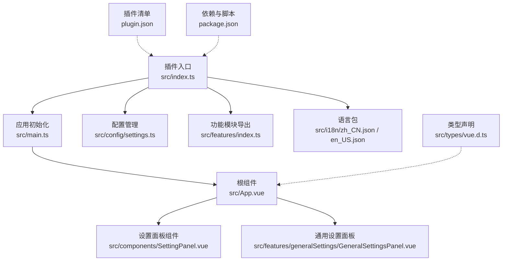
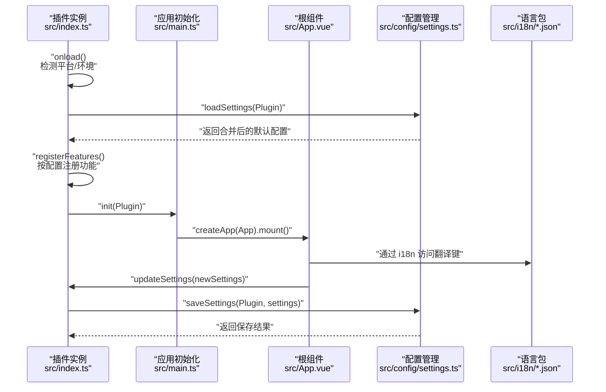
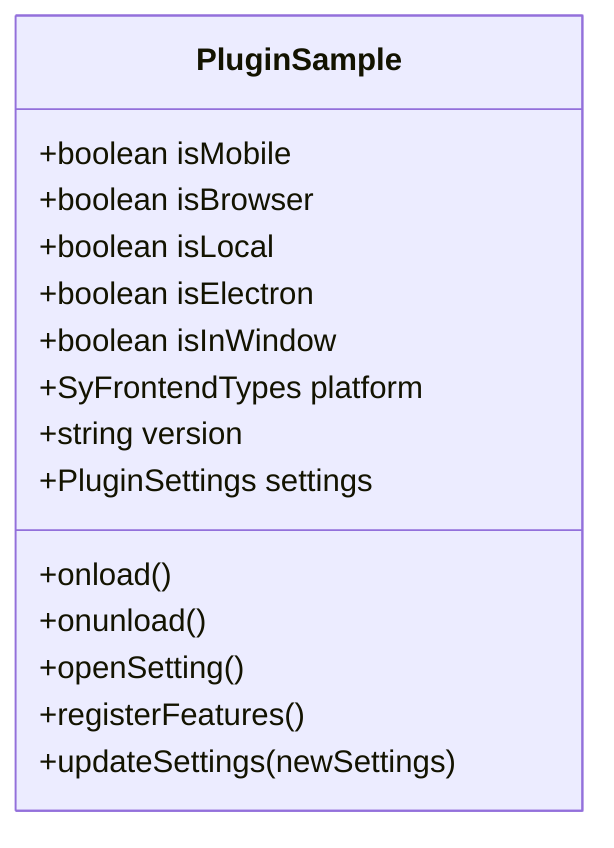
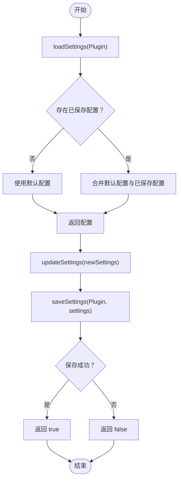
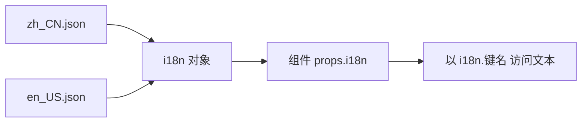
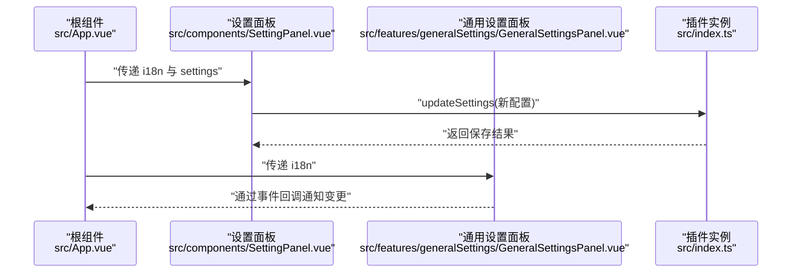
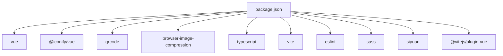

# 核心概念

<cite>
**本文引用的文件**
- [plugin.json](file://plugin.json)
- [src/index.ts](file://src/index.ts)
- [src/main.ts](file://src/main.ts)
- [src/config/settings.ts](file://src/config/settings.ts)
- [src/i18n/zh_CN.json](file://src/i18n/zh_CN.json)
- [src/i18n/en_US.json](file://src/i18n/en_US.json)
- [src/App.vue](file://src/App.vue)
- [src/components/SettingPanel.vue](file://src/components/SettingPanel.vue)
- [src/features/generalSettings/GeneralSettingsPanel.vue](file://src/features/generalSettings/GeneralSettingsPanel.vue)
- [src/features/index.ts](file://src/features/index.ts)
- [src/types/vue.d.ts](file://src/types/vue.d.ts)
- [package.json](file://package.json)
</cite>

## 目录
1. [简介](#简介)
2. [项目结构](#项目结构)
3. [核心组件](#核心组件)
4. [架构总览](#架构总览)
5. [详细组件分析](#详细组件分析)
6. [依赖关系分析](#依赖关系分析)
7. [性能考量](#性能考量)
8. [故障排查指南](#故障排查指南)
9. [结论](#结论)
10. [附录](#附录)

## 简介
本文件面向插件开发者，系统性梳理本仓库作为“思源笔记插件开发样板”的核心概念与最佳实践，重点覆盖：
- 插件入口机制与生命周期方法
- 配置管理系统（接口、默认值、加载/保存与数据存储）
- 多语言支持体系（语言包结构与在代码中的使用）
- Vue 组件开发最佳实践（SFC 结构、响应式编程）
- 实际示例路径（以文件路径代替具体代码片段）

## 项目结构
该项目采用“功能模块化 + 组件化 + 配置与国际化分离”的组织方式：
- 插件入口与生命周期：通过继承插件基类并在生命周期钩子中完成初始化与卸载
- 配置管理：集中定义接口、默认值与读写函数，统一与思源数据存储交互
- 国际化：独立语言包文件，组件通过 i18n 对象访问翻译键
- Vue 应用：在入口处挂载根组件，各功能模块以组件形式组合

图表来源
- [src/index.ts](file://src/index.ts#L1-L140)
- [src/main.ts](file://src/main.ts#L1-L45)
- [src/App.vue](file://src/App.vue#L1-L216)
- [src/components/SettingPanel.vue](file://src/components/SettingPanel.vue#L1-L200)
- [src/features/generalSettings/GeneralSettingsPanel.vue](file://src/features/generalSettings/GeneralSettingsPanel.vue#L1-L200)
- [src/config/settings.ts](file://src/config/settings.ts#L1-L141)
- [src/features/index.ts](file://src/features/index.ts#L1-L15)
- [src/i18n/zh_CN.json](file://src/i18n/zh_CN.json#L1-L317)
- [src/i18n/en_US.json](file://src/i18n/en_US.json#L1-L312)
- [plugin.json](file://plugin.json#L1-L34)
- [src/types/vue.d.ts](file://src/types/vue.d.ts#L1-L6)
- [package.json](file://package.json#L1-L46)

章节来源
- [src/index.ts](file://src/index.ts#L1-L140)
- [src/main.ts](file://src/main.ts#L1-L45)
- [src/config/settings.ts](file://src/config/settings.ts#L1-L141)
- [src/i18n/zh_CN.json](file://src/i18n/zh_CN.json#L1-L317)
- [src/i18n/en_US.json](file://src/i18n/en_US.json#L1-L312)
- [src/App.vue](file://src/App.vue#L1-L216)
- [src/components/SettingPanel.vue](file://src/components/SettingPanel.vue#L1-L200)
- [src/features/generalSettings/GeneralSettingsPanel.vue](file://src/features/generalSettings/GeneralSettingsPanel.vue#L1-L200)
- [src/features/index.ts](file://src/features/index.ts#L1-L15)
- [src/types/vue.d.ts](file://src/types/vue.d.ts#L1-L6)
- [plugin.json](file://plugin.json#L1-L34)
- [package.json](file://package.json#L1-L46)

## 核心组件
- 插件类与生命周期
  - 继承插件基类，在生命周期钩子中完成平台检测、配置加载、功能注册与应用挂载
  - 生命周期方法：加载时初始化，卸载时销毁
- 配置管理
  - 定义配置接口与默认值，封装加载与保存逻辑，与思源数据存储交互
- 国际化
  - 语言包以 JSON 形式提供，组件通过 i18n 对象访问翻译键
- Vue 应用与组件
  - 在入口处创建并挂载根组件，组件间通过 props 与事件通信，使用响应式 API 管理状态

章节来源
- [src/index.ts](file://src/index.ts#L23-L139)
- [src/main.ts](file://src/main.ts#L21-L45)
- [src/config/settings.ts](file://src/config/settings.ts#L9-L141)
- [src/i18n/zh_CN.json](file://src/i18n/zh_CN.json#L1-L317)
- [src/i18n/en_US.json](file://src/i18n/en_US.json#L1-L312)
- [src/App.vue](file://src/App.vue#L1-L150)

## 架构总览
下图展示插件从加载到运行的总体流程，以及配置与国际化在其中的位置。

图表来源
- [src/index.ts](file://src/index.ts#L39-L139)
- [src/main.ts](file://src/main.ts#L21-L45)
- [src/App.vue](file://src/App.vue#L1-L150)
- [src/config/settings.ts](file://src/config/settings.ts#L70-L96)
- [src/i18n/zh_CN.json](file://src/i18n/zh_CN.json#L1-L317)
- [src/i18n/en_US.json](file://src/i18n/en_US.json#L1-L312)

## 详细组件分析

### 插件入口与生命周期
- 继承与职责
  - 继承插件基类，暴露平台检测、版本信息、配置对象等能力
  - 在加载时解析插件清单、检测前端类型、判断是否 Electron 环境
- 生命周期方法
  - onload：加载配置、注册功能模块、初始化应用
  - onunload：销毁应用、移除挂载节点
  - openSetting：对外暴露打开设置面板的入口
- 条件注册
  - 根据配置开关逐项注册功能模块，确保最小化加载与可控扩展

图表来源
- [src/index.ts](file://src/index.ts#L23-L139)

章节来源
- [src/index.ts](file://src/index.ts#L23-L139)

### 配置管理系统
- 接口与默认值
  - 定义插件配置接口，包含各功能模块开关与通用选项
  - 提供默认配置常量，作为回退与迁移的基础
- 数据存储交互
  - 加载：从插件数据存储读取用户配置，若无则使用默认值
  - 保存：将当前配置写入插件数据存储，返回布尔结果
- 字体设置
  - 字体相关设置使用本地存储持久化，提供加载、保存与重置

图表来源
- [src/config/settings.ts](file://src/config/settings.ts#L70-L96)

章节来源
- [src/config/settings.ts](file://src/config/settings.ts#L9-L141)

### 多语言支持系统
- 语言包结构
  - 语言包为 JSON 文件，键名对应 UI 文案，部分键包含嵌套对象（如功能模块的子键）
- 使用方式
  - 组件通过 props 接收 i18n 对象，直接以点号路径访问翻译键
  - 示例路径：在设置面板组件中以 i18n.pluginSettings 访问翻译文本
- 语言选择
  - 插件清单中提供多语言显示名与描述，便于在应用侧展示

图表来源
- [src/i18n/zh_CN.json](file://src/i18n/zh_CN.json#L1-L317)
- [src/i18n/en_US.json](file://src/i18n/en_US.json#L1-L312)
- [src/components/SettingPanel.vue](file://src/components/SettingPanel.vue#L1-L200)
- [src/App.vue](file://src/App.vue#L1-L150)
- [plugin.json](file://plugin.json#L14-L23)

章节来源
- [src/i18n/zh_CN.json](file://src/i18n/zh_CN.json#L1-L317)
- [src/i18n/en_US.json](file://src/i18n/en_US.json#L1-L312)
- [src/components/SettingPanel.vue](file://src/components/SettingPanel.vue#L1-L200)
- [src/App.vue](file://src/App.vue#L1-L150)
- [plugin.json](file://plugin.json#L14-L23)

### Vue 组件开发最佳实践
- 单文件组件（SFC）结构
  - 模板、脚本、样式三段式组织，使用 <script setup> 与组合式 API
  - 通过 props 接收父组件传入的数据与回调，使用 emits 触发事件
- 响应式编程
  - 使用 ref、watchEffect 等 API 管理局部状态与副作用
  - 在 onMounted 中绑定 DOM 与事件监听，确保时机正确
- 与插件生态集成
  - 通过全局工具函数获取插件实例，实现跨组件共享状态
  - 通过事件总线或窗口对象暴露公开方法，供外部触发 UI

图表来源
- [src/App.vue](file://src/App.vue#L1-L150)
- [src/components/SettingPanel.vue](file://src/components/SettingPanel.vue#L1-L200)
- [src/features/generalSettings/GeneralSettingsPanel.vue](file://src/features/generalSettings/GeneralSettingsPanel.vue#L1-L200)
- [src/index.ts](file://src/index.ts#L128-L139)

章节来源
- [src/App.vue](file://src/App.vue#L1-L150)
- [src/components/SettingPanel.vue](file://src/components/SettingPanel.vue#L1-L200)
- [src/features/generalSettings/GeneralSettingsPanel.vue](file://src/features/generalSettings/GeneralSettingsPanel.vue#L1-L200)
- [src/types/vue.d.ts](file://src/types/vue.d.ts#L1-L6)

## 依赖关系分析
- 运行时依赖
  - Vue 3、@iconify/vue、qrcode、browser-image-compression 等
- 开发时依赖
  - Vite、TypeScript、ESLint、Sass 等
- 插件清单
  - 描述插件元信息、多语言文案、前后端兼容范围等

图表来源
- [package.json](file://package.json#L1-L46)

章节来源
- [package.json](file://package.json#L1-L46)
- [plugin.json](file://plugin.json#L1-L34)

## 性能考量
- 按需注册功能模块，避免一次性加载过多功能
- 合理使用响应式状态，减少不必要的重渲染
- 本地存储与数据存储的读写频率控制，避免频繁 I/O
- 组件挂载与卸载时机把控，确保内存释放

## 故障排查指南
- 配置加载失败
  - 现象：加载配置时出现错误日志
  - 排查：确认插件数据存储可用，检查读写权限
  - 参考路径：[src/config/settings.ts](file://src/config/settings.ts#L70-L82)
- 配置保存失败
  - 现象：保存配置返回失败
  - 排查：检查网络与权限，确认目标键名正确
  - 参考路径：[src/config/settings.ts](file://src/config/settings.ts#L84-L96)
- 国际化键缺失
  - 现象：组件中出现未翻译文本或空字符串
  - 排查：核对语言包键名是否存在，必要时在组件中提供降级文案
  - 参考路径：[src/components/SettingPanel.vue](file://src/components/SettingPanel.vue#L1-L200)
- 应用挂载异常
  - 现象：界面未显示或无法交互
  - 排查：确认根组件已挂载，检查初始化顺序与 DOM 准备状态
  - 参考路径：[src/main.ts](file://src/main.ts#L21-L45)

章节来源
- [src/config/settings.ts](file://src/config/settings.ts#L70-L96)
- [src/components/SettingPanel.vue](file://src/components/SettingPanel.vue#L1-L200)
- [src/main.ts](file://src/main.ts#L21-L45)

## 结论
本样板工程提供了完整的插件开发骨架：清晰的入口与生命周期、稳健的配置管理、完善的国际化支持、规范的 Vue 组件实践。遵循这些概念与最佳实践，可快速搭建高质量的思源插件。

## 附录
- 实际示例路径（以文件路径代替具体代码片段）
  - 在组件中使用 i18n 访问翻译文本：[src/components/SettingPanel.vue](file://src/components/SettingPanel.vue#L1-L200)
  - 在根组件中接收 i18n 并传递给子组件：[src/App.vue](file://src/App.vue#L1-L150)
  - 在插件类中加载与保存配置：[src/index.ts](file://src/index.ts#L59-L67), [src/index.ts](file://src/index.ts#L131-L139), [src/config/settings.ts](file://src/config/settings.ts#L70-L96)
  - 语言包键名与嵌套结构参考：[src/i18n/zh_CN.json](file://src/i18n/zh_CN.json#L1-L317), [src/i18n/en_US.json](file://src/i18n/en_US.json#L1-L312)
  - 功能模块导出与注册：[src/features/index.ts](file://src/features/index.ts#L1-L15)
  - Vue 类型声明与 SFC 支持：[src/types/vue.d.ts](file://src/types/vue.d.ts#L1-L6)
  - 插件清单与多语言文案：[plugin.json](file://plugin.json#L14-L23)