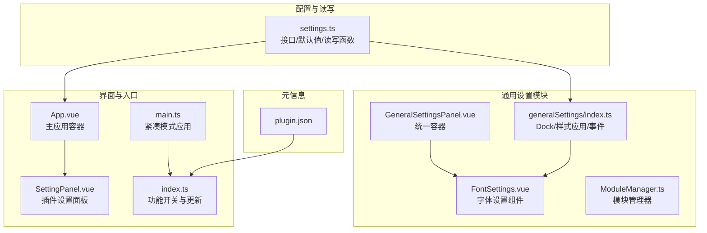
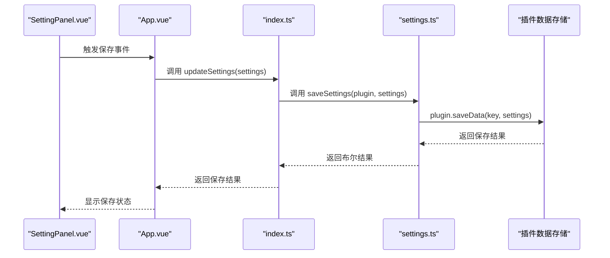
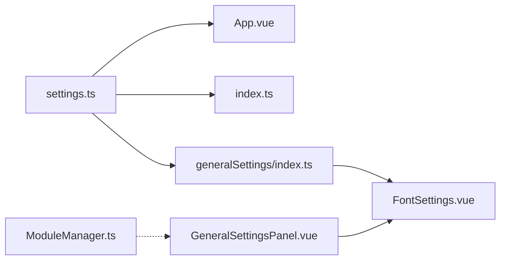

# 配置管理

<cite>
**本文引用的文件列表**
- [src/config/settings.ts](file://src/config/settings.ts)
- [src/features/generalSettings/index.ts](file://src/features/generalSettings/index.ts)
- [src/features/generalSettings/GeneralSettingsPanel.vue](file://src/features/generalSettings/GeneralSettingsPanel.vue)
- [src/features/generalSettings/components/FontSettings.vue](file://src/features/generalSettings/components/FontSettings.vue)
- [src/features/generalSettings/modules/ModuleManager.ts](file://src/features/generalSettings/modules/ModuleManager.ts)
- [src/components/SettingPanel.vue](file://src/components/SettingPanel.vue)
- [src/App.vue](file://src/App.vue)
- [src/main.ts](file://src/main.ts)
- [src/index.ts](file://src/index.ts)
- [plugin.json](file://plugin.json)
</cite>

## 目录
1. [简介](#简介)
2. [项目结构](#项目结构)
3. [核心组件](#核心组件)
4. [架构总览](#架构总览)
5. [详细组件分析](#详细组件分析)
6. [依赖关系分析](#依赖关系分析)
7. [性能考量](#性能考量)
8. [故障排查指南](#故障排查指南)
9. [结论](#结论)
10. [附录](#附录)

## 简介
本文件聚焦于插件的配置管理系统，围绕以下目标展开：
- 深入解析 PluginSettings 接口的设计与各功能模块开关及全局设置项
- 解释 DEFAULT_SETTINGS 常量如何提供默认配置值
- 说明 loadSettings 与 saveSettings 如何与思源笔记插件数据存储 API 交互
- 详述配置合并策略（默认配置与用户配置的合并）与错误处理机制
- 提供异步配置读写操作的实际代码示例路径
- 讲解 localStorage 在字体设置中的应用
- 明确配置键（SETTINGS_KEY）的定义与最佳实践

## 项目结构
配置管理相关的核心文件分布如下：
- 配置接口与默认值、读写函数：src/config/settings.ts
- 通用设置模块（Dock、样式应用、事件分发）：src/features/generalSettings/index.ts
- 通用设置面板与子组件（字体、代码块、密码、通用操作）：src/features/generalSettings/GeneralSettingsPanel.vue、components/FontSettings.vue 等
- 模块管理器：src/features/generalSettings/modules/ModuleManager.ts
- 插件入口与设置面板：src/App.vue、src/components/SettingPanel.vue
- 插件生命周期与紧凑模式应用：src/main.ts
- 插件入口逻辑与功能开关：src/index.ts
- 插件元信息：plugin.json

图表来源
- [src/config/settings.ts](file://src/config/settings.ts#L1-L141)
- [src/features/generalSettings/index.ts](file://src/features/generalSettings/index.ts#L1-L272)
- [src/features/generalSettings/GeneralSettingsPanel.vue](file://src/features/generalSettings/GeneralSettingsPanel.vue#L1-L95)
- [src/features/generalSettings/components/FontSettings.vue](file://src/features/generalSettings/components/FontSettings.vue#L1-L158)
- [src/features/generalSettings/modules/ModuleManager.ts](file://src/features/generalSettings/modules/ModuleManager.ts#L1-L99)
- [src/App.vue](file://src/App.vue#L1-L150)
- [src/components/SettingPanel.vue](file://src/components/SettingPanel.vue#L1-L188)
- [src/main.ts](file://src/main.ts#L1-L45)
- [src/index.ts](file://src/index.ts#L90-L139)
- [plugin.json](file://plugin.json#L1-L34)

章节来源
- [src/config/settings.ts](file://src/config/settings.ts#L1-L141)
- [src/features/generalSettings/index.ts](file://src/features/generalSettings/index.ts#L1-L272)
- [src/App.vue](file://src/App.vue#L1-L150)
- [src/index.ts](file://src/index.ts#L90-L139)

## 核心组件
- PluginSettings 接口：定义各功能模块的启用开关与全局设置项（如 API 密钥、紧凑模式等）
- DEFAULT_SETTINGS 常量：提供默认配置值，作为用户未配置时的兜底
- loadSettings/plugin.loadData：异步读取插件数据存储，若无数据则返回默认值；若有数据则与默认值进行浅合并
- saveSettings/plugin.saveData：异步保存配置到插件数据存储
- 通用设置模块（GeneralSettings）：负责将字体设置应用到思源笔记 DOM 元素，通过 CSS 变量与直接样式两种方式
- 字体设置组件（FontSettings）：提供字体族、字号、字重、行高的可视化配置与预览，并通过 localStorage 持久化
- 模块管理器（ModuleManager）：用于管理通用设置下的模块注册、启用/禁用、排序等

章节来源
- [src/config/settings.ts](file://src/config/settings.ts#L1-L141)
- [src/features/generalSettings/index.ts](file://src/features/generalSettings/index.ts#L1-L272)
- [src/features/generalSettings/components/FontSettings.vue](file://src/features/generalSettings/components/FontSettings.vue#L1-L158)
- [src/features/generalSettings/modules/ModuleManager.ts](file://src/features/generalSettings/modules/ModuleManager.ts#L1-L99)

## 架构总览
配置系统由“接口定义—默认值—读写函数—界面—应用层”构成闭环：
- 接口与默认值：定义配置结构与默认值
- 读写函数：封装与插件数据存储 API 的交互，提供异步读取与保存
- 界面层：SettingPanel（插件设置）与 GeneralSettingsPanel（通用设置）分别承载插件级与通用设置
- 应用层：通用设置模块将字体设置应用到 DOM，插件入口根据开关启用对应功能

图表来源
- [src/components/SettingPanel.vue](file://src/components/SettingPanel.vue#L189-L238)
- [src/App.vue](file://src/App.vue#L49-L89)
- [src/index.ts](file://src/index.ts#L128-L139)
- [src/config/settings.ts](file://src/config/settings.ts#L70-L96)

## 详细组件分析

### PluginSettings 接口与 DEFAULT_SETTINGS
- 结构设计要点
  - 功能模块开关：enablePageLock、enableTableOfContents、enableImageCompressor、enableDocNavigation、enableShortcuts、enableWordQuery、enableGeneralSettings、enableQRCode、enableUnitConverter、enableDiskBrowser
  - 全局设置项：wordQueryApiKey（单词查询 API 密钥）、compactMode（全局紧凑模式）
- 默认值策略
  - DEFAULT_SETTINGS 提供全量默认值，确保首次使用或缺失字段时有稳定行为
  - 通用设置模块也提供 DEFAULT_FONT_SETTINGS，用于字体设置的默认值

章节来源
- [src/config/settings.ts](file://src/config/settings.ts#L1-L60)

### 配置合并策略与错误处理
- 合并策略
  - loadSettings 读取用户配置后，采用“默认值优先”的浅合并策略：先以 DEFAULT_SETTINGS 为基础，再用用户配置覆盖同名字段
  - 这样既能保证新增字段的默认值，又能保留用户已有的个性化设置
- 错误处理
  - 读取失败：捕获异常并回退到 DEFAULT_SETTINGS
  - 保存失败：捕获异常并返回 false，调用方据此提示用户
  - 通用设置模块对样式应用与重置过程同样进行 try/catch 并记录日志

章节来源
- [src/config/settings.ts](file://src/config/settings.ts#L70-L96)
- [src/features/generalSettings/index.ts](file://src/features/generalSettings/index.ts#L92-L136)
- [src/features/generalSettings/index.ts](file://src/features/generalSettings/index.ts#L214-L235)

### 异步配置读写与插件数据存储 API
- 读取流程
  - 调用 plugin.loadData(SETTINGS_KEY)，若返回空则使用 DEFAULT_SETTINGS
  - 若存在用户数据，则与 DEFAULT_SETTINGS 浅合并
- 保存流程
  - 调用 plugin.saveData(SETTINGS_KEY, settings)，返回布尔值表示是否成功
- 实际代码示例路径
  - 读取：[loadSettings](file://src/config/settings.ts#L70-L82)
  - 保存：[saveSettings](file://src/config/settings.ts#L84-L96)
  - 插件入口更新：[updateSettings](file://src/index.ts#L128-L139)
  - 界面触发保存：[onSaveSettings](file://src/App.vue#L55-L65)、[SettingPanel 保存事件](file://src/components/SettingPanel.vue#L212-L220)

章节来源
- [src/config/settings.ts](file://src/config/settings.ts#L62-L96)
- [src/index.ts](file://src/index.ts#L128-L139)
- [src/App.vue](file://src/App.vue#L55-L65)
- [src/components/SettingPanel.vue](file://src/components/SettingPanel.vue#L189-L238)

### 字体设置与 localStorage 应用
- 字体设置组件（FontSettings.vue）
  - 提供字体族、字号、字重、行高的可视化配置与实时预览
  - 通过 localStorage 保存/加载字体设置，实现跨会话持久化
  - 支持“保存”和“重置”操作，重置时移除 localStorage 中的键
- 通用设置模块（GeneralSettings）
  - 将字体设置应用到思源笔记 DOM 元素，通过 CSS 变量与直接样式两种方式
  - 提供 getCurrentFontSettings、applySavedSettings、resetFontSettings 等方法
- 实际代码示例路径
  - 组件保存/重置：[FontSettings 保存/重置](file://src/features/generalSettings/components/FontSettings.vue#L233-L252)
  - 组件加载与初始化：[FontSettings 加载](file://src/features/generalSettings/components/FontSettings.vue#L254-L273)
  - 通用设置应用字体样式：[applyGlobalFontStyles](file://src/features/generalSettings/index.ts#L92-L114)
  - 通用设置重置字体样式：[resetFontSettings](file://src/features/generalSettings/index.ts#L214-L235)

章节来源
- [src/features/generalSettings/components/FontSettings.vue](file://src/features/generalSettings/components/FontSettings.vue#L1-L158)
- [src/features/generalSettings/index.ts](file://src/features/generalSettings/index.ts#L92-L136)
- [src/features/generalSettings/index.ts](file://src/features/generalSettings/index.ts#L154-L173)
- [src/features/generalSettings/index.ts](file://src/features/generalSettings/index.ts#L214-L235)

### 配置键（SETTINGS_KEY）定义与最佳实践
- 定义位置
  - 配置键 SETTINGS_KEY 位于 settings.ts 中，用于插件数据存储的键名
- 最佳实践
  - 保持键名稳定且语义明确，避免频繁变更导致历史数据不可读
  - 对于通用设置，建议使用前缀命名规范（如 general-*），便于区分与维护
  - 对于模块化设置，建议采用 {module-id}-settings 的命名，与通用设置模块文档一致
- 实际使用
  - 读取：plugin.loadData(SETTINGS_KEY)
  - 保存：plugin.saveData(SETTINGS_KEY, settings)
  - 通用设置模块中还使用了 localStorage 的键名（如 general-font-settings、general-codeblock-settings）

章节来源
- [src/config/settings.ts](file://src/config/settings.ts#L62-L66)
- [src/config/settings.ts](file://src/config/settings.ts#L70-L96)
- [src/features/generalSettings/index.ts](file://src/features/generalSettings/index.ts#L183-L213)
- [src/features/generalSettings/README.md](file://src/features/generalSettings/README.md#L195-L219)

### 模块管理器（ModuleManager）
- 职责
  - 注册、获取、启用/禁用、移除、清空设置模块
  - 支持按 order 排序与筛选启用模块
- 与通用设置的关系
  - 通用设置模块（GeneralSettings）内部可结合 ModuleManager 管理不同设置子模块（如字体、代码块、外观等）
- 实际代码示例路径
  - [ModuleManager 类](file://src/features/generalSettings/modules/ModuleManager.ts#L1-L99)
  - [通用设置面板](file://src/features/generalSettings/GeneralSettingsPanel.vue#L1-L95)

章节来源
- [src/features/generalSettings/modules/ModuleManager.ts](file://src/features/generalSettings/modules/ModuleManager.ts#L1-L99)
- [src/features/generalSettings/GeneralSettingsPanel.vue](file://src/features/generalSettings/GeneralSettingsPanel.vue#L1-L95)

### 紧凑模式与插件入口
- 紧凑模式
  - 插件入口在初始化时检查 settings.compactMode，并为根元素添加紧凑模式类名
- 功能开关
  - 插件入口根据 settings.enableXxx 开关逐项注册对应功能模块
- 实际代码示例路径
  - 紧凑模式应用：[init](file://src/main.ts#L21-L31)
  - 功能开关注册：[index.ts 功能注册](file://src/index.ts#L90-L127)

章节来源
- [src/main.ts](file://src/main.ts#L21-L31)
- [src/index.ts](file://src/index.ts#L90-L127)

## 依赖关系分析
- settings.ts 为配置接口与读写函数的中心，被 App.vue、index.ts、generalSettings/index.ts 等多处依赖
- generalSettings/index.ts 依赖 settings.ts 的默认值与通用设置键名，同时向 DOM 注入样式
- FontSettings.vue 与 GeneralSettingsPanel.vue 通过事件向上汇报设置变更
- ModuleManager.ts 为通用设置模块提供管理能力，可与 Panel 组件配合使用

图表来源
- [src/config/settings.ts](file://src/config/settings.ts#L1-L141)
- [src/App.vue](file://src/App.vue#L1-L150)
- [src/index.ts](file://src/index.ts#L90-L139)
- [src/features/generalSettings/index.ts](file://src/features/generalSettings/index.ts#L1-L272)
- [src/features/generalSettings/GeneralSettingsPanel.vue](file://src/features/generalSettings/GeneralSettingsPanel.vue#L1-L95)
- [src/features/generalSettings/components/FontSettings.vue](file://src/features/generalSettings/components/FontSettings.vue#L1-L158)
- [src/features/generalSettings/modules/ModuleManager.ts](file://src/features/generalSettings/modules/ModuleManager.ts#L1-L99)

## 性能考量
- 按需加载：通用设置模块仅在需要时加载当前激活的模块，减少不必要的渲染与计算
- 轻量组件：每个设置模块均为独立组件，便于复用与维护
- 本地存储：设置数据保存在 localStorage，避免频繁网络请求
- 事件驱动：模块间通过事件通信，降低耦合度

章节来源
- [src/features/generalSettings/README.md](file://src/features/generalSettings/README.md#L173-L178)

## 故障排查指南
- 读取配置失败
  - 现象：加载配置时出现错误日志，最终回退到默认值
  - 排查：确认插件数据存储 API 可用性，检查 SETTINGS_KEY 是否正确
  - 参考路径：[loadSettings 错误处理](file://src/config/settings.ts#L70-L82)
- 保存配置失败
  - 现象：保存返回 false，界面提示保存失败
  - 排查：检查插件权限、存储空间、网络环境（若涉及远程配置）
  - 参考路径：[saveSettings 错误处理](file://src/config/settings.ts#L84-L96)
- 字体设置未生效
  - 现象：修改字体设置后未看到样式变化
  - 排查：确认通用设置模块已初始化并应用样式；检查 CSS 变量与 DOM 选择器是否匹配
  - 参考路径：[applyGlobalFontStyles](file://src/features/generalSettings/index.ts#L92-L114)
- 字体设置重置无效
  - 现象：重置后仍保留旧样式
  - 排查：确认已调用 resetFontSettings 并移除了 CSS 变量与 DOM 样式
  - 参考路径：[resetFontSettings](file://src/features/generalSettings/index.ts#L214-L235)

章节来源
- [src/config/settings.ts](file://src/config/settings.ts#L70-L96)
- [src/features/generalSettings/index.ts](file://src/features/generalSettings/index.ts#L92-L114)
- [src/features/generalSettings/index.ts](file://src/features/generalSettings/index.ts#L214-L235)

## 结论
该配置管理系统以清晰的接口定义、稳定的默认值、可靠的读写函数与完善的错误处理为核心，结合通用设置模块的样式应用与模块化管理器，实现了插件级与通用设置的解耦与扩展。通过 SETTINGS_KEY 与 localStorage 的合理使用，既满足了插件数据持久化需求，又兼顾了用户体验与开发效率。建议在后续迭代中持续完善键名规范与错误日志，提升可观测性与可维护性。

## 附录
- 配置键命名规范参考
  - 插件设置：plugin-settings
  - 通用设置：general-font-settings、general-codeblock-settings 等
  - 其他模块：{module-id}-settings
- 插件元信息
  - 插件名称、版本、兼容性等信息见 [plugin.json](file://plugin.json#L1-L34)

章节来源
- [src/config/settings.ts](file://src/config/settings.ts#L62-L66)
- [src/features/generalSettings/README.md](file://src/features/generalSettings/README.md#L195-L219)
- [plugin.json](file://plugin.json#L1-L34)