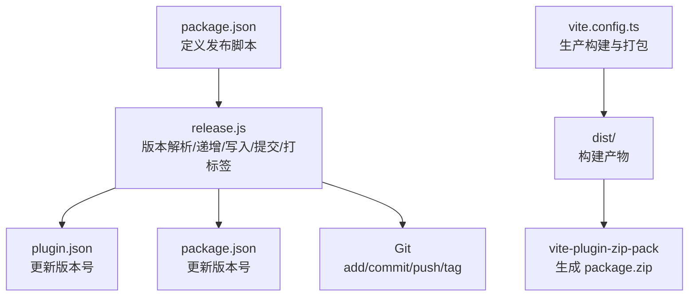
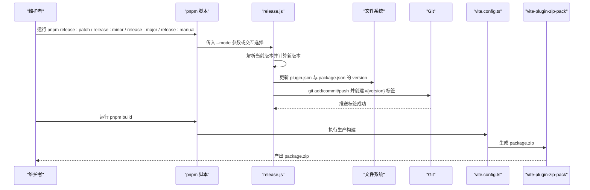
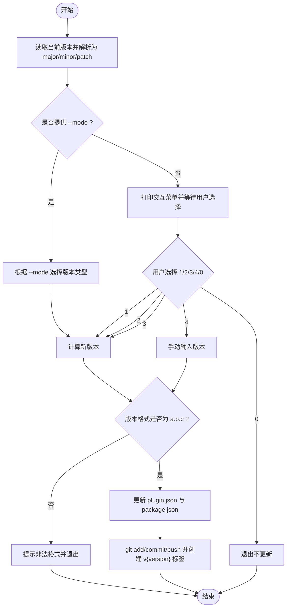
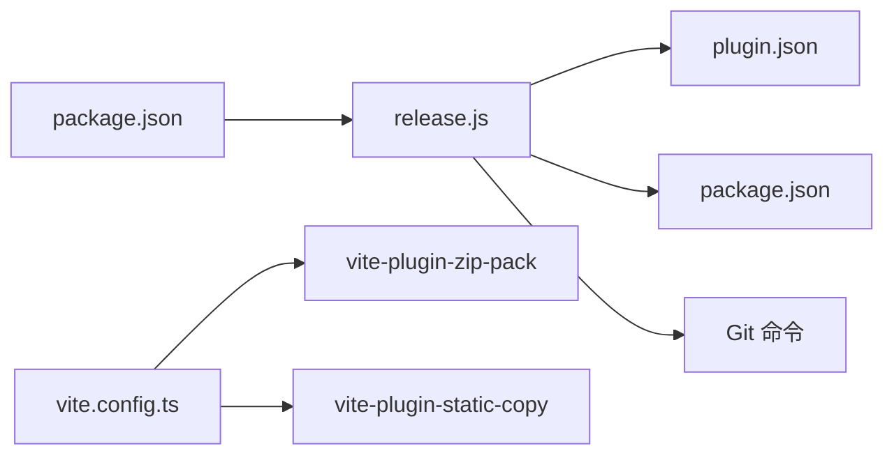

# 版本发布

<cite>
**本文引用的文件**
- [release.js](file://release.js)
- [package.json](file://package.json)
- [plugin.json](file://plugin.json)
- [vite.config.ts](file://vite.config.ts)
- [README.md](file://README.md)
</cite>

## 目录
1. [简介](#简介)
2. [项目结构](#项目结构)
3. [核心组件](#核心组件)
4. [架构总览](#架构总览)
5. [详细组件分析](#详细组件分析)
6. [依赖分析](#依赖分析)
7. [性能考虑](#性能考虑)
8. [故障排除指南](#故障排除指南)
9. [结论](#结论)
10. [附录](#附录)

## 简介
本文件面向维护者，系统性说明该仓库的自动化发布流程与最佳实践。重点覆盖：
- release.js 脚本的工作原理：版本解析、递增逻辑、交互式选择与 Git 操作。
- 通过 pnpm release:patch、release:minor、release:major 三种命令执行不同类型的版本更新。
- 手动发布流程（pnpm release:manual）及其适用场景。
- 发布脚本如何自动更新 package.json 与 plugin.json 中的版本号、创建 Git 标签、触发构建与生成 package.zip。
- 版本控制策略与发布最佳实践，确保发布过程的一致性与可靠性。

## 项目结构
围绕“版本发布”的关键文件与职责如下：
- release.js：发布脚本，负责版本号解析与递增、交互式选择、写入版本文件、Git 提交与打标签。
- package.json：定义发布相关脚本（release、release:patch、release:minor、release:major、release:manual）以及构建脚本。
- plugin.json：插件元数据，包含当前版本号，发布脚本会在此文件中更新版本。
- vite.config.ts：构建配置，生产构建时通过 vite-plugin-zip-pack 生成 package.zip。
- README.md：提供发布命令与流程说明。

图表来源
- [package.json](file://package.json#L10-L17)
- [release.js](file://release.js#L142-L178)
- [plugin.json](file://plugin.json#L1-L34)
- [vite.config.ts](file://vite.config.ts#L132-L136)

章节来源
- [package.json](file://package.json#L10-L17)
- [release.js](file://release.js#L142-L178)
- [plugin.json](file://plugin.json#L1-L34)
- [vite.config.ts](file://vite.config.ts#L132-L136)
- [README.md](file://README.md#L336-L362)

## 核心组件
- 发布脚本（release.js）
  - 版本解析：将形如 a.b.c 的字符串拆分为 major/minor/patch 数字。
  - 版本递增：支持 patch、minor、major 三类递增，遵循语义化版本规则。
  - 交互式选择：支持自动选项与手动输入；支持 --mode=manual/patch/minor/major。
  - 写入版本：同时更新 plugin.json 与 package.json 中的 version 字段。
  - Git 操作：提交变更、推送、创建并推送标签 v{version}。
- 发布脚本入口（package.json）
  - 定义 release、release:manual、release:patch、release:minor、release:major、build 等脚本。
- 构建与打包（vite.config.ts）
  - 生产构建时启用 vite-plugin-zip-pack，将 dist 目录打包为 package.zip。
- 插件元数据（plugin.json）
  - 包含当前版本号，发布脚本会在此文件中更新版本。

章节来源
- [release.js](file://release.js#L17-L56)
- [release.js](file://release.js#L74-L178)
- [package.json](file://package.json#L10-L17)
- [vite.config.ts](file://vite.config.ts#L132-L136)
- [plugin.json](file://plugin.json#L1-L34)

## 架构总览
发布流程由“脚本入口 -> 版本处理 -> 文件更新 -> Git 操作 -> 构建打包”构成，整体顺序如下：

图表来源
- [package.json](file://package.json#L10-L17)
- [release.js](file://release.js#L74-L178)
- [vite.config.ts](file://vite.config.ts#L132-L136)

## 详细组件分析

### 发布脚本（release.js）工作原理
- 版本解析与递增
  - 解析：将版本字符串按点号分割为整数数组，映射为 major/minor/patch。
  - 递增：patch 直接对补丁号加一；minor 对次级号加一并将补丁清零；major 对主版本加一并将次级与补丁清零。
- 交互式选择与模式
  - 支持 --mode=manual/patch/minor/major；未提供模式时进入交互菜单，提供 1/2/3/4 选项与退出选项。
  - 输入校验：仅接受形如 a.b.c 的版本格式。
- 文件更新
  - 同步更新 plugin.json 与 package.json 中的 version 字段。
- Git 操作
  - 先 add/commit/push，再创建并推送 v{version} 标签。
- 错误处理
  - 对无效选项、非法版本格式、Git 操作异常进行提示并终止。

图表来源
- [release.js](file://release.js#L17-L56)
- [release.js](file://release.js#L74-L178)

章节来源
- [release.js](file://release.js#L17-L56)
- [release.js](file://release.js#L74-L178)

### 发布命令与使用场景
- pnpm release:patch
  - 自动将补丁版本号加一，适合修复小缺陷或微调。
- pnpm release:minor
  - 自动将次版本号加一并重置补丁号，适合新增向后兼容的功能。
- pnpm release:major
  - 自动将主版本号加一并重置次、补丁号，适合破坏性变更或重大重构。
- pnpm release:manual
  - 交互式手动输入任意版本号，适用于需要精确控制版本号的场景（例如回退或特殊发布）。

章节来源
- [package.json](file://package.json#L10-L17)
- [README.md](file://README.md#L336-L362)

### 构建与打包（vite.config.ts）
- 生产构建
  - 当非 watch 模式时，构建产物输出至 dist 目录。
- 打包生成 package.zip
  - 通过 vite-plugin-zip-pack 将 dist 目录打包为 package.zip，输出到仓库根目录。
- 开发模式
  - watch 模式下构建到思源工作区插件目录，便于热重载调试。

章节来源
- [vite.config.ts](file://vite.config.ts#L90-L156)
- [vite.config.ts](file://vite.config.ts#L132-L136)

### 发布脚本与构建流程衔接
- 发布脚本负责更新版本号并创建 Git 标签。
- 构建脚本负责生产构建与打包，二者解耦，可在发布后单独执行构建或使用 CI 流水线完成。

章节来源
- [release.js](file://release.js#L142-L178)
- [vite.config.ts](file://vite.config.ts#L132-L136)

## 依赖分析
- 脚本入口依赖
  - package.json 定义了发布脚本与构建脚本，作为发布流程的入口。
- 发布脚本依赖
  - 读取 plugin.json 获取当前版本，随后更新 plugin.json 与 package.json。
  - 通过 child_process.exec 调用 Git 命令完成提交与打标签。
- 构建与打包依赖
  - vite.config.ts 依赖 vite-plugin-zip-pack 实现打包；依赖 viteStaticCopy 复制静态资源。

图表来源
- [package.json](file://package.json#L10-L17)
- [release.js](file://release.js#L142-L178)
- [plugin.json](file://plugin.json#L1-L34)
- [vite.config.ts](file://vite.config.ts#L132-L136)

章节来源
- [package.json](file://package.json#L10-L17)
- [release.js](file://release.js#L142-L178)
- [vite.config.ts](file://vite.config.ts#L132-L136)

## 性能考虑
- 发布脚本为单次执行任务，性能开销主要来自文件读写与 Git 操作，通常可忽略。
- 构建阶段的性能取决于 dist 目录规模与打包插件行为；建议保持 dist 清晰、避免冗余资源。
- 若在 CI 中执行，建议缓存依赖与构建产物以提升速度。

## 故障排除指南
- 版本格式不合法
  - 现象：脚本提示非法版本格式并退出。
  - 排查：确认输入为 a.b.c 形式，且均为数字。
- Git 操作失败
  - 现象：添加/提交/推送或打标签时报错。
  - 排查：检查本地分支状态、远程仓库权限、网络连通性；必要时先手动执行相应 Git 命令定位问题。
- 构建未生成 package.zip
  - 现象：执行 pnpm build 后未生成 package.zip。
  - 排查：确认当前为生产构建（非 watch 模式），dist 目录存在且包含构建产物；检查 vite.config.ts 中 zipPack 配置。
- 版本未同步更新
  - 现象：plugin.json 或 package.json 的 version 未更新。
  - 排查：确认脚本已成功写入文件；检查文件权限与编辑器是否占用文件。

章节来源
- [release.js](file://release.js#L135-L178)
- [vite.config.ts](file://vite.config.ts#L132-L136)

## 结论
该发布流程通过脚本化的方式实现了版本号管理、文件更新与 Git 标签的自动化，配合生产构建与打包插件，形成从版本更新到产物发布的完整闭环。维护者可根据变更级别选择合适的发布命令，或在需要时使用手动模式精确控制版本号。建议在团队内统一发布规范，结合 CI/CD 实现更稳定的发布体验。

## 附录
- 发布最佳实践
  - 在发布前确保本地工作区干净，无未提交更改。
  - 优先使用语义化版本规则：补丁修复、次版本新增兼容功能、主版本破坏性变更。
  - 在多人协作时，发布前先拉取最新代码，避免标签冲突。
  - 在 CI 中执行构建与打包，确保产物一致性。
  - 发布后及时更新变更记录与发布说明，便于用户追踪。