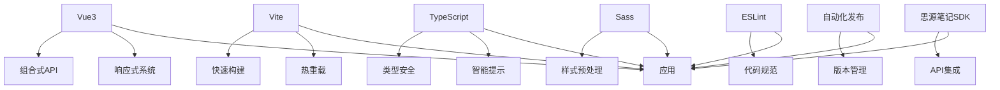
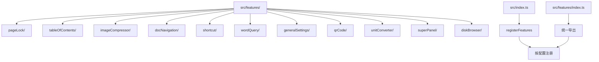
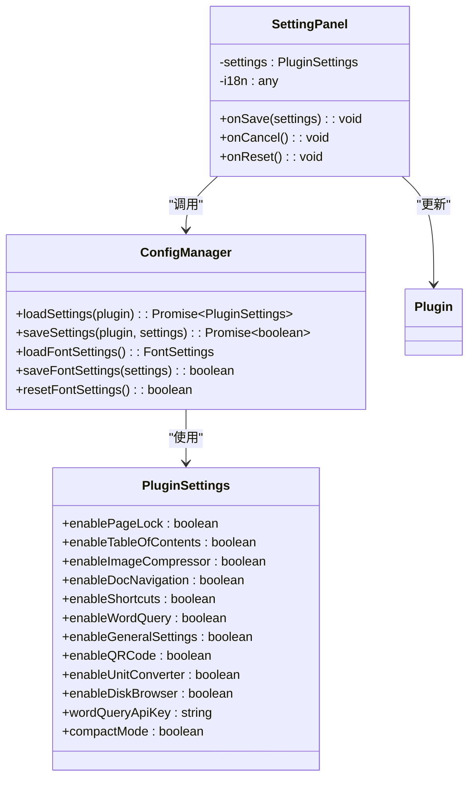
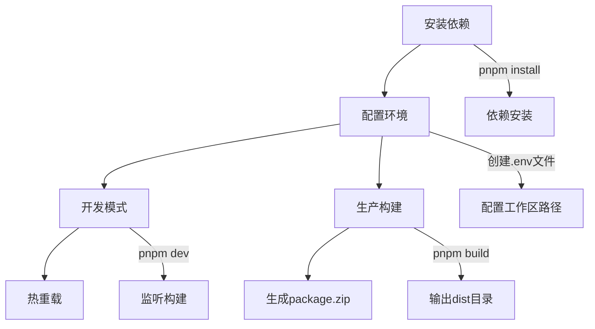

# 项目概述

<cite>
**本文档引用的文件**  
- [README.md](file://README.md)
- [package.json](file://package.json)
- [plugin.json](file://plugin.json)
- [src/index.ts](file://src/index.ts)
- [src/main.ts](file://src/main.ts)
- [src/config/settings.ts](file://src/config/settings.ts)
- [src/features/index.ts](file://src/features/index.ts)
- [src/App.vue](file://src/App.vue)
- [src/components/SettingPanel.vue](file://src/components/SettingPanel.vue)
- [src/api.ts](file://src/api.ts)
- [vite.config.ts](file://vite.config.ts)
</cite>

## 目录
1. [项目简介](#项目简介)
2. [技术栈与架构设计](#技术栈与架构设计)
3. [核心目标与设计理念](#核心目标与设计理念)
4. [模块化架构与功能扩展](#模块化架构与功能扩展)
5. [插件入口与生命周期](#插件入口与生命周期)
6. [配置管理系统](#配置管理系统)
7. [工作流程示例](#工作流程示例)
8. [插件元数据与生态系统](#插件元数据与生态系统)
9. [学习路径与开发者指南](#学习路径与开发者指南)

## 项目简介

思源笔记插件开发模板是一个基于 Vite 和 Vue3 的现代化插件开发框架，旨在为思源笔记用户提供一个功能完整、结构清晰、易于扩展的插件开发解决方案。该模板不仅集成了最新的前端技术栈，还提供了丰富的功能模块示例，包括页面锁定、目录生成、图片压缩、文档导航、快捷键管理、单词查询、二维码生成、单位转换和本地磁盘浏览器等实用功能。通过这个模板，开发者可以快速搭建自己的插件项目，专注于业务逻辑的实现，而无需从零开始构建开发环境和基础架构。

该模板的设计充分考虑了思源笔记的生态系统和用户需求，采用模块化架构，支持功能的灵活启用和禁用。同时，模板内置了多语言支持、自动化构建和发布流程，以及完善的开发调试工具，极大地提升了开发效率和用户体验。无论是初学者还是有经验的开发者，都可以通过这个模板快速上手思源笔记插件开发，为思源笔记社区贡献更多优质插件。

**Section sources**
- [README.md](file://README.md#L1-L436)

## 技术栈与架构设计

本项目采用现代化的前端技术栈，以确保开发效率和运行性能。核心框架为 Vue3，利用其组合式 API 和响应式系统实现高效的组件化开发。构建工具选用 Vite，提供闪电般的开发服务器启动速度和热模块替换功能，显著提升开发体验。项目全面使用 TypeScript，提供严格的类型检查和智能代码提示，增强代码的可维护性和可靠性。

在样式处理方面，项目采用 Sass 作为 CSS 预处理器，支持嵌套规则、变量和混合宏等高级特性，使样式代码更加模块化和可复用。代码质量控制方面，集成 ESLint 进行静态代码分析，确保代码风格统一和潜在错误的及时发现。此外，项目还包含自动化版本发布脚本，简化了插件的发布流程。

**Diagram sources**
- [README.md](file://README.md#L363-L370)
- [package.json](file://package.json#L19-L43)

## 核心目标与设计理念

该项目的核心目标是为思源笔记插件开发提供一个标准化、现代化的开发模板，降低开发门槛，提高开发效率。设计理念主要体现在以下几个方面：首先，强调模块化设计，将不同功能拆分为独立的模块，便于维护和扩展；其次，注重用户体验，通过多语言支持和直观的设置面板，确保插件对不同用户群体的友好性；再次，追求开发效率，利用 Vite 的快速构建和热重载特性，实现即时反馈的开发体验。

项目还特别关注代码质量和可维护性，通过 TypeScript 的类型系统和 ESLint 的代码规范检查，确保代码的健壮性和一致性。同时，模板提供了详细的文档和示例代码，帮助开发者快速理解和使用各项功能。整体设计遵循思源笔记的开发规范和最佳实践，确保插件能够无缝集成到思源笔记生态系统中。

**Section sources**
- [README.md](file://README.md#L1-L436)

## 模块化架构与功能扩展

项目采用清晰的模块化架构，所有功能模块均位于 `src/features/` 目录下，每个功能独立成一个文件夹，包含其相关的组件、逻辑和资源。这种设计使得功能模块高度解耦，便于单独开发、测试和维护。通过 `src/features/index.ts` 文件统一导出所有功能模块的注册函数，实现了功能的集中管理和按需加载。

功能扩展非常简单，开发者只需在 `src/features/` 下创建新的功能文件夹，实现相应的功能逻辑，并在 `src/features/index.ts` 中导出注册函数。然后在 `src/config/settings.ts` 中添加对应的配置项，并在 `src/index.ts` 的 `registerFeatures()` 方法中根据配置决定是否注册该功能。这种设计模式不仅保持了代码的整洁性，还支持功能的动态启用和禁用，满足不同用户的需求。

**Diagram sources**
- [README.md](file://README.md#L127-L139)
- [src/features/index.ts](file://src/features/index.ts#L1-L15)
- [src/index.ts](file://src/index.ts#L80-L126)

## 插件入口与生命周期

插件的主入口文件为 `src/index.ts`，其中定义了继承自 `Plugin` 类的主类。该类实现了插件的生命周期方法，包括 `onload()`、`onunload()` 和 `openSetting()`。`onload()` 方法在插件加载时执行，负责加载配置、注册功能模块和初始化 UI；`onunload()` 方法在插件卸载时执行，用于清理资源；`openSetting()` 方法用于打开插件的设置面板。

插件的初始化流程非常清晰：首先获取运行环境信息，然后加载插件配置，接着调用 `registerFeatures()` 方法根据配置注册相应的功能模块，最后初始化 Vue 应用。这种设计确保了插件的稳定性和可预测性，同时也为功能的动态管理提供了基础。

**Section sources**
- [src/index.ts](file://src/index.ts#L23-L139)

## 配置管理系统

项目提供了一套完善的配置管理系统，位于 `src/config/settings.ts` 文件中。该系统定义了 `PluginSettings` 接口，包含所有可配置的选项，如各功能模块的启用状态、API 密钥、字体设置等。系统提供了 `DEFAULT_SETTINGS` 常量作为默认配置，并实现了 `loadSettings()` 和 `saveSettings()` 函数用于从思源笔记的插件数据存储中读取和保存配置。

配置管理不仅限于插件级别的设置，还包括更细粒度的设置，如字体设置。这些设置可以存储在 `localStorage` 中，实现跨会话的持久化。设置面板组件 `SettingPanel.vue` 提供了直观的用户界面，允许用户可视化地修改配置，并通过 `updateSettings()` 方法将更改保存到插件实例中。这种分层的配置管理方式既保证了配置的灵活性，又确保了数据的一致性和安全性。

**Diagram sources**
- [src/config/settings.ts](file://src/config/settings.ts#L9-L140)
- [src/components/SettingPanel.vue](file://src/components/SettingPanel.vue#L1-L427)

## 工作流程示例

从环境配置到生产构建的完整工作流程如下：首先，确保安装了 Node.js >= 16 和 pnpm（推荐），然后在项目根目录执行 `pnpm install` 安装依赖。接着，创建 `.env` 文件并配置思源工作区路径，例如 `VITE_SIYUAN_WORKSPACE_PATH=C:/Users/YourName/AppData/Roaming/SiYuan`。

开发模式下，执行 `pnpm dev` 启动开发服务器，Vite 会监听文件变化并自动将构建结果同步到思源工作区的 `data/plugins/siyuan-plugin-vite-vue-sn` 目录，支持热重载。生产构建时，执行 `pnpm build`，构建产物输出到 `./dist` 目录，并自动打包为 `package.zip`，准备发布。

**Diagram sources**
- [README.md](file://README.md#L23-L57)

## 插件元数据与生态系统

`plugin.json` 文件定义了插件的元数据，是插件在思源笔记生态系统中的身份标识。该文件包含插件名称、作者、版本号、最低应用版本要求、前后端兼容性、多语言显示名称和描述等信息。其中 `minAppVersion` 字段确保插件只在兼容的思源笔记版本上运行，避免因 API 变化导致的兼容性问题。

`displayName` 和 `description` 字段支持多语言，通过 `default`、`en_US` 和 `zh_CN` 等键提供不同语言的显示文本，增强了插件的国际化能力。`readme` 字段指向不同语言的 README 文件，为用户提供详细的使用说明。这些元数据不仅帮助用户了解插件的功能和用法，还在思源笔记的插件市场中起到关键作用，影响插件的搜索排名和用户评价。

**Section sources**
- [plugin.json](file://plugin.json#L1-L34)

## 学习路径与开发者指南

对于初学者，建议首先阅读 `README.md` 中的快速开始指南，按照步骤完成环境配置和首次构建，直观感受开发流程。然后浏览项目结构，了解各个目录和文件的职责。接着，尝试修改现有功能模块的代码，观察其在思源笔记中的表现，逐步理解插件的工作机制。

对于有经验的开发者，可以直接深入 `src/features/` 目录下的具体功能实现，研究其与思源笔记 API 的交互方式。重点关注 `src/api.ts` 中封装的常用 API，以及 `src/index.ts` 中的插件生命周期管理。通过添加新的功能模块，实践模块化开发的最佳实践。同时，利用提供的调试技巧，如开启开发者工具和使用 Vue DevTools，提高开发效率和问题排查能力。

无论处于哪个阶段，都应遵循项目的开发规范，包括命名约定、目录组织和代码风格，确保代码质量和团队协作的顺畅。通过不断实践和探索，开发者可以充分利用这个模板的强大功能，创造出更多有价值的思源笔记插件。

**Section sources**
- [README.md](file://README.md#L187-L436)