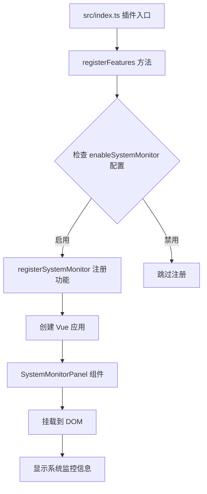
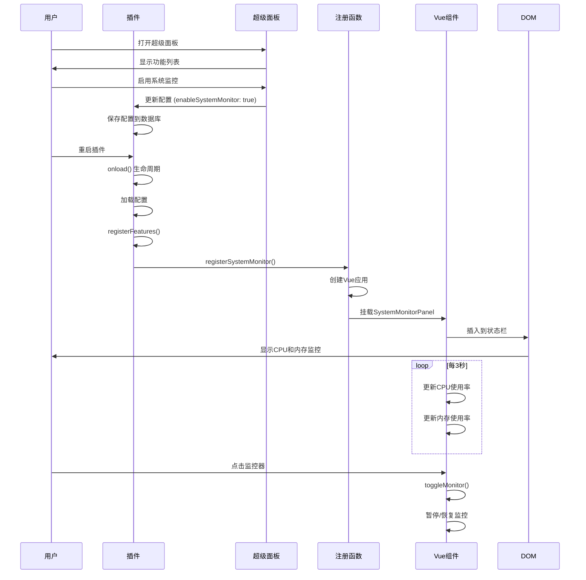

# 系统监控功能实现指南

## 概述

本指南详细说明如何在思源笔记插件中实现系统监控功能，从入口配置到超级面板开关，再到功能实现的完整流程。

## 架构图



## 1. 插件入口配置 (src/index.ts)

### 1.1 导入系统监控功能

```typescript
// 第8行：导入所有功能模块
import {
  // ... 其他功能
  registerSystemMonitor,  // 系统监控功能注册函数
  // ... 其他功能
} from '@/features'
```

### 1.2 在 registerFeatures 中注册

```typescript
/**
 * 注册所有功能模块
 */
private async registerFeatures() {
  // 注册超级面板（统一入口，始终启用）
  console.log('注册超级面板')
  registerSuperPanel(this)

  // ... 其他功能模块

  // 根据配置注册系统监控功能
  if (this.settings.enableSystemMonitor) {
    console.log('注册系统监控功能')
    registerSystemMonitor(this)  // 仅在启用时注册
  }
}
```

**关键点：**
- 系统监控功能依赖于 `enableSystemMonitor` 配置项
- 只有在超级面板中启用该功能后，插件加载时才会注册
- 注册过程是条件性的，不是强制性的

## 2. 配置系统 (src/config/settings.ts)

### 2.1 在 PluginSettings 接口中添加配置项

```typescript
export interface PluginSettings {
  // ... 其他配置
  enableSystemMonitor: boolean   // 是否启用系统监控功能
  // ... 其他配置
}
```

### 2.2 设置默认值

```typescript
export const DEFAULT_SETTINGS: PluginSettings = {
  // ... 其他默认值
  enableSystemMonitor: true,  // 默认启用
  // ... 其他默认值
}
```

**配置特点：**
- 布尔值类型，控制功能启用/禁用
- 默认值为 `true`，新用户开箱即用
- 用户可通过超级面板修改此配置

## 3. 超级面板开关 (src/features/superPanel/)

### 3.1 功能映射配置

在 `src/features/superPanel/index.ts` 中，系统监控功能被映射到超级面板的开关：

```typescript
const settingsMap: Record<string, keyof typeof pluginSample.settings> = {
  // ... 其他功能
  'systemMonitor': 'enableSystemMonitor',  // 映射到配置项
  // ... 其他功能
}
```

### 3.2 开关切换处理

```typescript
async function handleFeatureToggle(plugin: Plugin, featureId: string, enabled: boolean) {
  const pluginSample = plugin as any
  const settingsMap: Record<string, keyof typeof pluginSample.settings> = {
    'systemMonitor': 'enableSystemMonitor',
    // ... 其他映射
  }

  const settingKey = settingsMap[featureId]
  if (settingKey) {
    const newSettings = {
      ...pluginSample.settings,
      [settingKey]: enabled  // 动态更新配置
    }

    const success = await pluginSample.updateSettings(newSettings)
    if (success) {
      showMessage(
        enabled
          ? '功能已启用，请重启插件生效'
          : '功能已禁用，请重启插件生效',
        3000,
        'info'
      )
    }
  }
}
```

**工作流程：**
1. 用户在超级面板中切换系统监控开关
2. 触发 `handleFeatureToggle` 函数
3. 更新 `enableSystemMonitor` 配置项
4. 保存到插件数据库
5. 提示用户重启插件使更改生效

## 4. 功能注册实现 (src/features/systemMonitor/index.ts)

### 4.1 注册函数

```typescript
import { Plugin } from 'siyuan'
import { createApp } from 'vue'
import SystemMonitorPanel from './SystemMonitorPanel.vue'

let app: ReturnType<typeof createApp> | null = null

/**
 * 注册系统监控功能
 * @param plugin 插件实例
 */
export function registerSystemMonitor(plugin: Plugin) {
  const container = document.createElement('div')
  app = createApp(SystemMonitorPanel)
  app.mount(container)
}
```

### 4.2 取消注册函数

```typescript
/**
 * 取消注册系统监控功能
 */
export function unregisterSystemMonitor() {
  if (app) {
    app.unmount()
    app = null
  }
}
```

**注册特点：**
- 创建独立的 DOM 容器
- 使用 Vue 应用挂载组件
- 提供清理函数用于卸载

## 5. Vue 组件实现 (SystemMonitorPanel.vue)

### 5.1 组件结构

```vue
<template>
  <div
    v-if="showMonitor"
    ref="monitorElement"
    class="status__resUsage"
    style="font-size:12px;cursor:pointer;"
    @click="toggleMonitor"
  >
    <span class="ft__on-surface">CPU</span>&nbsp;
    <span class="fn__cpu">{{ cpuUsage }}</span>
    <span class="fn__space"></span>
    <span class="ft__on-surface">内存</span>&nbsp;
    <span class="fn__mem">{{ memoryUsage }}</span>
    <span class="fn__space"></span>
  </div>
</template>
```

**模板特点：**
- `v-if="showMonitor"` - 条件渲染
- `ref="monitorElement"` - DOM 引用
- `@click="toggleMonitor"` - 点击事件
- 响应式数据绑定 `{{ cpuUsage }}`

### 5.2 脚本逻辑

```typescript
<script setup lang="ts">
import { ref, onMounted, onUnmounted } from 'vue'

const showMonitor = ref(false)
const cpuUsage = ref('0%')
const memoryUsage = ref('0M')
const monitorElement = ref<HTMLElement | null>(null)

let intervalId: ReturnType<typeof setInterval> | null = null
let timeoutId: ReturnType<typeof setTimeout> | null = null
let observer: MutationObserver | null = null

function start() {
  if (!monitorElement.value || intervalId) return

  showMonitor.value = true

  let prevCPU = process.cpuUsage()
  let prevTime = Date.now()

  intervalId = setInterval(() => {
    const currCPU = process.cpuUsage()
    const currTime = Date.now()
    const timeDiff = currTime - prevTime

    if (timeDiff === 0) return

    // 计算CPU使用率百分比
    const cpuDiff = (currCPU.user + currCPU.system) - (prevCPU.user + prevCPU.system)
    const cpuPercent = Math.max(0, Math.min(100, (cpuDiff / (timeDiff * 1000)) * 100))

    const memUsage = process.memoryUsage()

    cpuUsage.value = `${cpuPercent.toFixed(1)}%`
    memoryUsage.value = `${(memUsage.rss / 1024 / 1024).toFixed(1)}M`

    prevCPU = currCPU
    prevTime = currTime
  }, 3000)
}

function stop() {
  if (intervalId) {
    clearInterval(intervalId)
    intervalId = null
  }
  showMonitor.value = false
}

function toggleMonitor() {
  if (showMonitor.value) {
    stop()
  } else {
    start()
  }
}

onMounted(() => {
  timeoutId = setTimeout(() => {
    if (typeof process === 'undefined') return

    const counter = document.querySelector('#status .status__counter')
    if (!counter) return

    // 移除已存在的面板
    const existing = document.querySelector('.status__resUsage')
    if (existing) existing.remove()

    // 使用MutationObserver监听monitorElement是否已挂载
    observer = new MutationObserver(() => {
      if (monitorElement.value && document.body.contains(monitorElement.value)) {
        counter.parentNode?.insertBefore(monitorElement.value, counter)
        observer?.disconnect()
        observer = null
        start()
      }
    })

    observer.observe(document.body, { childList: true, subtree: true })
    showMonitor.value = true

    // 1秒后如果还没挂载，强制检查
    setTimeout(() => {
      if (monitorElement.value) {
        counter.parentNode?.insertBefore(monitorElement.value, counter)
        observer?.disconnect()
        observer = null
        start()
      }
    }, 1000)
  }, 2000)
})

onUnmounted(() => {
  if (timeoutId) {
    clearTimeout(timeoutId)
    timeoutId = null
  }
  stop()

  if (observer) {
    observer.disconnect()
    observer = null
  }
})
</script>
```

**组件特点：**
- 响应式数据管理
- 自动挂载到状态栏
- 定时更新CPU和内存使用率
- 支持点击暂停/恢复
- 完整的资源清理

## 6. 完整流程时序图



## 7. 关键配置项总结

| 配置项 | 类型 | 默认值 | 作用 |
|--------|------|--------|------|
| `enableSystemMonitor` | boolean | `true` | 控制是否启用系统监控功能 |

## 8. 最佳实践

### 8.1 内存管理
- ✅ 使用 `onUnmounted` 清理所有定时器
- ✅ 断开 `MutationObserver` 防止内存泄漏
- ✅ 卸载 Vue 应用

### 8.2 错误处理
- ✅ 检查 `process` 是否存在
- ✅ 防止除零错误
- ✅ 限制CPU百分比在0-100%范围

### 8.3 用户体验
- ✅ 提供点击切换功能
- ✅ 显示实时数据更新
- ✅ 集成到状态栏，不干扰主界面

## 9. 调试技巧

### 9.1 查看配置
```typescript
console.log('插件配置:', this.settings)
```

### 9.2 查看功能注册状态
```typescript
if (this.settings.enableSystemMonitor) {
  console.log('系统监控功能已启用')
}
```

### 9.3 监控组件挂载
```typescript
observer = new MutationObserver(() => {
  console.log('元素已挂载到DOM')
})
```

## 10. 常见问题

### Q: 修改配置后功能未生效？
A: 需要重启插件使配置更改生效

### Q: 监控器不显示？
A: 检查 `process` API 是否可用，以及 DOM 挂载是否成功

### Q: CPU使用率显示为0%？
A: 确保时间差大于0，且计算逻辑正确

## 11. 扩展功能

### 11.1 添加更多系统指标
```typescript
const diskUsage = process.diskUsage()  // 磁盘使用率
const uptime = process.uptime()        // 运行时间
```

### 11.2 添加告警功能
```typescript
if (cpuPercent > 80) {
  showMessage('CPU使用率过高', 2000, 'warning')
}
```

### 11.3 添加历史数据图表
- 集成 Chart.js 或 ECharts
- 显示历史趋势图
- 支持导出数据

## 结论

通过以上配置和实现，系统监控功能可以完美集成到思源笔记插件生态中。用户可以通过超级面板方便地启用/禁用功能，插件会在重启后根据配置自动注册相应功能。Vue 组件提供了良好的用户体验，响应式数据和定时更新确保信息的实时性。
