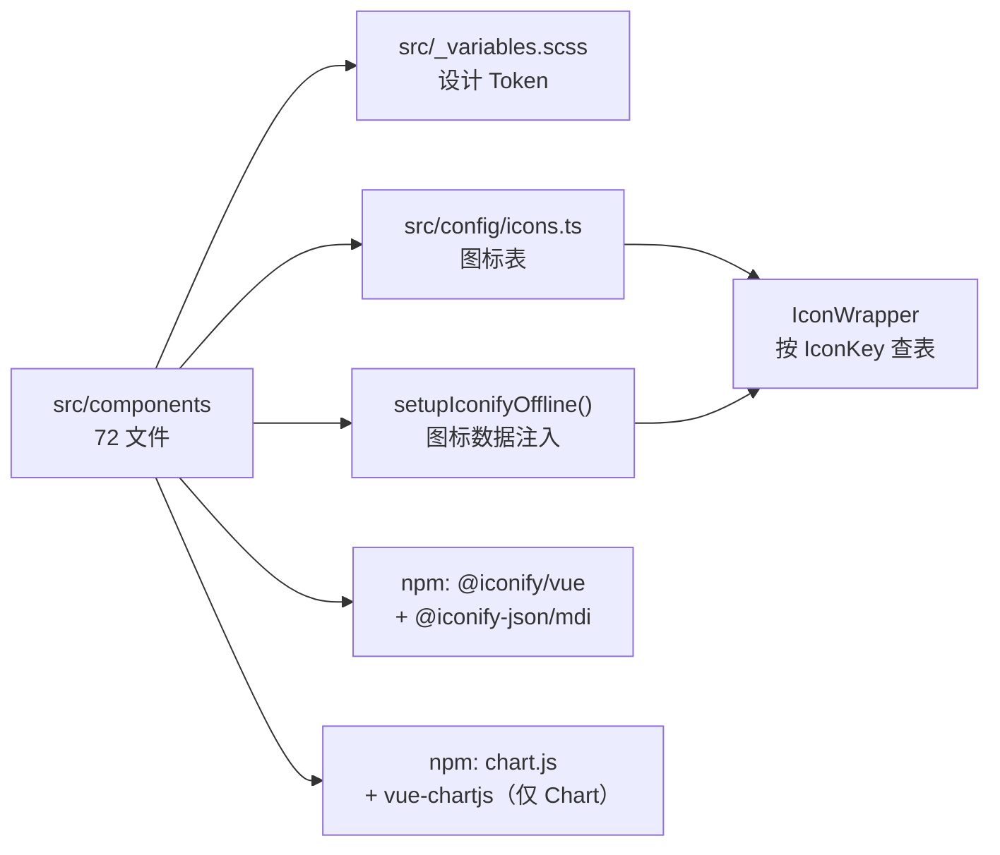

# 共享组件库迁移到普通 Vue 3 项目

> **基线**：2026-09-10，本仓库 `src/components/` 共 **72 个文件**、**25 个公开组件**。
> **复核方式**：文末附录给出全部计数与变量清单的实测命令，文档与代码漂移时可自行核对。

---

## 一、结论与适用范围

**能复制，但不能只复制 `src/components/`。**

组件本体是**零业务耦合**的纯 UI 组件——不引用 i18n、不依赖 plugin 实例、不 import `siyuan` 包、不依赖 store，也不引用任何 feature 目录；全部文案与数据通过 props 传入。真正需要额外处理的是两件事：

1. **组件目录之外还有 2 个必需文件**（设计 Token、图标表）和 1 段必需初始化代码（图标离线预加载）；
2. **非思源环境缺少 `--b3-*` 主题变量**，不补桥接会导致组件恒定亮色，而组件的暗色判定与气泡提示各有 1 处直接依赖原宿主。

### 适用 / 不适用

| 场景 | 结论 |
|---|---|
| 普通 Vue 3 + Vite 项目（TS 可选） | ✅ 适用，按本文第 5 节照做即可 |
| 只复制 `src/components/`，不带 `_variables.scss` 与 `config/icons.ts` | ❌ 编译直接失败 |
| 不做主题桥接，指望组件自动跟随宿主暗色主题 | ⚠️ 可运行，但恒定亮色（见第 6 节） |
| 想连组件预览面板一起搬 | ❌ 不建议，预览面板属于 feature，另有大量依赖（见第 8 节） |

---

## 二、复制清单

### 2.1 目录树（必须在目标项目中保持相对结构）

```
src/components/                        # 26 个文件
├── Avatar.vue  Badge.vue  Button.vue  Card.vue
├── Chart.vue            chart.types.ts
├── Checkbox.vue  ColorField.vue  ConfirmDialog.vue
├── DatePicker.vue  FormField.vue  IconWrapper.vue
├── Input.vue  InputGroup.vue  InputGroupAddon.vue
├── Label.vue  Listbox.vue  Loader.vue  RadioButton.vue
├── Select.vue  Slider.vue  SpeedDial.vue  Switch.vue
├── Tag.vue  Textarea.vue  ToggleButton.vue
├── datePicker/                        # 7 个文件（DatePicker 的私有子部件）
│   ├── PickerPanel.vue  CalendarPanel.vue  MonthYearPanel.vue
│   └── types.ts  utils.ts  formatUtils.ts  useDatePicker.ts
├── select/                            # 5 个文件（Select 的私有子部件）
│   └── types.ts  navigation.ts  utils.ts
│       useSelectKeyboard.ts  useSelectNavigation.ts
├── speedDial/                         # 3 个文件（SpeedDial 的私有子部件）
│   └── types.ts  geometry.ts  useSpeedDial.ts
├── textarea/                          # 1 个文件
│   └── autoResize.ts
└── styles/                            # 30 个 .scss（与 .vue 同级，路径不可变）
    ├── _mixins.scss   index.scss
    └── <ComponentName>.scss × 28
```

计数核对：`26 + 7 + 5 + 3 + 1 + 30 = 72`。

### 2.2 三类文件的处理方式

| 类别 | 文件 | 说明 |
|---|---|---|
| **必须整目录带** | 25 个公开组件 `.vue` + `chart.types.ts` | 公开 API，业务侧直接使用 |
| **必须整目录带** | `datePicker/` `select/` `speedDial/` `textarea/` | 私有子部件与 composable，被父组件用相对路径引用；**不可拍平、不可改名** |
| **必须整目录带** | `styles/` 30 个 `.scss` | 每个 `.vue` 的 `<style scoped>` 只 `@use` 自己那一份；子面板用 `../styles/Xxx.scss` 引用 |

### 2.3 两处「结构敏感」的引用，改结构必崩

- **根组件 → 私有子目录**：`DatePicker.vue` 引 `./datePicker/*`，`Select.vue` 引 `./select/*`，`SpeedDial.vue` 引 `./speedDial/*`，`Textarea.vue` 引 `./textarea/autoResize`。
- **子面板 → 样式目录**：`datePicker/PickerPanel.vue` 等子面板写的是 `@use '../styles/DatePickerPanel.scss'`——**样式目录必须是组件目录的一级子目录**，把 `datePicker/` 提到别处就会断链。

### 2.4 组件之间的引用方式（决定别名怎么配）

组件之间一律用 **`@/components/X.vue`** 绝对路径互相引用：

| 被复用者 | 复用方数量 | 典型场景 |
|---|---|---|
| `IconWrapper.vue` | 10 | 所有需要图标渲染的组件 |
| `FormField.vue` | 9 | Input / Select / Textarea / Checkbox / RadioButton / DatePicker / ToggleButton / Slider / Listbox |
| `Button.vue` | 3 | ConfirmDialog / ToggleButton / SpeedDial |
| `Input.vue` | 1 | Listbox（筛选框） |
| `Select.vue`（仅 `SelectOption` 类型） | 1 | Listbox |

因此目标项目**必须提供 `@` → `src` 的别名**（Vite 与 tsconfig 两处，见第 4.3 节）；若坚持不配别名，就全局替换 `@/components/` 为你的实际路径。

### 2.5 可以删的无关文件

- `styles/index.scss`：当前是空占位（只有注释），**仓库内无任何文件引用它**，可以不带。
  但因为它就在 `styles/` 里，整目录复制时顺手带上也无副作用。

---

## 三、组件目录之外的必需文件



### 3.1 `src/_variables.scss` —— 设计 Token（**缺则编译失败**）

全部 30 个组件 SCSS 都以 `@use '@/variables.scss' as *;` 开头。该文件是纯 Sass 变量声明、无任何 `@use`/`@import`，可直接原样复制。

提供的内容：

| 分组 | 变量 | 取值 |
|---|---|---|
| 语义颜色 | `$color-fg` `$color-bg` `$color-muted` `$color-surface` `$color-border` `$color-primary` `$color-secondary` `$color-accent` `$color-danger` `$color-danger-bright` `$color-success` `$color-warning` `$color-info` | 暖色（Codex）主题 |
| 字体 | `$font-zh` `$vp-mono` `$font-size-2xs/xs/sm/base/lg/2xl/3xl/4xl` `$font-weight-light/normal/medium/semibold/bold` `$line-height-tight/normal/relaxed` | 字号阶梯 10/12/14/16/18/24/30/36px |
| 圆角 | `$radius-none/sm/base/md/lg/xl/2xl/full` `$vp-radius` | 4/6/8/12/16/24px |
| 间距 | `$spacing-2px` `$spacing-px` `$spacing-0…16` | 2/3/4/8/12/16/20/24/32/40/48/64px |
| 其他 | `$mobile-breakpoint` `$codeblock-*` | 响应式断点、代码块尺寸 |

> **注意 Sass 的 partial 解析**：文件名带下划线前缀，`@use '@/variables.scss'` 能正确命中它，**不需要**改写成 `_variables.scss`。
> 这些 `$color-*` 在组件里只作为思源 CSS 变量的 **fallback** 出现（如 `var(--b3-theme-primary, $color-danger)`），桥接完成后基本不再生效——但**不能删**，否则变量声明缺省值时 Sass 直接报未定义。

### 3.2 `src/config/icons.ts` —— 图标表（**必需**）

- 853 行，**零外部依赖**：只有 `IconConfig` 接口、`FEATURE_ICONS`、`COMMON_ICONS`、`getIconConfig()` 与 `IconKey` 类型别名，可直接原样复制。
- 组件库内共 **14 个文件**引用它（13 个 `.vue` + `speedDial/types.ts`），其中 **`IconWrapper.vue` 是唯一的运行时消费方**（调 `getIconConfig()`），其余全部是 `import type { IconKey }`。
- 迁移策略见第 8.2 节（整体复制 / 精简两条路径）。

### 3.3 图标离线预加载（**必需，且最易漏**）

`IconWrapper.vue` 渲染的是 `@iconify/vue` 的 `<Icon>`。若没有在应用入口把图标数据注入 Iconify 注册表，`<Icon>` 会**转为请求公共 CDN**（`api.iconify.design`），离线与内网环境下图标**全部空白**，且不会抛错，症状非常迷惑。

本项目实现在 `src/utils/iconifySetup.ts`：

```ts
import mdiIcons from "@iconify-json/mdi/icons.json"
import { addCollection } from "@iconify/vue"

let loaded = false
export function setupIconifyOffline() {
  if (loaded) return          // 幂等守卫，入口调用一次即可
  addCollection(mdiIcons as any)
  loaded = true
}
```

原实现同时注册了 `@iconify-json/ph`（Phosphor），但**组件库自身只用 mdi**（图标表内 100% 是 `mdi:*`，15 个内置键亦然）。**只搬组件库时 `@iconify-json/ph` 可以完全省略**，能少打包一整套图标数据。

### 3.4 TypeScript 用户额外需要

- `declare module "*.vue"`（Vite 官方模板生成的 `src/vite-env.d.ts` / `env.d.ts` 通常已包含），否则 `.ts` 文件导入 `.vue` 会报 `TS2614`。
- **不要照抄本仓库的 `tsconfig.json`**：它的 `compilerOptions.types` 是 `["node", "vite/client", "siyuan"]`，`"siyuan"` 来自 devDependency，目标项目没有该包时会直接报错——删掉它即可。别名只保留 `"@/*": ["./src/*"]` 一行，其余 40 余条 feature 别名与本组件库无关。

---

## 四、依赖与构建配置

### 4.1 npm 依赖

| 包 | 类型 | 必需性 | 用在哪 |
|---|---|---|---|
| `vue` | 运行时 | **必需** | 28 个文件（25 个 `.vue` + 3 个 composable：`useDatePicker.ts` / `useSelectNavigation.ts` / `useSpeedDial.ts`） |
| `@iconify/vue` | 运行时 | **必需** | 仅 `IconWrapper.vue`（唯一的图标渲染出口） |
| `@iconify-json/mdi` | 运行时 | **必需** | 图标离线数据，`setupIconifyOffline()` 注入 |
| `@iconify-json/ph` | 运行时 | 可省 | 组件库不使用；仅当目标项目自身要 ph 图标时才装 |
| `chart.js` | 运行时 | **仅 Chart.vue** | `Chart.vue` 注册控制器与元素 |
| `vue-chartjs` | 运行时 | **仅 Chart.vue** | Bar / Line / Pie / Doughnut 包装组件 |
| `sass` | dev | **必需** | 编译 30 个 `.scss` |
| `@vitejs/plugin-vue` | dev | **必需** | 编译 SFC（`<style scoped>`、`:deep()` 都需要） |

```bash
# 最小安装（含 Chart）
npm i vue @iconify/vue @iconify-json/mdi chart.js vue-chartjs
npm i -D sass @vitejs/plugin-vue
```

### 4.2 版本要求

- **Vue 3.4+**（本项目为 `^3.5.42`）：组件使用 `<script setup>`、`defineProps`、`defineExpose`、`:deep()`。
- **CSS 相对颜色语法**：多个组件样式使用 `hsla(from var(--b3-theme-primary) h s l / 0.12)` 这类写法（`Tag.scss` / `DatePickerCalendar.scss` / `Listbox.scss` / `Select.scss` / `_mixins.scss` 等）。该语法需要 **Chromium 119+ / Safari 16.4+ / Firefox 128+**。若目标项目要兼容更旧的内核，需在编译层改用 `color-mix()` 或把透明度预计算成 `rgba()`——**这是唯一一处需要改样式源码的兼容性风险**。

### 4.3 别名配置（两处都要）

```ts
// vite.config.ts
import { resolve } from "node:path"
export default defineConfig({
  resolve: {
    alias: { "@": resolve(import.meta.dirname, "src") },
  },
})
```

```json
// tsconfig.json
{
  "compilerOptions": {
    "baseUrl": ".",
    "paths": { "@/*": ["./src/*"] }
  }
}
```

Vite 的 `resolve.alias` 同样作用于 Sass 的 `@use`，所以 `@/variables.scss` 在 scoped style 里也能解析——**不需要**为 Sass 单独配 importer。

---

## 五、目标项目接入步骤

按顺序执行，每步都有可验证的结果。

### Step 1 · 文件落位

把第 2 节的 `src/components/` 整目录，加上 `src/_variables.scss`、`src/config/icons.ts`，复制到目标项目的对应位置（默认都放在项目的 `src/` 下，与别名配置保持一致）。

> 复制后立即验证结构：`src/components/styles/` 与 `src/components/*.vue` 必须是同级。

### Step 2 · 配置别名

按第 4.3 节配好 Vite 与 tsconfig 的 `@` 别名。

> 验证：任意 `.vue` 里写 `import Button from "@/components/Button.vue"`，编辑器不再飘红。

### Step 3 · 安装依赖

按第 4.1 节安装；不需要 `Chart` 的话可以不装 `chart.js` / `vue-chartjs`（同时删掉 `Chart.vue` / `styles/Chart.scss` / `chart.types.ts`）。

### Step 4 · 入口注入图标数据

在应用入口（`main.ts`）调用一次：

```ts
import { setupIconifyOffline } from "@/utils/iconifySetup"

setupIconifyOffline()        // 必须在挂载前调用

createApp(App).mount("#app")
```

若不想复制 `iconifySetup.ts`，把上面那几行内联进 `main.ts` 也一样。

> 验证：断网（或屏蔽 `api.iconify.design`）后刷新，`Button` 的图标按钮仍能渲染。

### Step 5 · 注入主题桥接

在全局样式中引入第 6 节的 `bridge.scss`，**必须早于组件样式**（例如放在 `main.ts` 里所有 `import` 的最前面，或全局 SCSS 的首行 `@use`）。

> 验证：写一个 `<Button variant="primary">`，主色应为你配置的品牌色而非组件内 fallback 的暖黑/红色。

### Step 6 · 适配两处宿主耦合

下表中 2、3 号耦合点是全库唯一需要改源码的地方（1 号由 Step 5 的桥接覆盖），按第 7.1 节的补丁替换。

### Step 7 · 冒烟验证

依次挂载这 5 个组件（覆盖弹层、图标、表单三条链路）：

```vue
<DatePicker v-model="d" />          <!-- 弹层 + 图标 -->
<Select v-model="s" :options="opts" />  <!-- 弹层 + 筛选 + 键盘 -->
<Input v-model="t" suffix-icon="magnify" />
<FormField label="说明"><Textarea v-model="body" /></FormField>
<SpeedDial :model="actions" />      <!-- 气泡提示 -->
```

---

## 六、主题桥接

### 6.1 为什么不改组件样式

组件 SCSS 里对颜色的用法有两层：

1. `var(--b3-theme-primary, $color-danger)` —— 主题变量 + fallback；
2. `hsla(from var(--b3-theme-primary) h s l / 0.12)` —— **从主题变量派生出半透明底色**。

逐个改写等于把这套设计系统重写一遍。而在目标项目声明约 20 行 CSS 变量，就能让全部 25 个组件跟随宿主主题，**成本与风险都低一个量级**。这也是本文档推荐且唯一推荐的做法。

### 6.2 组件实际消费的变量（实测去重，共 20 个）

| 变量 | 语义 | 主要出现位置 |
|---|---|---|
| `--b3-theme-primary` | 主色：焦点环、选中态、强调描边 | 几乎所有组件 |
| `--b3-theme-primary-rgb` | 主色 RGB 分量，用于 `rgba(var(...), a)` | Input / Slider / Select |
| `--b3-theme-on-primary` | 主色之上的文字色 | Button / Checkbox / RadioButton / Switch / Badge |
| `--b3-theme-secondary` | 次要文本、占位符、次级图标 | Input / Textarea / Select / Slider / Listbox / FormField |
| `--b3-theme-background` | 页面与控件底色 | Input / Textarea / Select / Card / Listbox |
| `--b3-theme-background-rgb` | 背景 RGB 分量，用于半透明遮罩 | Chart / Card |
| `--b3-theme-surface` | 卡片 / 面板 / 弹层底 | Input / Select / Card / ConfirmDialog |
| `--b3-theme-surface-light` | 次级表面：hover 底、次级按钮底 | Input / Listbox / Select / Button |
| `--b3-theme-surface-lighter` | 三级表面：开关轨道、实底控件填充 | Input / Textarea / Switch / Card / Button |
| `--b3-theme-hover` | 列表 / 选项 hover 底 | Select |
| `--b3-theme-on-background` | 正文文本 | Input / Select / Loader / Card |
| `--b3-theme-on-surface` | 表面之上的文字 | Button / Badge / ColorField / ConfirmDialog / Avatar |
| `--b3-theme-border` | 边框色 | Button |
| `--b3-theme-outline` | 外描边 / 分割线 | ConfirmDialog / ColorField |
| `--b3-border-color` | 分隔线、凹槽、控件描边、滑块轨道 | Input / Textarea / Card / Checkbox / Listbox / Button 等 |
| `--b3-theme-error` | 错误态 | Button / Input / Textarea / Checkbox / Label / Slider |
| `--b3-theme-success` | 成功态 | Button / Tag / Badge / Label |
| `--b3-theme-warning` | 警告态 | Button / Tag / Badge / Label |
| `--b3-theme-info` | 信息态 | Button / Tag / Badge / Label |
| `--b3-theme-destructive` | ⚠️ **原宿主从未定义过**，仅 4 处误用（见 7.2） | Tag.scss ×3 / Badge.scss ×1 |

### 6.3 可直接粘贴的 `bridge.scss`

> 下面的取值是**示例值**（取自组件内置 fallback 的 Codex 暖色系），请逐项替换为目标项目的设计 Token。
> 映射判断标准：`primary` 对品牌主色、`background` 对页面底、`surface*` 三档对卡片与填充底、`border-color` 对分割线、四个语义色对状态色。

```scss
/* bridge.scss —— 全局引入一次，且必须早于组件样式 */
:root {
  /* —— 主色族 —— */
  --b3-theme-primary: #3b82f6;          /* 焦点环 / 选中态 / 强调描边 */
  --b3-theme-primary-rgb: 59, 130, 246; /* 逗号分隔！被 rgba(var(--x), a) 消费 */
  --b3-theme-on-primary: #ffffff;       /* 主色之上的文字色 */

  /* —— 背景与表面（三档必须递减，见 7.3） —— */
  --b3-theme-background: #ffffff;           /* 页面 / 控件底 */
  --b3-theme-background-rgb: 255, 255, 255; /* 逗号分隔！ */
  --b3-theme-surface: #f7f7f5;              /* 卡片 / 面板底（比 background 略深） */
  --b3-theme-surface-light: #efefec;        /* 次级表面：hover 底 */
  --b3-theme-surface-lighter: #e8e8e4;      /* 三级表面：开关轨道 / 实底控件填充 */
  --b3-theme-hover: rgba(0, 0, 0, 0.06);    /* 列表项 hover 底（整色，非分量） */

  /* —— 文本 —— */
  --b3-theme-on-background: #1a1a1a;    /* 正文 */
  --b3-theme-on-surface: #1a1a1a;       /* 表面之上的文字 */
  --b3-theme-secondary: #8a8a8a;        /* 次要文本 / 占位符 / 次级图标 */

  /* —— 描边（分隔线一律用 border-color，勿用 surface，见 7.3） —— */
  --b3-border-color: #e0deda;           /* 分隔线 / 凹槽 / 控件描边 / 滑块轨道 */
  --b3-theme-border: #e0deda;           /* Button 的边框 */
  --b3-theme-outline: #d9d7d3;          /* ConfirmDialog / ColorField 的外描边 */

  /* —— 语义状态 —— */
  --b3-theme-error: #ef4444;
  --b3-theme-success: #10b981;
  --b3-theme-warning: #f59e0b;
  --b3-theme-info: #3b82f6;

  /* —— 兼容位：原宿主从未定义，组件内有 4 处误用 —— */
  --b3-theme-destructive: #ef4444;      /* 建议顺手把源码改成 --b3-theme-error，见 7.2 */
}

/* 暗色主题：选择器换成目标项目的方案（.dark / [data-theme="dark"] / prefers-color-scheme） */
[data-theme="dark"] {
  --b3-theme-primary: #60a5fa;
  --b3-theme-primary-rgb: 96, 165, 250;
  --b3-theme-on-primary: #0b1220;

  --b3-theme-background: #1c1c1e;
  --b3-theme-background-rgb: 28, 28, 30;
  --b3-theme-surface: #2c2c2e;
  --b3-theme-surface-light: #232325;    /* 暗色下「更亮」的层级是反的，按需调整 */
  --b3-theme-surface-lighter: #3a3a3c;
  --b3-theme-hover: rgba(255, 255, 255, 0.08);

  --b3-theme-on-background: #ededed;
  --b3-theme-on-surface: #ededed;
  --b3-theme-secondary: #9a9a9a;

  --b3-border-color: #3a3a3c;
  --b3-theme-border: #3a3a3c;
  --b3-theme-outline: #48484a;

  --b3-theme-error: #f87171;
  --b3-theme-success: #34d399;
  --b3-theme-warning: #fbbf24;
  --b3-theme-info: #60a5fa;
  --b3-theme-destructive: #f87171;
}
```

**两个 `*-rgb` 变量必须是「逗号分隔的数字」**，因为它们被消费成 `rgba(var(--b3-theme-primary-rgb, 201, 122, 93), 0.1)`。写成空格分隔（现代写法）会让整条声明失效。

---

## 七、已知坑与宿主耦合点

### 7.1 三处宿主编译/运行时耦合（唯一需要改源码的地方）

| # | 位置 | 现状 | 症状 | 替换做法 |
|---|---|---|---|---|
| 1 | 全部样式 | 颜色写 `var(--b3-theme-*, fallback)` | 不做桥接则恒定亮色、不跟随宿主暗色 | 按第 6.3 节注入变量（**无需改组件**） |
| 2 | `Chart.vue:175-180`<br>`isSiYuanDarkMode()` | 判定 `html[data-theme-mode=dark]` / `.theme-dark` / `.b3-theme-dark` | `theme="auto"` 时图表恒为亮色配色 | 换成目标项目的暗色判据（见下方补丁） |
| 3 | `SpeedDial.vue:206`<br>`itemClass` | 输出 `b3-tooltips b3-tooltips__${side}` | 悬浮气泡不显示（`aria-label` 仍在，无障碍不受影响） | 补一份 `.b3-tooltips` 全局样式，或改用目标项目的 tooltip 组件 |

**补丁 2** —— 替换 Chart 的暗色判定与监听目标：

```ts
/** 改为目标项目的暗色判据（三选一或组合） */
function isDarkMode(): boolean {
  const html = document.documentElement
  return html.classList.contains("dark")                                  // class 方案
    || html.getAttribute("data-theme") === "dark"                         // 属性方案
    || window.matchMedia("(prefers-color-scheme: dark)").matches          // 系统方案
}
```

同时把 `onMounted` 里 `MutationObserver` 的 `attributeFilter`（现为 `["data-theme-mode", "class"]`）里的 `"data-theme-mode"` 换成目标项目实际使用的属性名；用系统方案时改为监听 `matchMedia(...).addEventListener("change", ...)`。

**补丁 3** —— 目标项目没有等价 tooltip 时，补一份最小实现（覆盖 `DIRECTION_TOOLTIP_SIDE` 实际用到的 6 个方向）：

```scss
/* SpeedDial 气泡替代实现 */
.b3-tooltips { position: relative; }

.b3-tooltips::after {
  content: attr(aria-label);
  position: absolute;
  z-index: 60;
  padding: 2px 6px;
  border-radius: 4px;
  font-size: 12px;
  line-height: 1.6;
  white-space: nowrap;
  color: var(--b3-theme-on-primary);
  background: var(--b3-theme-primary);
  opacity: 0;
  pointer-events: none;
  transition: opacity 0.12s;
}

.b3-tooltips:hover::after { opacity: 1; }

.b3-tooltips__w::after  { right: calc(100% + 6px); top: 50%; transform: translateY(-50%); }
.b3-tooltips__n::after  { bottom: calc(100% + 6px); left: 50%; transform: translateX(-50%); }
.b3-tooltips__nw::after { bottom: calc(100% + 6px); right: 0; }
.b3-tooltips__ne::after { bottom: calc(100% + 6px); left: 0; }
.b3-tooltips__sw::after { top: calc(100% + 6px); right: 0; }
.b3-tooltips__se::after { top: calc(100% + 6px); left: 0; }
```

### 7.2 `--b3-theme-destructive` 从未定义（**原项目的既有缺陷**）

组件里有 4 处引用了这个在原宿主中**不存在**的变量：`Tag.scss:98-100`（3 处）、`Badge.scss:91`（1 处）。

- `Tag.scss` 三处都带 fallback（`$color-danger`），所以只表现为「永远走 fallback、暗色下偏暗」；
- `Badge.scss:91` 同样带 fallback，问题一致；
- 但 **`ColorField.scss` 有 4 处 `var(--b3-theme-outline)` 完全不带 fallback**（第 16/31/50/65 行）——变量未定义时该 `border` 声明在计算值阶段失效，边框颜色退回 `currentColor`。桥接时务必把 `--b3-theme-outline` 补上。

**建议**：迁移时顺手把这 4 处改成 `--b3-theme-error`，从源头消除这个不一致。

### 7.3 `surface` 与 `background` 是相邻色，不能画分隔线

`--b3-theme-surface`(`#f7f7f5`) 与 `--b3-theme-background`(`#ffffff`) 只差约 3% 灰度，**用它们画细线等同不可见**。桥接时请保证两者是「卡片底 / 页面底」的相邻关系，而把**所有分隔线、凹槽、滑块轨道交给 `--b3-border-color`**（组件内已是这个约定）。

同理，**三档表面必须单调递减**（`surface` → `surface-light` → `surface-lighter` 逐渐加深），否则 `Switch` 轨道、实底控件填充会与卡片底融为一体。

### 7.4 与宿主无关、但迁移后仍存在的使用约束

| 组件 | 约束 |
|---|---|
| `Select` / `DatePicker` | 弹层是**相对定位、未用 Teleport**：父容器 `overflow: hidden` 会裁掉下拉面板 |
| `FormField` | 是**多根组件**（label → 默认插槽 → hint → 计数），控件**必须放进默认插槽**，写成自闭合兄弟节点会让 hint 排到控件上方 |
| `Input` / `Select` / `Textarea` | 在表单与弹窗中建议显式 `size="small"`（默认即 small；`medium` 高 36px 偏高） |
| `Loader` | 无 props 且 `height: 100%`，**父容器必须给显式高度**，否则不可见 |
| `ColorField` | 存在的原因：思源 Electron 下原生 `<input type="color">` 不弹取色器。**普通浏览器项目里原生控件是可用的**，可自行决定是否换回 |
| 实底变体控件 | 禁用内嵌的 `focus-ring` mixin（它只改 `border-color`，而实底控件的 border 是透明的），需改用 `outline`。组件内部已按此处理，业务侧不要覆写 |
| 图标 | 传入的 `icon` / `onIcon` / `offIcon` 等必须是**已注册的 `IconKey`**，传 `mdi:xxx` 原样字符串不会渲染（`getIconConfig` 按 key 查表） |

---

## 八、可选裁剪与边界

### 8.1 按组件裁剪

| 不要的组件 | 一并删除 | 可省依赖 | 附带收益 |
|---|---|---|---|
| 不需要图表 | `Chart.vue`、`styles/Chart.scss`、`chart.types.ts` | `chart.js`、`vue-chartjs` | — |
| 不需要浮钮 | `SpeedDial.vue`、`styles/SpeedDial.scss`、`speedDial/` | — | 第 3 号耦合点（`b3-tooltips`）自动消失 |

`IconWrapper` 是 10 个组件的公共依赖，**不能删**。

### 8.2 精简 `icons.ts`

`config/icons.ts` 里混着本插件 60+ 个 feature 的图标定义，直接复制虽然安全但有噪声。两条路径：

**路径 A（推荐，零风险）**：整体复制，保留 `IconKey` 类型完整，业务侧可用的键与源项目一致。

**路径 B（精简）**：只保留组件**自身渲染**用到的 15 个键，其余按业务需要追加。这 15 个键全部位于 `COMMON_ICONS`：

```
minus   check   x   close   eye   eyeOff   calendar
chevronUp   chevronDown   chevronLeft   chevronRight
chevronDoubleLeft   chevronDoubleRight   magnify   plus
```

> 另需注意：业务侧通过 props 传入的任意图标键（`Button` 的 `icon`、`Tag` 的 `icon`、`SpeedDial` 动作的 `icon` 等）也必须存在于表中，否则静默退化为 `mdi:help-circle`。
> 精简时建议保留 `getIconConfig()` 的兜底分支与 `IconKey` 类型别名，避免 `IconWrapper` 的 props 类型报错。

### 8.3 不建议一并搬运

| 内容 | 原因 |
|---|---|
| `src/features/componentPreview/`（含 `previewData/*.ts`） | 组件预览是一条独立 feature 链路，依赖 feature 注册、i18n、设置项等一整套机制，不是组件库的一部分 |
| 本仓库的 `tsconfig.json` | `types` 含 `siyuan`，路径别名含 40 余条 feature 映射，照抄必报错（见 3.4） |
| `siyuan` devDependency | 组件库不 import 它；仅当要跑本仓库的构建配置才需要 |
| `features/generalSettings/assets/fonts/` | 组件只使用字体栈字符串（`$font-zh` / `$vp-mono`），**无任何 `@font-face` 与字体文件引用** |

---

## 附录 · 复核命令（PowerShell）

文档过期时，用下列命令重取实测值：

```powershell
# 1) 组件目录文件总数（基线 72）
(Get-ChildItem -Path .\src\components -Recurse -File | Measure-Object).Count

# 2) 各子目录文件数（基线：根 26 / datePicker 7 / select 5 / speedDial 3 / textarea 1 / styles 30）
Get-ChildItem -Path .\src\components -Directory |
  ForEach-Object { "$($_.Name): $((Get-ChildItem $_.FullName -File).Count)" }

# 3) 组件库消费的思源主题变量（基线 20 个）
$m = Get-ChildItem -Path .\src\components -Recurse -Include *.scss,*.vue |
  Select-String -Pattern '--b3-[a-z0-9-]+' -AllMatches |
  ForEach-Object { $_.Matches.Value }
$m | Sort-Object -Unique

# 4) 组件库引用的非相对模块
#    基线应恰好为：@/components/{Button,FormField,IconWrapper,Input,Select}.vue
#                 @/config/icons、@iconify/vue、chart.js、vue、vue-chartjs
#    注意用 from "..." 而非 ^import ... from，因为 Chart.vue 的 import 是多行写法
Get-ChildItem -Path .\src\components -Recurse -Include *.vue,*.ts |
  Select-String -Pattern 'from "(@/[^"]+|[a-z@][^"./][^"]*)"' |
  ForEach-Object { $_.Matches[0].Groups[1].Value } | Sort-Object -Unique

# 5) 组件自身硬编码的图标键（基线 15 个）
$k = Get-ChildItem -Path .\src\components -Recurse -Include *.vue |
  Select-String -Pattern 'as IconKey' |
  ForEach-Object { [regex]::Matches($_.Line, "'(\w+)'") } |
  ForEach-Object { $_.Groups[1].Value }
$k += Get-ChildItem -Path .\src\components -Recurse -Include *.vue |
  Select-String -Pattern 'prefix-icon="(\w+)"|showIcon: "(\w+)"|name="close"' |
  ForEach-Object { [regex]::Match($_.Line, '"(\w+)"').Groups[1].Value }
$k | Sort-Object -Unique
```

若第 1、3、5 项与文中基线不一致，说明组件库已迭代，请以命令输出为准回填本文档。
